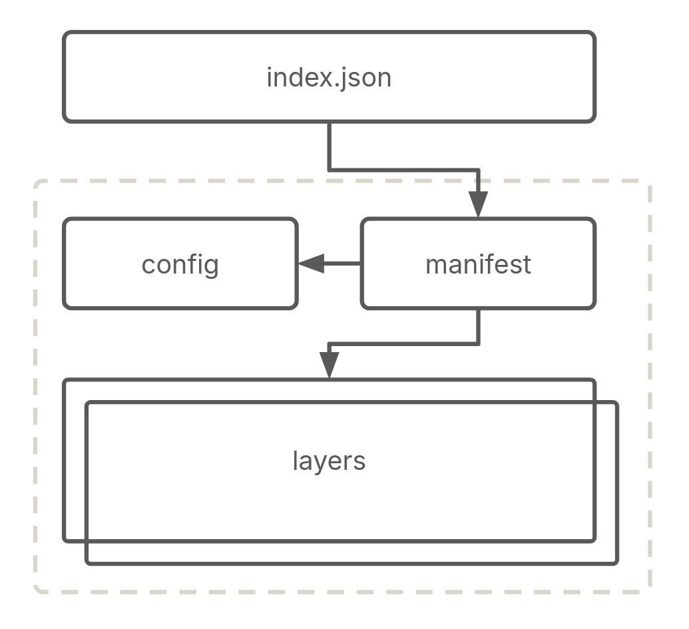
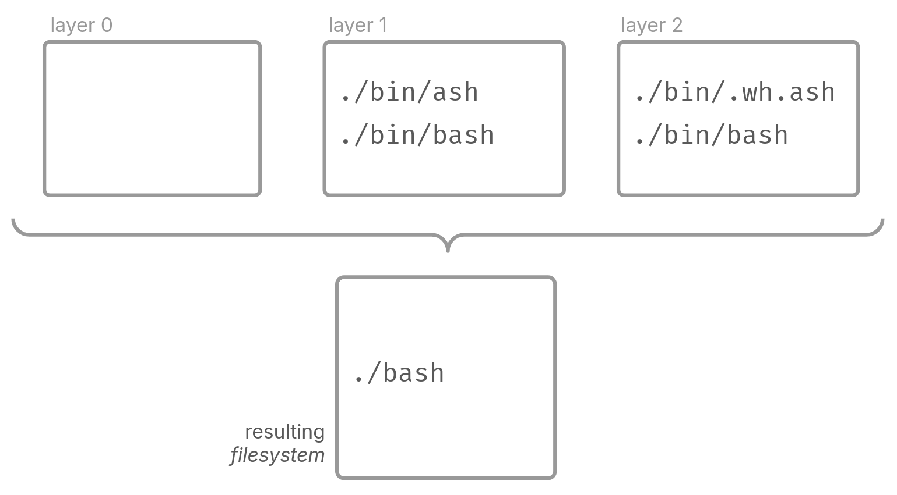
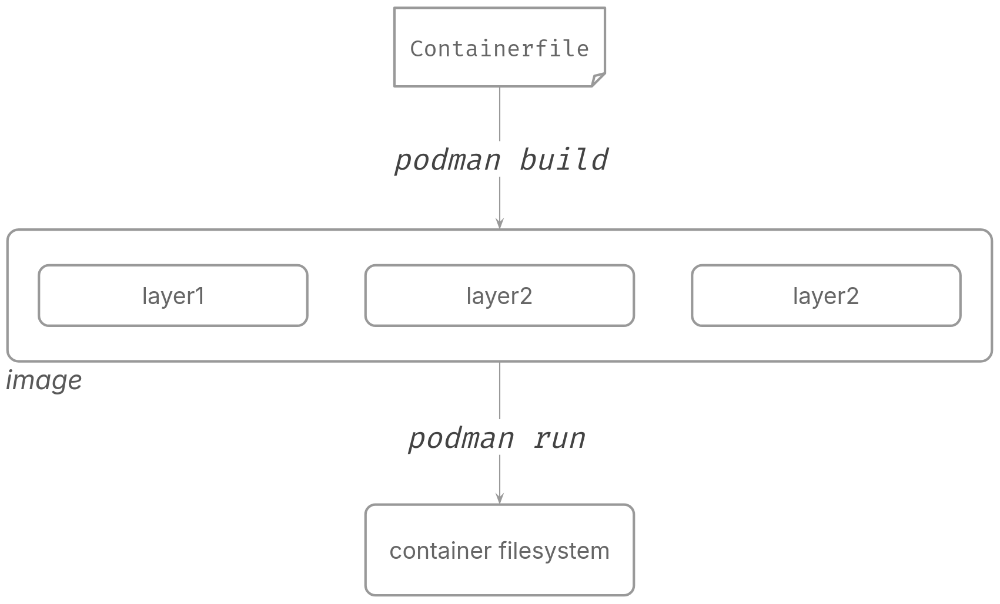
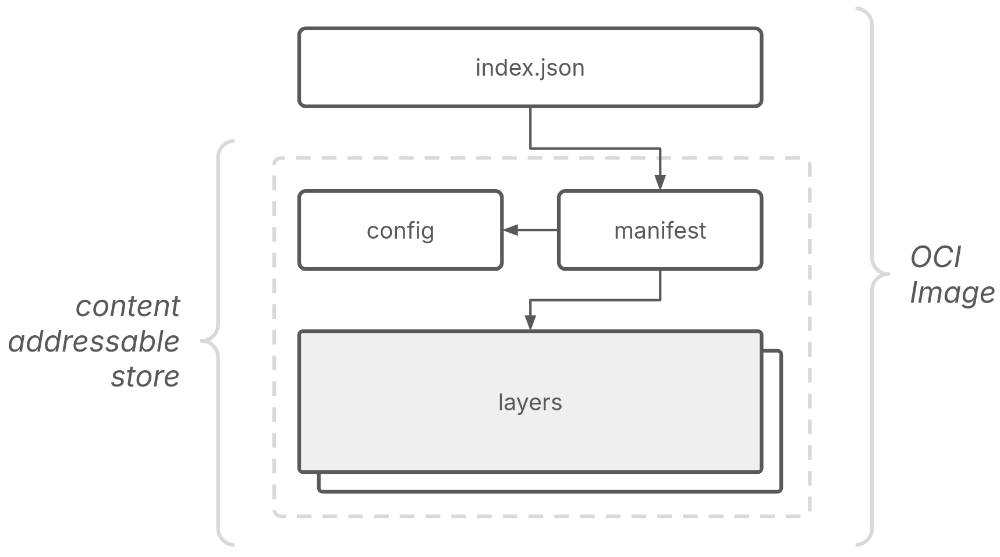
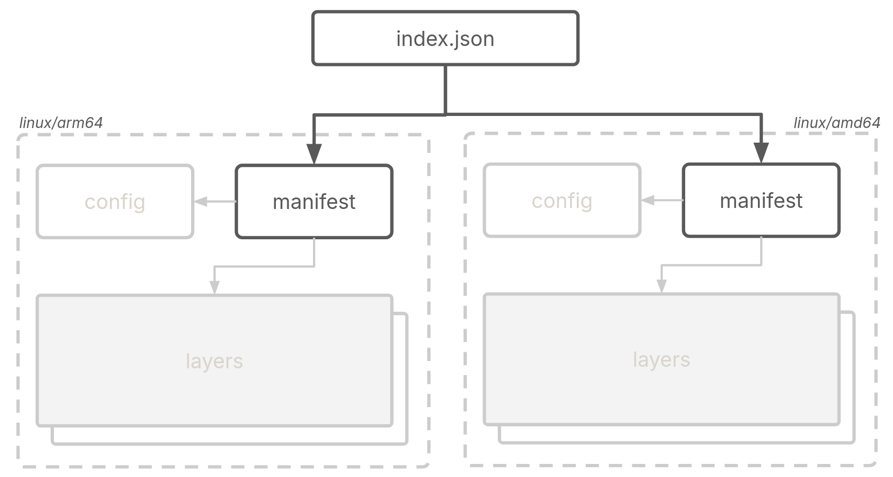

<span class="note">There's also a talk based on this article if you prefer video based content. You can find it [here](https://youtu.be/TsfT5qsTMB0?si=3m8D8mH17w1X2X91).</span>

For a developer, a Container image is essentially a collection of configurations required to run a container. But what really is a container image? You might know what a container image is, how it is made up of layers and that it's a collection of tar archives. There are questions that still went unanswered, questions such as what makes up a layer, how are layers combined to form a complete filesystem or multi-platform images, etc. In this article, we'll build a container image from scratch and try to answer all these questions to understand container image internals.

## OCI Image
Little bit of history before we proceed. Up until roughly 10 years back, docker-format was the only format being used and with the emergence of all the tooling around containers, there was a need for standardisation. Around 2015, the Open Containers Initiative was established--no a Linux Foundation project--with the aim to standardise all things containers. They came up with a specification for container images called the OCI spec. Modern tooling all conform and follow the runtime spec while dealing with container images and so for this article, and OCI image and a container image will be used interchangeably.

An OCI image consists of four core components--layer, config, manifest and index:



We'll understand each of the above components and build a "hello" image from scratch to practically understand all these components. If we had a Containerfile for our "hello" image, it would look like the following:

```
FROM scratch

COPY ./hello ./

ENTRYPOINT ["./hello"]
```

The image itself is based on `scratch`, an empty base image. We then copy the `hello` binary to the image and set it as the [entrypoint](/posts/dockerfile-practices) for the container. Let's get going.


## 1. layer — _what's inside the image_
Layers represent _what's inside a container image_. Often referred to as the basic building blocks of container images. They consist of components such as your source code you copy to your image, the container filesystem, or virtually anything you add to your container image.

Technically, a container image is a filesystem _changeset_. A filesystem changeset is a diff between two filesystems serialized as a tar archive. Consider the following container image:
```
FROM Alpine

RUN rm -f /bin/ash \
    && apk add bash
```

We've used alpine as the base image, deleted `/bin/ash` and installed `bash`. Let's use this as an example to build changesets and then to assemble the final filesystem of the container.

### 1.1 layer: create a changeset
In order to create a layer or more appropriately, a filesystem changeset, we start with a minimal root filesystem, one from [alpine](https://hub.docker.com/_/alpine) in our case since our example Containerfile starts off with the alpine base image:

```
$ wget https://dl-cdn.alpinelinux.org/alpine/v3.18/releases/x86_64/alpine-minirootfs-3.18.4-x86_64.tar.gz && tar -xvf ${_##*/}
$ tree
.
├── alpine-minirootfs-3.18.4-x86_64.tar.gz
├── bin
│   ├── arch
│   ├── ash
│   ├── base64
│   ├── bbconfig
│   ├── busybox
│   ├── cat
│   ├── chattr
...
```

In order to create subsequent layers, we create a copy/snapshot of the base filesystem--using `cp -rp`–and make changes to the snapshot by adding, deleting, or modifying files or directories.

A changeset consists of only files that are added, modified, and deleted. In order to create the changeset, both the filesystems(snapshots from previous step) are recursively compared. A tar archive is then created that contains _only_ the changeset.

Given that we removed `/bin/ash` and added `/bin/bash` from our example image, our changeset/layer would look like:

```
./bin/bash
./bin/.wh.ash
```

Notice the `.wh` which means whiteout to denote deleted files. The changeset above tells the container engine that we added/modified `bash` and deleted `ash` _on top_ of the previous layer/changeset--the alpine base in our case. And that would constitute a changeset, a layer.

### 1.2 layer: creating the filesystem

Now we have created a layer. A container engine takes multiple layers and creates a complete filesystem for the resulting container.



Let's say we have 3 layers, an empty layer with no filesystem--the starting changeset. Then we create a changeset and add two binaries, `/bin/ash` and `/bin/bash`. Then a final layer deletes `/bin/ash` and modifies `/bin/bash`.

The container engine would apply all the layers part of an image on top of each other left-to-right to generate the resulting filesystem. In this case, the final filesystem would only have `/bin/bash` as a result of applying layer 1 on top of layer 0, and layer 2 on top of layer 1. This is how a container engine creates a filesystem from a collection of layers in the form of a container image.

### 1.3 layer: lifecycle

So far we've understood:

- How an image consists of one or more layers.
- How layers are created from a Containerfile.
- How a container enginer creates the final filesystem for the container using all the layers.

How does this all play together when you employ containers in your daily workflow? Consider the lifecycle of a container image, from a Containerfile to a Container image and finally to a running container:



You use `podman build` and pass in the Containerfile, podman would then create various layers, and package that as a "container image". When you use `podman run` with this image, the engine would combine all the various layers part of the image and create the root filesystem for the container being run.

### 1.4 layer — _our scratch image layer_
Let's create the layer for our "hello" image. For reference, this is how our image would look like had it been a Containerfile:
```
FROM scratch

COPY ./hello /root/

ENTRYPOINT ["./hello"]
```
Here, our image contains 2 layers. The first layer comes from the scratch image--a special "image" that tells the container engine to start without a filesystem layer for your image. As we saw in previous sections, this means starting off with an empty filesystem layer and then having subsequent instructions create layers. Almost every instruction inside a Containerfile generates another layer. So in the Containerfile above, the `COPY` instruction creates the second layer which includes filesystem changes to the layer before it. The change here is "adding" a new file—the `hello` binary—to the existing filesystem i.e. the alpine root filesystem.

Let us create the layer for our image. We start by creating a statically linked C binary for our simple "Hello world" program:
```
$ cat hello.c
#include <stdio.h>

int main(int argc, char *argv[]) {
    if (argc < 2) {
        printf("Usage: %s <name>\n", argv[0]);
        return 1;
    }

    printf("Hello, %s!\n", argv[1]);

    return 0;
}

$ gcc -o hello hello.c -static
$ tar --remove-files -czvf layer.tar.gz hello

$ sha256sum layer.tar.gz
36c412b23a871c4afbec29a45b25faad76197f3a9dbf806f3aef779af926790a layer.tar.gz
$ mv layer.tar.gz 36c412b23a871c4afbec29a45b25faad76197f3a9dbf806f3aef779af926790a
```

We then create a gzip compressed tar archive of the binary. This constitues our first and only layer.

## 2. config — _how to run the container_
The config represents _how to run the container_. It's a JSON file that stores the configuration options used to configure the container. Options such as environment variables, entrypoint of the container, and volumes, etc. These options can be supplied via the command line while running the container, or as part of the Containerfile in which case, the config.json file is populated.

Consider the following snippet from a sample config.json:

```
$ vim sample_config.json
{
    "architecture": "amd64",
    "os": "linux",
    "config": {
        "Entrypoint": [
            "./bin/bash"
        ],
        "User": "danish",
        "ExposedPorts": {
            "8080/tcp": {}
        },
        "Env": [
            "FOO=bar",
        ],
        "Volumes": {
            "/var/logs": {}
        }
    }
}
```

You can see the various configuration options being set in the config section of the file along with additional metadata. You can set the entrypoint, user, ports, environment variables, etc. Let's write the configuration for our image:

```
$ vim config.json
{
    "architecture": "amd64",
    "os": "linux",
    "config": {
        "Entrypoint": [
            "time",
            "./hello"
        ]
    }
}
```

You can notice it's not too much. If you refer back to our image's Containerfile equivalent, you'll notice we set our "hello" binary as the entrypoint for our image, and that's the only configuration option we need to set.

## 3. manifest — _locate layers and config.json_
The container engine uses the manifest to locate layers and config.json for an image. Consider the following snippet from a sample `manifest.json`:

```
{
    "schemaVersion": 2,
    "mediaType": "application/vnd.oci.image.manifest.v1+json",
    "config": {
        "mediaType": "application/vnd.oci.image.config.v1+json",
        "digest": "sha256:<DIGEST>",
        "size": XYZ
    },
    "layers": [
        {
            "mediaType": "application/vnd.oci.image.layer.v1.tar+gzip",
            "digest": "sha256:<DIGEST>",
            "size": XZY
        }
    ]
}
```

The manifest mentions the config and the layer in the above snippet along with additional metadata for each of them. But instead of referring to a path, the manifest addresses the components via a digest. That's because the layers, config and the manifest together make up what's called a _content-addressable store_.


### 3.1 Content addressability
In order to allow for efficiency and integrity, OCI requires components in the OCI image to be identified based on their content i.e. you can identify data based on their content rather than its location (filepath, etc). To achive this in the case of an OCI image, a unique identifier (generally a cryptographic hash) is used as the filename. This is known as _content addressability_.



It helps with deduplication, layer sharing leading to reduced memory and performance overhead, and ensuring data integrity.

We'll use sha256 as the algorithm to generate the identifiers for the various components in this post. Let's make our layer archive that we created in a previous step content addressable:
```
$ sha256sum layer.tar.gz
c37c06cdec9d6a0f2a2d55deb5aa002b26b37b17c02c2eca908fc062af5f53eb layer.tar
$ mv layer.tar c37c06cdec9d6a0f2a2d55deb5aa002b26b37b17c02c2eca908fc062af5f53eb
```

#### Directory structure
OCI also defines a layout for an OCI image and container engines expects an image to be packed in the specified format before parsing. It's defined as follows:

```
$ tree
├── blobs/<alg>
│       ├── <content addressable config>
│       ├── <content addressable manifest>
│       └── <content addressable layer>
└── index.json
```

The content addressable content resides inside a subdirectory under the `blobs` directory which identifies the algorithm used to encode the content. Since we used `sha256` to compute the digest for our blobs, we create the directory `sha256`:

```
$ mkdir --parents blobs/sha256
$ mv c37c06cdec9d6a0f2a2d55deb5aa002b26b37b17c02c2eca908fc062af5f53eb $_

$ tree ../..
└── blobs/sha256
        └── c37c06cdec9d6a0f2a2d55deb5aa002b26b37b17c02c2eca908fc062af5f53eb
```

While we're at it, let's also make our config content addressable and create the manifest.json file for our "hello" image:


```
$ sha256 config.json
99c9d2dcbdbc6e28277d379c2b9a59443b91937720361773963d28d5376252a9  config.json
$ mv config.json 99c9d2dcbdbc6e28277d379c2b9a59443b91937720361773963d28d5376252a9

$ tree ../..
└── blobs/sha256
        ├── c37c06cdec9d6a0f2a2d55deb5aa002b26b37b17c02c2eca908fc062af5f53eb
        └── 99c9d2dcbdbc6e28277d379c2b9a59443b91937720361773963d28d5376252a9

$ vim manifest.json
{
    "schemaVersion": 2,
    "mediaType": "application/vnd.oci.image.manifest.v1+json",
    "config": {
        "mediaType": "application/vnd.oci.image.config.v1+json",
        "digest": "sha256:99c9d2dcbdbc6e28277d379c2b9a59443b91937720361773963d28d5376252a9",
        "size": 149
    },
    "layers": [
        {
            "mediaType": "application/vnd.oci.image.layer.v1.tar+gzip",
            "digest": "sha256:36c412b23a871c4afbec29a45b25faad76197f3a9dbf806f3aef779af926790a",
            "size": 1372604
        }
    ]
}
```

From the top above, we make our config.json content addressable, we then tke a look at our current image layout, consisting of `blobs/sha256` directory which contains our layer and our config. We then create our manifest file, and refer to to both the config and the layer by their digests along with additional metadata such as size and label.

And now that our manifest is ready, let's make that content addressable too:
```
$ sha256 manifest.json
2e17c995558ebfa8faacfe64ff78c359ab9f28b3401076bb238fd28c5b3a648b  manifest.json
$ mv manifest.json 2e17c995558ebfa8faacfe64ff78c359ab9f28b3401076bb238fd28c5b3a648b

$ tree .
└── blobs/sha256
        ├── c37c06cdec9d6a0f2a2d55deb5aa002b26b37b17c02c2eca908fc062af5f53eb
        ├── 99c9d2dcbdbc6e28277d379c2b9a59443b91937720361773963d28d5376252a9
        └── 2e17c995558ebfa8faacfe64ff78c359ab9f28b3401076bb238fd28c5b3a648b
```


So far, our unpacked OCI "hello" image has a single layer archive consisting of our statically linked `hello` binary, the configuration for the container, and the manifest for the image, all encoded by their sha256 digest.

## 4. index — _manifest for manifests_
index.json file acts as an index for a set of images that can span different architectures and operating systems.



An example could be having images for two different architectures in one OCI image, a linux/arm64 and a linux/amd64 variant. In this case, the index.json would contain two entries pointing to the two variants of the image via their manifests that in turn would contain image specific metadata as shown in the diagram above.

With that in mind, we create the index.json for our "hello" image. We don't have multiple architectures so our index.json file points to only one manifest.json in our image, by its digest:
```
$ cd ../..
$ vim index.json
{
    "schemaVersion": 2,
    "manifests": [
        {
            "mediaType": "application/vnd.oci.image.manifest.v1+json",
            "digest": "sha256:2e17c995558ebfa8faacfe64ff78c359ab9f28b3401076bb238fd28c5b3a648b",
            "size": 748,
            "annotations": {
                "org.opencontainers.image.ref.name": "hello:scratch"
            }
        }
    ]
}
```

Additionally, we've added an annotation representing the name and tag for our image referenced by the manifest. The index.json file isn't required to be encoded, so it resides at the top-level directory of our image and not under `blobs/` if you recall the high-level OCI image architecture we discussed in the beginning. With all the finished components, let's do a quick recap:
```

$ tree
├── blobs/sha256
│       ├── c37c06cdec9d6a0f2a2d55deb5aa002b26b37b17c02c2eca908fc062af5f53eb
│       ├── 99c9d2dcbdbc6e28277d379c2b9a59443b91937720361773963d28d5376252a9
│       └── 2e17c995558ebfa8faacfe64ff78c359ab9f28b3401076bb238fd28c5b3a648b
└── index.json
```

(in the order shown above)

1. `c37c06cdec9d6a0f2a2d55deb5aa002b26b37b17c02c2eca908fc062af5f53eb` — the layer for our image that includes the `hello` binary.
2. `99c9d2dcbdbc6e28277d379c2b9a59443b91937720361773963d28d5376252a9` — config.json that tells the container engine to set our `hello` binary as the entrypoint to the container that will be run from this image.
3. `2e17c995558ebfa8faacfe64ff78c359ab9f28b3401076bb238fd28c5b3a648b` — manifest.json file locates the config and the layer for the container engine.
4. `index.json` — a higher-level manifest that references multiple image manifests, allowing for the distribution of container images across different platforms or architectures.


## Packing
We have all the parts in place for our image. Let's create an archive of the components we've created so far, and test our image:
```
$ tree
├── blobs/sha256
│       ├── c37c06cdec9d6a0f2a2d55deb5aa002b26b37b17c02c2eca908fc062af5f53eb
│       ├── 99c9d2dcbdbc6e28277d379c2b9a59443b91937720361773963d28d5376252a9
│       └── 2e17c995558ebfa8faacfe64ff78c359ab9f28b3401076bb238fd28c5b3a648b
└── index.json
$ tar -cf hello.tar *

$ podman load < hello.tar
Getting image source signatures
Copying blob c37c06cdec9d done   |
Copying config cd12bca58e done   |
Writing manifest to image destination
Loaded image: localhost/hello:scratch

$ podman run localhost/hello:scratch world
Hello world!

$ podman image ls hello
REPOSITORY   TAG       IMAGE ID       CREATED   SIZE
hello        scratch    25e8b3bd9720  N/A       3.67MB
```

We can see that the image was loaded by podman, and we were able to run a container based on our image, correctly outputting `hello world!` to stdout. We know exactly what made up the image, what files we put in, the configuration we set, and the metadata that's part of the image.

## Using a Base Image
Let's create a version of our image based on `alpine` instead of scratch. This introduces another layer in our image, so let's see how to handle multiple layers. In this case, the Containerfile is as follows.

```
FROM alpine:latest

COPY ./hello /root/hello

ENTRYPOINT ["time", "./hello"]
```

Note that we changed the entrypoint to use the `time` utility. This is done to demonstrate how two layers work in the image.

So far, the image has only one layer that consists of the `hello` binary. As mentioned previously, a layer can be considered a filesystem diff. So if we use alpine as the base image, we need the respective root filesystem onto which we'll base the second layer (that is, the layer with the binary). You can obtain the alpine root filesystem from the project's official website.

```
$ cd blobs/sha256
$ wget https://dl-cdn.alpinelinux.org/alpine/v3.18/releases/x86_64/alpine-minirootfs-3.18.4-x86_64.tar.gz
$ mv alpine-minirootfs-3.18.4-x86_64.tar.gz \
    $(sha256sum alpine-minirootfs-3.18.4-x86_64.tar.gz | awk '{print $1}')
```

That rootfs downloaded is already gzipped, so all we need to do is encode this with its sha256 digest and it's ready to go.

```
$ cd ../..
$ tree
├── blobs/sha256
│       ├── 99c9d2dcbdbc6e28277d379c2b9a59443b91937720361773963d28d5376252a9
│       ├── 8289bd1bdc2a1fae2d2d717b7c40baaedc4c5c4d9c9f4f1a1b045287067e9f2c
│       ├── c37c06cdec9d6a0f2a2d55deb5aa002b26b37b17c02c2eca908fc062af5f53eb
│       └── 2e17c995558ebfa8faacfe64ff78c359ab9f28b3401076bb238fd28c5b3a648b
└── index.json
```

Along with our previous three components--hello layer, config and manifest--we now have an additional layer for the alpine rootfs (`8289bd1`).

Next, we need to update config and manifest files with new information. After that, we also need to make sure that we encode them again with their respective updated sha256 digests.

```
$ vim config.json
{
    "architecture": "amd64",
    "os": "linux",
    "config": {
        "Entrypoint": [
            "time",
            "./hello"
        ]
    }
}

$ mv config.json $(sha256sum config.json | awk '{print $1}')
```

We modify our entrypoint to preped `time` to our `hello` binary so as to differentiate between our scratch image and alpine base image. No other modifications to the config.json are required.

In our manifest.json file, we update the digest for our modified config.json and add layer information for our alpine base layer. Layers are added top-to-bottom, so our alpine base layer is the first entry in the array, followed by our hello layer.

```
$ vim manifest.json
{
    "schemaVersion": 2,
    "mediaType": "application/vnd.oci.image.manifest.v1+json",
    "config": {
        "mediaType": "application/vnd.oci.image.config.v1+json",
----->  "digest": "sha256:75b148a9a5b61403d082f1930ccc779bfdac5acddb48ed8f90ccdc4219d51268",
----->  "size": 603
    },
    "layers": [
        {
            "mediaType": "application/vnd.oci.image.layer.v1.tar+gzip",
            "digest": "sha256:8289bd1bdc2a1fae2d2d717b7c40baaedc4c5c4d9c9f4f1a1b045287067e9f2c",
            "size": 3279768
        },
        {
            "mediaType": "application/vnd.oci.image.layer.v1.tar+gzip",
--------->  "digest": "sha256:c37c06cdec9d6a0f2a2d55deb5aa002b26b37b17c02c2eca908fc062af5f53eb",
            "size": 1372611
        }
    ]
}

$ mv manifest.json $(sha256sum manifest.json | awk '{print $1}')
```

Since we changed our manifest, we need to update index.json with the new digest and filesize:

```
$ vim index.json
{
    "schemaVersion": 2,
    "manifests": [
        {
            "mediaType": "application/vnd.oci.image.manifest.v1+json",
--------->  "digest": "sha256:8289bd1bdc2a1fae2d2d717b7c40baaedc4c5c4d9c9f4f1a1b045287067e9f2c",
--------->  "size": 748,
            "annotations": {
                "org.opencontainers.image.ref.name": "hello:alpine"
            }
        }
    ]
}
```

If we pack and load the image again with podman, we can see the modified image in action:
```
$ tree
├── blobs
│   └── sha256
│       ├── 99c9d2dcbdbc6e28277d379c2b9a59443b91937720361773963d28d5376252a9
│       ├── 8289bd1bdc2a1fae2d2d717b7c40baaedc4c5c4d9c9f4f1a1b045287067e9f2c
│       ├── c37c06cdec9d6a0f2a2d55deb5aa002b26b37b17c02c2eca908fc062af5f53eb
│       └── 2e17c995558ebfa8faacfe64ff78c359ab9f28b3401076bb238fd28c5b3a648b
└── index.json
$ tar -cvf hello-alpine.tar *

$ podman load < hello-alpine.tar
Getting image source signatures
Copying blob c59d5203bc6b done   |
Copying blob c37c06cdec9d done   |
Copying config 75b148a9a5 done   |
Writing manifest to image destination
Loaded image: localhost/hello:alpine

$ podman run --rm localhost/hello:alpine reader
Hello, reader!
real    0m 0.00s
user    0m 0.00s
sys     0m 0.00s

$ podman image ls hello
REPOSITORY   TAG       IMAGE ID       CREATED   SIZE
hello        scratch   25e8b3bd9720   N/A       3.67MB
hello        alpine    3d0268e9a91e   N/A       11MB
```

## Conclusion
I hope this post helped you understand container images in slightly more detail and in a manner that was accessible and approachable. The examples used in this article is not something you'd use in your daily workflow. Their purpose is to demonstrate the inner workings of container images.

If you find any problems or improvements, open an issue or feel free to reach out via email.

_Thanks to Aleksa, Dan, and Dmitri for all their help with this article._

:wq
