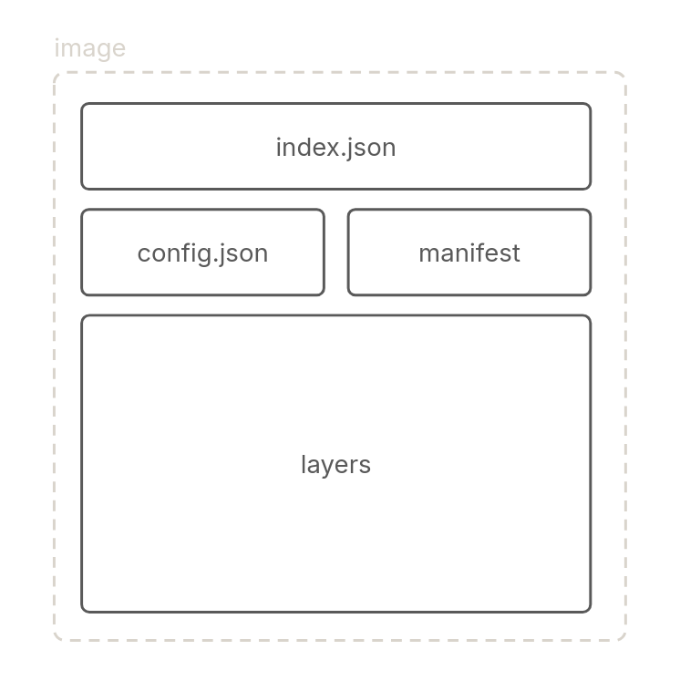
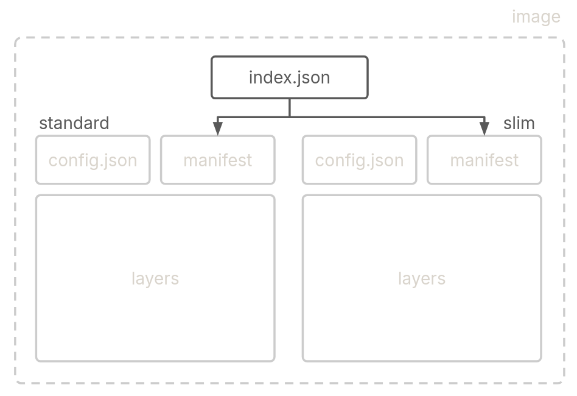

For a developer, a Container image is essentially a collection of configurations required to run a container. But what really is a container image? For the longest time, I theoretically knew what a container image was, how it was made up of layers and that it was a collection of tar archives but that was about it. Let's try building an OCI(Open Container Initative) image from the ground up and undertand what's really inside.

# Scratch?
This post aims to build an "OCI" image from scratch. What we mean by scratch here is that we're not going to use any specialized tool i.e. docker, podman, or buildah to build our image. Rather, we'll manually create all the required files, the layers and metadata, and then package it into an OCI image format that almost all container engines support. In so doing, the idea is to see what really constitutes an image and what a container engine such as docker or podman does under the hood when you run `[docker|podman] build -f Containerfile` in your terminal.

We'll be building an equivalent of the following Containerfile:

```
FROM scratch

COPY ./hello ./

ENTRYPOINT ["./hello"]
```

In the above sample Containerfile, the image is based on the "scratch" image discussed previously, then the statically linked `hello` binary is copied into the image and finally it is set as the [entrypoint](/posts/dockerfile-practices) of the container.

Now that we know what our Docker image is supposed to be doing, let's start by building one. Let's understand the different components that make up an OCI container image.

#### The Big Picture
There are 4 major components that make up a container image, one or more layers, configuration, manifest and an index.



Whenever you `build` an image using a Containerfile, the engine or whatever tool you're using (Buildah, img, Podman, Docker, etc), creates these 4 components. But since we're not using any tools in this session, we'll create all the components manually and understand how they make up a container image together.

#### layers
You can think of a layer as a filesystem changeset, or a diff format for filesystems created when you add or remove elements from one filesystem to the next. Layers are the basic building blocks of an image. An image, an OCI image in this case, is made up of different layers stacked on top of each other to generate the filesystem of the end image.

To better understand the concept of layers, let's look at the following example:
```
FROM alpine

COPY ./hello /root/
```
Here, your image contains 2 layers. The first layer comes from the base image, the alpine official docker image i.e. the root filesystem with all the standard shell tools that come along with an alpine distribution. Almost every instruction inside your Dockerfile generates another layer. So in the Containerfile above, the `COPY` instruction creates the second layer which includes filesystem changes to the layer before it. The change here is "adding" a new file to the existing filesystem i.e. the alpine root filesystem.

Let us create the layer for our image. We start by creating a statically linked C binary for our simple "Hello world" program:
```
$ cat hello.c
#include <stdio.h>

int main(int argc, char *argv[]) {
    if (argc < 2) {
        printf("Usage: %s <name>\n", argv[0]);
        return 1;
    }

    printf("Hello, %s!\n", argv[1]); // Print "Hello, [name]"

    return 0;
}

$ gcc -o hello hello.c -static
$ tar --remove-files -czvf layer.tar.gz hello
```

We then create an gzip compressed tar archive of the binary. This constitues our first and only layer.

#### content addressability
In order to allow for efficiency and integrity, OCI requires components in the OCI image to be identified based on their content i.e. you can identify data based on their content rather than its location (filepath, etc). To achive this in the case of an OCI image, a unique identifier (generally a cryptographic hash) is used as the filename. This is known as _content addressability_.

We'll use sha256 as the algorithm to generate the identifiers for the various components in this post. Let's make our layer archive content addressable:
```
$ sha256sum layer.tar.gz
c37c06cdec9d6a0f2a2d55deb5aa002b26b37b17c02c2eca908fc062af5f53eb layer.tar
$ mv layer.tar c37c06cdec9d6a0f2a2d55deb5aa002b26b37b17c02c2eca908fc062af5f53eb
```

#### directory structure
OCI defines a layout for an OCI image and container engines expects an image to be packed in the specified format before parsing. It's defined as follows:

```
$ tree
├── blobs/<alg>
│       ├── <content addressable config>
│       ├── <content addressable manifest>
│       └── <content addressable layer>
└── index.json
```

The content addressable content resides inside a subdirectory under the `blobs` directory which identifies the algorithm used to encode the content. Since we used `sha256` to compute the digest for our blobs, we create the directory `sha256`:
```
$ mkdir --parents blobs/sha256
$ mv c37c06cdec9d6a0f2a2d55deb5aa002b26b37b17c02c2eca908fc062af5f53eb $_
$ tree ../..
└── blobs/sha256
        └── c37c06cdec9d6a0f2a2d55deb5aa002b26b37b17c02c2eca908fc062af5f53eb
```

So far, our unpacked OCI image has a single layer archive consisting of our statically linked hello \<name> binary, encoded by its sha256 digest. We can now move on to defining the configuration of the container that will run based on this image.

#### Config
When we run a container using `docker run ...`, we often supply command line options such as environment variables, container entrypoint, or volume mounts, etc. These options can be part of the image, in which case, they are passed onto the container engine/runtime of choice that uses these options to configure the container when we run it.

It's equally common to have such configuration as part of your image. In an OCI image, this is done via config.json, a JSON file that includes various configuration options for an image, along with layer information. Here's how it looks for our image:

```
$ vim config.json
{
    "architecture": "amd64",
    "os": "linux",
    "config": {
        "Entrypoint": [
            "./hello"
        ]
    },
    "rootfs": {
        "type": "layers",
        "diff_ids": [
            "sha256:c37c06cdec9d6a0f2a2d55deb5aa002b26b37b17c02c2eca908fc062af5f53eb"
        ]
    }
}

$ mv config.json $(sha256sum config.json | awk '{print $1}')
$ tree
└── blobs/sha256
        ├── c37c06cdec9d6a0f2a2d55deb5aa002b26b37b17c02c2eca908fc062af5f53eb
        └── cd12bca58eb0ed29b24e4264179a2696b68df24f9006bc16563fe3525210936e
```
The configuration part is self-explanatory, we defined the static binary as the entrypoint and that's the only configuration option we need for our image. It's stated that this image is made for `linux/amd64` platform, and we also refer to the layer we created earlier by its sha256 digest. Lastly, we encode our config.json with its sha256 digest to make it content addressable.

#### manifest
We need a way to index(v.) our layers and configuration for the image. The manifest file holds information such as the location of the config, the different layers that are part the image. It does so by referring to their individual content addresses, as shown below:

```
$ vim manifest.json
{
    "schemaVersion": 2,
    "mediaType": "application/vnd.oci.image.manifest.v1+json",
    "config": {
        "mediaType": "application/vnd.oci.image.config.v1+json",
        "digest": "sha256:bf7031d43f7d2c9ec77ed23de9d4daa3ed1482c4bd5eb4b941caee79f2c4be42",
        "size": 296
    },
    "layers": [
        {
            "mediaType": "application/vnd.oci.image.layer.v1.tar+gzip",
            "digest": "sha256:583eb9106f1be6dffa3f0e2fabe1fee5073878fbc66f7d2d5b19192db187e73a",
            "size": 1377804
        }
    ]
}

$ mv manifest.json $(sha256sum manifest.json | awk '{print $1}')
$ tree ../..
└── blobs/sha256
        ├── 38f01cd4419e646946527861333e01d71775c43965ff340dea0466eae61c200d
        ├── c37c06cdec9d6a0f2a2d55deb5aa002b26b37b17c02c2eca908fc062af5f53eb
        └── cd12bca58eb0ed29b24e4264179a2696b68df24f9006bc16563fe3525210936e
```

The `mediaType` attribute references the type of the media. OCI spec defines media types for various kinds of content. In our case, we refer to the config and layer with the relevant `mediaType` value. And as is required, we encode the manifest file too.

#### index.json
index.json file acts as an index for a set of images that can span different architectures and operating systems.



A simple example could be a container image that has different flavors e.g. a fully-featured base image with all the bells and whistles but also a "slim" variant that comes without unwanted additions. Here, the index.json would contain two entries pointing to the two variants of the image via their manifests, which would then contain image specific metadata.

```
$ cd ../..
$ vim index.json
{
    "schemaVersion": 2,
    "manifests": [
        {
            "mediaType": "application/vnd.oci.image.manifest.v1+json",
            "digest": "sha256:38f01cd4419e646946527861333e01d71775c43965ff340dea0466eae61c200d",
            "size": 530,
            "annotations": {
                "org.opencontainers.image.ref.name": "hello:scratch"
            }
        }
    ]
}
```

We've added an annotation representing the name and tag for our image referenced by the manifest. The index.json file isn't required to be encoded and therefore resides at the top-level directory of our image and not under `blobs/`. With all the finished components, a quick recap of what's what:
```
$ tree
├── blobs/sha256
│       ├── 38f01cd4419e646946527861333e01d71775c43965ff340dea0466eae61c200d
│       ├── c37c06cdec9d6a0f2a2d55deb5aa002b26b37b17c02c2eca908fc062af5f53eb
│       └── cd12bca58eb0ed29b24e4264179a2696b68df24f9006bc16563fe3525210936e
└── index.json
```

(in the order shown above)

1. `38f01cd4419e646946527861333e01d71775c43965ff340dea0466eae61c200d` — Metadata such as image name and tag for our image along with other data.
2. `c37c06cdec9d6a0f2a2d55deb5aa002b26b37b17c02c2eca908fc062af5f53eb` — gzip compressed tar archive that consists of the only layer in our image which in turn consists of a single static C binary.
3. `cd12bca58eb0ed29b24e4264179a2696b68df24f9006bc16563fe3525210936e` — Container configuration options such as the entrypoint and environment variables that are going to be used by the container runtime when running the container based off of our image.
4. `index.json` — a higher-level manifest that references multiple image manifests, allowing for the distribution of container images across different platforms or architectures.


# Packing
We have all the parts in place for our image. Let's create an archive of the various components we've created so far and test our image out:
```
$ tree
├── blobs/sha256
│       ├── 38f01cd4419e646946527861333e01d71775c43965ff340dea0466eae61c200d
│       ├── c37c06cdec9d6a0f2a2d55deb5aa002b26b37b17c02c2eca908fc062af5f53eb
│       └── cd12bca58eb0ed29b24e4264179a2696b68df24f9006bc16563fe3525210936e
└── index.json
$ tar -cf hello.tar *

$ podman load < hello.tar
Getting image source signatures
Copying blob c37c06cdec9d done   |
Copying config cd12bca58e done   |
Writing manifest to image destination
Loaded image: localhost/hello:scratch

$ podman run localhost/hello:scratch world
hello world!
```

We can see that the image was loaded without any problems by podman, and we were able to run a container based on our image, correctly dumping `hello world!` to stdout. Let's inspect our loaded image:

```
$ podman image ls hello
REPOSITORY   TAG       IMAGE ID       CREATED   SIZE
hello        scratch    25e8b3bd9720  N/A       3.67MB
```

Thanks to the scratch base image, our image has a minimal footprint, in fact, the only file in our image is our binary.

# Using a Base Image
Let's try creating a version of our image which is based on `alpine` rather than scratch. This would introduce another layer in our image, so let's see how to handle multiple layers. For the sake of better understanding, this is how our Containerfile would look using alpine if we hadn't been doing it from scratch.

```
FROM alpine:latest

COPY ./hello /root/hello

ENTRYPOINT ["time", "./hello"]
```

Note that we also changed the entrypoint to use the `time` utility, part of the alpine builtins, this is simply to demonstrate working of the two layers in the image.

In our image so far, we have had just one layer that consists of the `hello` binary. As we've seen before, a layer can be considered a filesystem diff. So if we plan to use alpine as the base image, we need the respective root filesystem onto which we'll base the second layer, the one with the binary. You can obtain the alpine root filesystem from their official website.

```
$ cd blobs/sha256
$ wget https://dl-cdn.alpinelinux.org/alpine/v3.18/releases/x86_64/alpine-minirootfs-3.18.4-x86_64.tar.gz
$ mv alpine-minirootfs-3.18.4-x86_64.tar.gz \
    $(sha256sum alpine-minirootfs-3.18.4-x86_64.tar.gz | awk '{print $1}')
```

That rootfs downloaded is already gzipped, so all we need to do is encode this with its sha256 digest and it's ready to go.

```
$ cd ../..
$ tree
├── blobs/sha256
│       ├── 75b148a9a5b61403d082f1930ccc779bfdac5acddb48ed8f90ccdc4219d51268
│       ├── 8289bd1bdc2a1fae2d2d717b7c40baaedc4c5c4d9c9f4f1a1b045287067e9f2c
│       ├── c37c06cdec9d6a0f2a2d55deb5aa002b26b37b17c02c2eca908fc062af5f53eb
│       └── c59d5203bc6b8b6ef81f3f6b63e32c28d6e47be806ba8528f8766a4ca506c7ba
└── index.json
```

It's a little hard to figure out what's what with all those digests, but rest assured, you will _never_ find yourself doing this manually, ever again.

Now, on to updating our config and manifest files with the new layer. Once done, we also need to make sure, we encode them again with their respective updated sha256 digests.

```
$ vim config.json
{
    "architecture": "amd64",
    "os": "linux",
    "config": {
        "Entrypoint": [
            "time",
            "./hello"
        ]
    },
    "rootfs": {
        "type": "layers",
        "diff_ids": [
--------->  "sha256:c59d5203bc6b8b6ef81f3f6b63e32c28d6e47be806ba8528f8766a4ca506c7ba",
            "sha256:c37c06cdec9d6a0f2a2d55deb5aa002b26b37b17c02c2eca908fc062af5f53eb"
        ]
    }
}

$ mv config.json $(sha256sum config.json | awk '{print $1}')
```

Layers are represented top to bottom so the base alpine rootfs layer comes first and then the second layer with the binary. Note also that we modified the entrypoint to use the `time` utility as discussed previously. The manifest file also sees similar changes--adding the layer digests--along with updating the size of our config file, and not to forget re-calculating the digest and encoding our updated manifest.

```
$ vim manifest.json
{
    "schemaVersion": 2,
    "mediaType": "application/vnd.oci.image.manifest.v1+json",
    "config": {
        "mediaType": "application/vnd.oci.image.config.v1+json",
----->  "digest": "sha256:75b148a9a5b61403d082f1930ccc779bfdac5acddb48ed8f90ccdc4219d51268",
----->  "size": 403
    },
    "layers": [
        {
            "mediaType": "application/vnd.oci.image.layer.v1.tar+gzip",
            "digest": "sha256:c59d5203bc6b8b6ef81f3f6b63e32c28d6e47be806ba8528f8766a4ca506c7ba",
            "size": 3279768
        },
        {
            "mediaType": "application/vnd.oci.image.layer.v1.tar+gzip",
--------->  "digest": "sha256:c37c06cdec9d6a0f2a2d55deb5aa002b26b37b17c02c2eca908fc062af5f53eb",
            "size": 1372611
        }
    ]
}

$ mv manifest.json $(sha256sum manifest.json | awk '{print $1}')
```

Note: the filenames for both config.json and manifest.json would've been the sha256 digests from the first variant of the image we built, I'm choosing to revert them to config.json and manifest.json for presentation purposes.

Since we changed our manifest, we need to update index.json with the new digest and filesize:

```
$ vim index.json
{
    "schemaVersion": 2,
    "manifests": [
        {
            "mediaType": "application/vnd.oci.image.manifest.v1+json",
--------->  "digest": "sha256:8289bd1bdc2a1fae2d2d717b7c40baaedc4c5c4d9c9f4f1a1b045287067e9f2c",
--------->  "size": 748,
            "annotations": {
                "org.opencontainers.image.ref.name": "hello:alpine1"
            }
        }
    ]
}
```

If we pack and load the image again with podman, we can see the modified image in action:
```
$ tree
├── blobs
│   └── sha256
│       ├── 75b148a9a5b61403d082f1930ccc779bfdac5acddb48ed8f90ccdc4219d51268
│       ├── 8289bd1bdc2a1fae2d2d717b7c40baaedc4c5c4d9c9f4f1a1b045287067e9f2c
│       ├── c37c06cdec9d6a0f2a2d55deb5aa002b26b37b17c02c2eca908fc062af5f53eb
│       └── c59d5203bc6b8b6ef81f3f6b63e32c28d6e47be806ba8528f8766a4ca506c7ba
└── index.json
$ tar -cvf hello-alpine.tar *

$ podman load < hello-alpine.tar
Getting image source signatures
Copying blob c59d5203bc6b done   |
Copying blob c37c06cdec9d done   |
Copying config 75b148a9a5 done   |
Writing manifest to image destination
Loaded image: localhost/hello:alpine

$ podman run --rm localhost/hello:alpine reader
Hello, reader!
real    0m 0.00s
user    0m 0.00s
sys     0m 0.00s

$ podman image ls hello
REPOSITORY   TAG       IMAGE ID       CREATED   SIZE
hello        scratch   25e8b3bd9720   N/A       3.67MB
hello        alpine    3d0268e9a91e   N/A       11MB
```

So there we have it, our two images loaded into the docker daemon. We can run both of them and see the same output from both of them. One interesting thing to note is the size difference between the two images. Alpine, while still having a lower footprint is larger than scratch, but nothing extraordinary. Hopefully this example demonstrated interaction between different layers in an image and how a manifest file can represent multiple images from a single file.


# Conclusion
I was initially planning to title this article "Container Image Internals" and the first draft of that came out all theoretical and while reading it, even I felt bored even though I enjoyed finding about all I could about container images for the post. But then I decided to document the fun part of this whole journey and here we are. In this article, we saw how we can "build" a docker image from scratch. But that's not to say that we'd be doing something like that on a day to day basis. You should never find yourself doing this as part of your regular development workflow. This article intentionally uses a simple example and so it misses out on important nuances such as how layers use an impelementation of UnionFS and don't pack simplified tarballs anymore, etc.

But alas, it's always fun to crack open something and to understanding things so I hope this article helped demistify container images to a certain extent. If you find anything that seems wrong or if you think there's something that can be improved, feel free to reach out.

:wq
