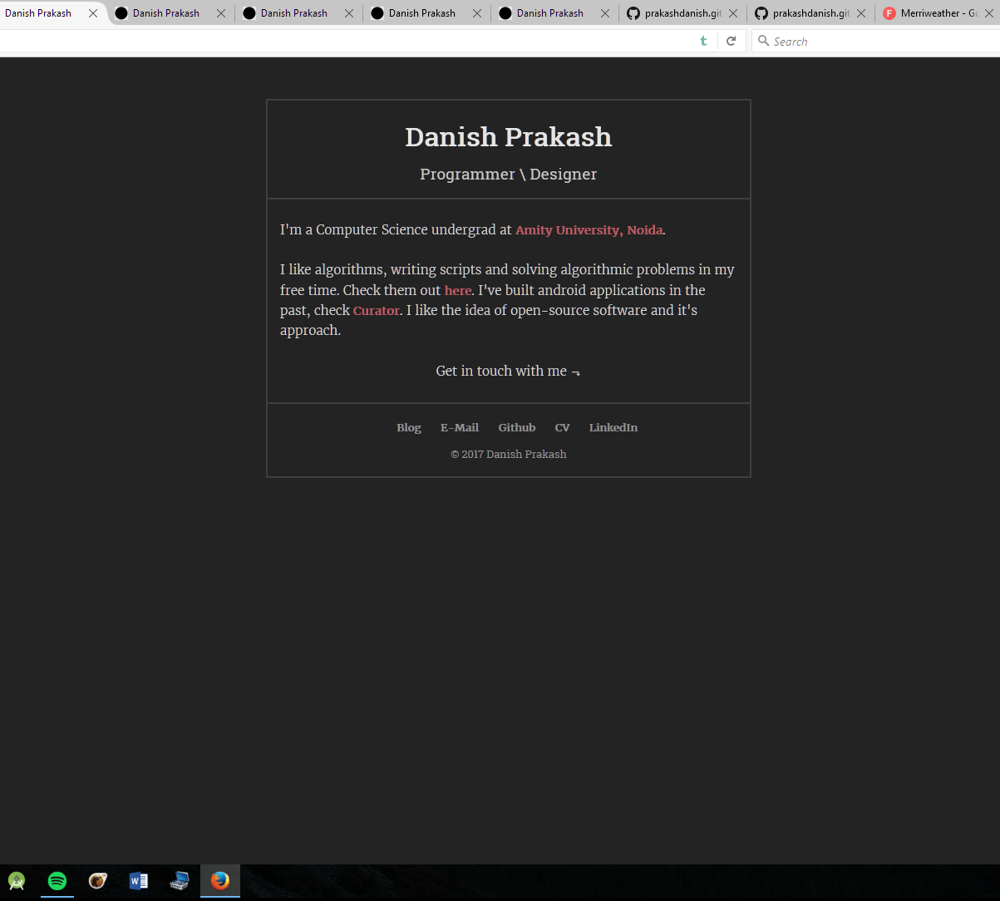
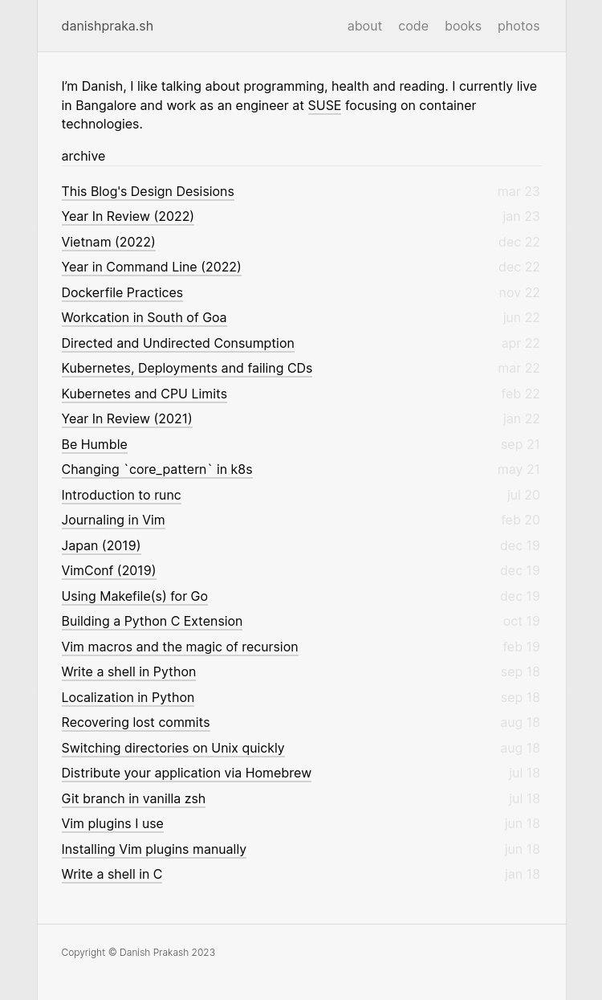
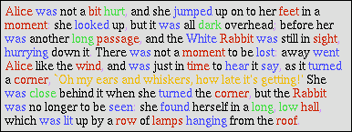
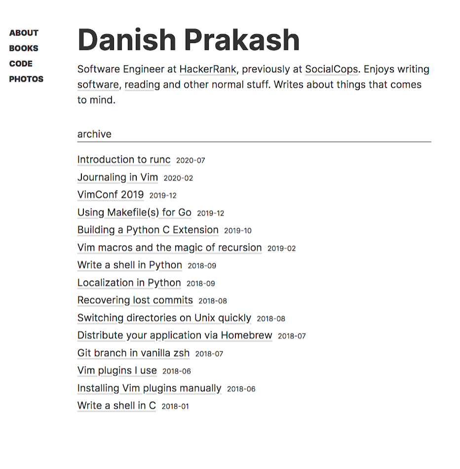
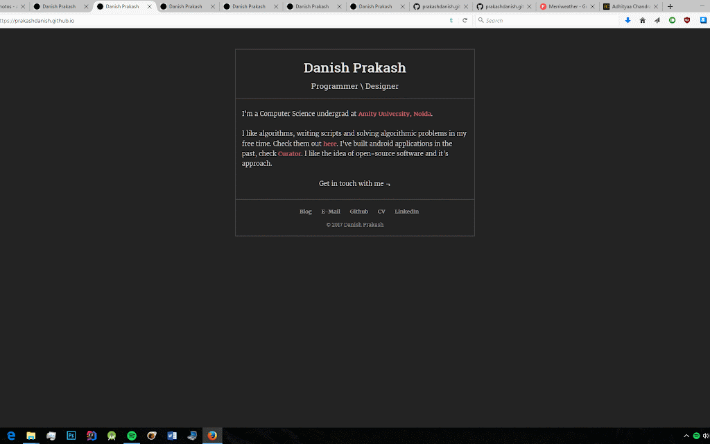

Just some random thoughts about some of the design decisions behind this blog.

## humble beginnings
The first iteration for my small corner on the interwebz looked like as shown in the screenshot below. Little background, feel free to skip to the good parts if you want. Sometime in my final year in college, I came across someone's "personal" website, the term was fresh to me and I didn't understand it completely although I knew [internet](http://erikdemaine.org/)-[famous](http://www.paulgraham.com/) folks had their presence on the internet. But the mere fact that virtually anybody could have a piece of the internet reserved to themselves, felt somewhat liberating. I quickly sprung into action to figure out how I could do the same. Lo and behold, technology came to  the rescue. Github pages had just launched and I got the coveted username.github.io up and running.

And that was that. Occassionaly, it felt good to have someone come up to me to say that they came across my website and that it looked cool. Positive reinforcement worked it's magic and I got to work on new iterations for the design looking every which way for inspiration(more on the progression at the end of this post). And it slowly evolved to the point that I focused more on fretting about the design than the content, yak-shaving. I struggled quite a lot finding a balance between writing and aesthetic. To this day, I sit to write something and I'd snap open main.css to fiddle with the design here and there.

### disclaimer
Before I start harping about some of the decisions I've taken, I'd like to add a small disclaimer that I've written this post at a certain point in time when the site looked like the screenshot below. If you're reading this in 2034 with a dark theme, please don't label me a hypocrite. People change, decisions change, tastes change.

(inception^) With that legality out of the way, I'd like to talk about some of the things I had in mind while I was writing the draft for this post.

## why
Natural for someone reading this to ask why was this written this in the first place. Honestly, there's no concrete reasoning behind this. I just thought it'd be fun to dump the often in hindsight reasons behind some of the design decisions I've taken with this blog. Another reason that nudged me to write this was how sometimes people would ping talking about the design of this site and even asking for the theme. I thought it'd be fun for such readers and anyone interested in design really to go through the thought process. I know I would, so if you're on the fence on something like this, please write!

I'll briefly talk about a topic and then move on to the next, there's nothing profound about this so I'd rather not waste too much time if you decide to read the whole piece.

## dark theme
The most obvious of them all. I want to create a more readable experience, I wanted to optimize for reading when someone lands on this blog. I'm of course biased--affect bias--because I've never personally liked reading white-on-black. Have you ever had to read white text on a black sheet? It's not nice. Reading black-on-white takes me back to the good old days without technology where all you could find is black-on-white and I cherish that memory when I open such sites still. It is also partially inspired by Instapaper, that app is so visually appealing to read on and I wanted to create something similar, I'm sure you'd have noticed similarities by now. And also, let's not forget Kindle. I do most of my [reading](/reading/) on an old kindle and I cherish the warm and comfortable reading experience that the white on black provides.

## hyperlink decoration
I come from the school of thought that too much visual confetti breaks comprehension. Again, affect bias would be the underlying theme for this post but you get the idea. For that reason, I've tried to keep hyperlink decorations to the bare minimum. Only so much as you'd get a hint that it's indeed a hyperlink and that's about it. No need for your peripheral vision to jump around to colorful elements popping out while you're trying to focus on content. I don't use syntax highlighting to comprehend code and I believe it's easier for us to comprehend literature without syntax highlighting. Think about it.

The above image is taken from [this post](https://www.linusakesson.net/programming/syntaxhighlighting/) by Linus Åkesson. End of the day, this is personal preference and very much pointless to debate on it but it's worth mentioning here because of the topic in question.

## center alignment
The content on this site has been centrally-aligned since its inception. I tried a left-aligned variant briefly before reverting back.

I realized fairly quickly how "unnatural" left-alignment on a monitor is. It's just natural for you to sit with your face aligned with the center of your display. And if you use multiple displayes, then for your eyes to align with the center, no matter what's on the screen before adjusting itself to find content. To draw parallels with traditional media, we always keep the book or paper we're reading in the front center, not left and not right and if it were to be like that for some reason, it'll quickly get uncomfortable if you spend more than a few minutes in that position.

## header
By now the pattern must be discernible. Optimize for reading and keep the fluff to the minimal. The header tries to be as unassuming as it possible can while still providing the required details and navigation across the site. There's no over the top hero image, contrasting color scheme or fancy floating animation.

I've come across websites in the past that make it extremely difficult to navigate the site or to skip to the main content of the site just because they have so much chaos going on in the header. I admire Google's simplicity here, keeping it stupidly simple just works.

## future
There are a lot of microdecisions that I decided not to talk about here for the sake of keeping this post comprehensible. As for the future of this blog's design, as I mentioned in the disclaimer, tastes change and it would inevitably lead to some drastic changes to this blog but I want to believe the things I've talked about here would remain intact one way or another.
I plan to keep this post as a living post which documents the design journey of this blog.

## conclusion
No reasonable conclusion to this one but hoping this would be a poignant reminder to my future self to continue this ever-evolving obsession with improving this blog, so to speak, all the while continuing to strike a balance with writing more content here.

:wq
