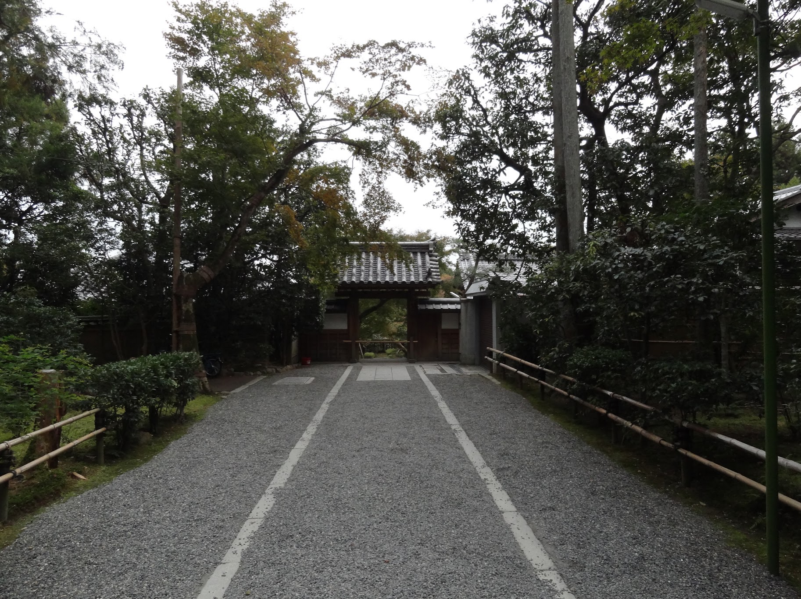

Last month I had the privilege and opportunity to travel to Japan for a [conference](/posts/vimconf-2019). It was my first visit to Japan and I'd had been mesmerised this by this beautiful piece of land on earth.

## tokyo
I flew from New Delhi to Narita with a short layover in Hong Kong. It was a nice comfy flight on a Boeing 777-300ER, one massive and majestic piece of engineering. I landed in Tokyo shortly after noon and then took an express train to the city center from where I took the Ginza line to Akihabara. I took in the bigger than life skyscrapers with the latest and greatest anime characters plastered on each and every one of them. It was shortly before I was supposed to leave for Japan when a friend of mine told me that Akihabara is apparently the anime city.

 

I checked into my hostel, [Hiromas](https://www.agoda.com/hiromas-hostel-akihabara/hotel/tokyo-jp.html?cid=1844104), and then proceed to head out to have some quick bite at the local 7/11. It was soon dark and it was then that Akihabara truly shines, quite literally. All the billboards come alive with character moving around with grace on the brightly lit mini LED bulbs. It was nothing short of a sensory overload.

The next day was the conference, VimConf 2019, I was busy the whole day. I've written more about the conference in a [separate post](). Got to meet lots of Vim enthusiasts with an energy I've personally not seen before for an editor, it was infectious.

During the conference, the locals from as far as Kansai gave me hints on how and where to visit for the next few days I was in Japan. Although I had already planned most of my itinerary, it was good to have suggestions, especially from the locals. I roamed around Tokyo the next day, doing the touristy stuff and eating around.

First stop was the famous Shinjuku Gyoen, it's a vast expanse of greenery bang in the middle of the city. It wasn't long after I saw something similar in Osaka that I realized how great of a job the Japanese have done preserving natural and historical lands while building a metropolitan city all around. Throngs of people on a weekday were there with their families having a good time. Old folks clicking photographs on their shiny cameras and people finding a shade to read under. I had my first real matcha with daifuku in the old tea house within the garden premises.

I then walked around the residential areas and clicked as many photographs of the clean and aesthetic alleys as I could. Eventually I reached the famous Meiji Jingu Temple. It had an eery silence to it which is quite difficult to shake off, I thoroughly enjoyed it. After this, in quick succession, I visited piss alley, Shibuya and then back to Akihabara to call it a night.

<!--  -->

## osaka
Early int the morning, I took the Shinkansen from Tokyo to Osaka where I'd spend the next 3 nights. It is customary to buy bento from the station and have it onboard the Shinkansen, and I did the same with a shot of Suntory coffee. The train had great wifi and I spent some time working on the way. The Salaryman(サラリーマン) next to me pointed out Fuji San when it passed by, It was majestic.

I checked in to my hostel, [CharinCo](https://www.agoda.com/bike-bed-charin-co-hostel-osaka/hotel/osaka-jp.html?cid=1844104) and then headed out to walk around the area. It was close to a residential area and was relatively quieter than usual. Japan is an extermely walkable place, almost every city there is so friendly to both pedestrians and bikers, it was honestly surprising. Sequestered away in the middle of a shopping street is the Hozenji Temple. As I mentioned, Japan does an commendable job blending the past and present and even future in some cases (Akihabara). The temple entrance was so unassuming, I passed it thrice without realizing while having Google Maps open the whole time until an elderly hunched Japanese grandpa smiled and directed me towards the place, as he must've had done for countless such visitors.

To end the day, I travelled far out of the city center to the famous collosus Tempozan Giant Ferris Wheel and the famous acquarium nearby. I had no intention of riding it or even going inside the acquarium but I ended up doing the latter just because I had some time and it was freezing cold outside.

Next morning, I visited the Osaka Castle, Shitennoji Temple, Tennoji, Osaka zoo. A lot of walking, I wonder how much steps I clocked that day. But it was a pleasant sunny day, perfect for exploring the city. Shitennoji also had a stillness in the atmosphere similar to Senso-Ji which I had come to really like. In Tennoji shopping district, I also saw some Geisha or Kabuki performers roaming around while tourists hogged them for photos.

## kyoto
Kyoto is close enough to Osaka for it to be a day long trip. So I took the express train from Osaka to Kyoto and reached within 1.5 hours I guess. I first went to the Fushimi Inari shrine. It's a long long way up to the top with lots of stairs and Torii gates all the way up to the top. The hike itself is calming, albeit a little tiring because of the 12000 steps in total. Everybody was walking up to the Shrine in good spirits and it was a fun, cheery atmosphere.

Coming back from the shrine, I roamed around the residential area surrounding it and appreciate the quaint little homes with properly trimmed bonsais out in front or in the yard behind the gates. I then took the local bus to Ryōan-ji Zen temple, which, honestly was one of the most peaceful places I've ever been to anywhere so far. There were lots of tourists around but apparently there was no sign of any noise apart from the one that that light breeze that evening was producing. It was surreal, to sit around the rock garden and just not think about anything else, nothing short of magical.

It was almost sundown when I headed out of the temple, I took the crowded bus to the city center and by the time I reached, It was dark but the streets were glowing courtesy of the countless stores out there. It was quite nice to walk around. I also realized what a grave mistake I did by not staying in Kyoto for longer, definitely another reason for me to go back soon.

Early next day, I took the Shinkansen back to Tokyo and stayed in the Akasaka area for my last night. The next morning, I left for Haneda airport, all the while wishing to come back as soon as possible.

## observations
There were lots in this one, let me jot down the most notable ones:

- Japan is extremely civilized. Before I went to Japan, my then manager told me to enjoy the Structural Chaos in Japan and I knew this as soon as I landed at Narita. There was a huge line at the airport at the exit point. Some people running ahead while others just added onto the line making it even longer. I also did the same, trying not to commit a faux pas in a foreign land. After a while, I noticed people are deliberately leaving one side of the elevator for those who are in hurry even though it crowded the airport exit. Pareto principle, in reverse.
- It's extremely clean. Obssessively clean. I saw people picking random trash on the streets to put in the bin, talk about civility. I'm sure this happens in other western nations too, but its not common here in India.
- Pokemon Go was all the hype. Whole alleys in Akihabara were filled with people trying to "catch'em all". It was honestly a bit depressing and seemed like an episode of Black Mirror being shot discreetly.
- Accessible public transportation. People in wheelchairs were assisted by the subway staff and the bus staff if they were onboard, making the city more accessible to them. This is something I had never ever seen in India, I hope this is replicated everywhere else in the world.
- It's true that there's a sense of individualism in Japan. Whether it's the he hole in the wall ramen joint, or a bar or a dessert shop, you'd almost always find single seating and most of the times, they'd be full. Even in the subway, there's an odd silence with everybody gazing at their smartphones incessantly. Another episode.

Obligatory disclaimer that I was just there for around 10 days and almost everything I observed could be anecdotal so please bear that in mind.

## conclusion
I personally am someone who believes in a society where people follow rules for the sake of others. I'm not referring to being a conformist but rather being a responsible citizen and thus making the society better for the rest. After visiting Japan, I tell everyone how a society should function. Now of course, there are concepts such as the pervasive drinking culture or death by overworking (Karoshi) and many more. But ammortized benefits of the structure in Japanese society, imo, still makes it one of the best places in the world.

:wq
