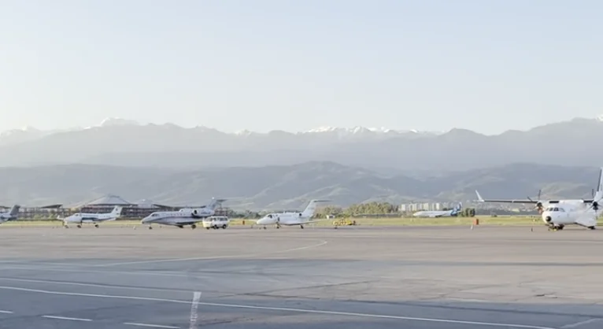
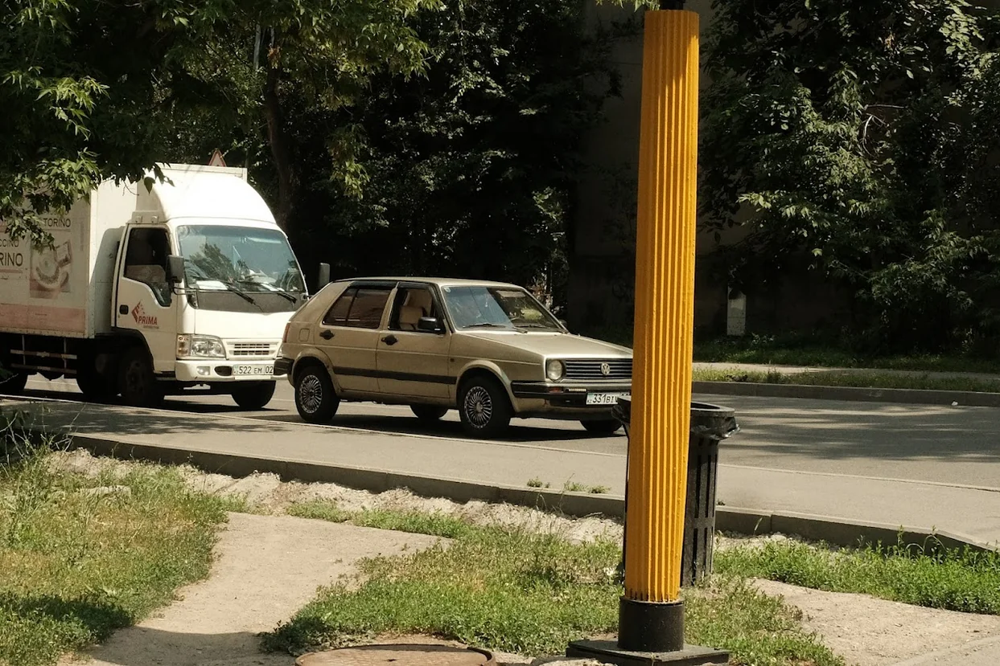
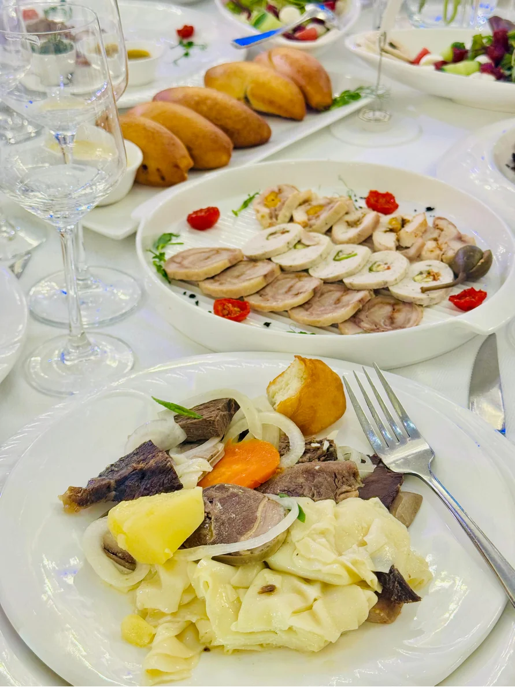
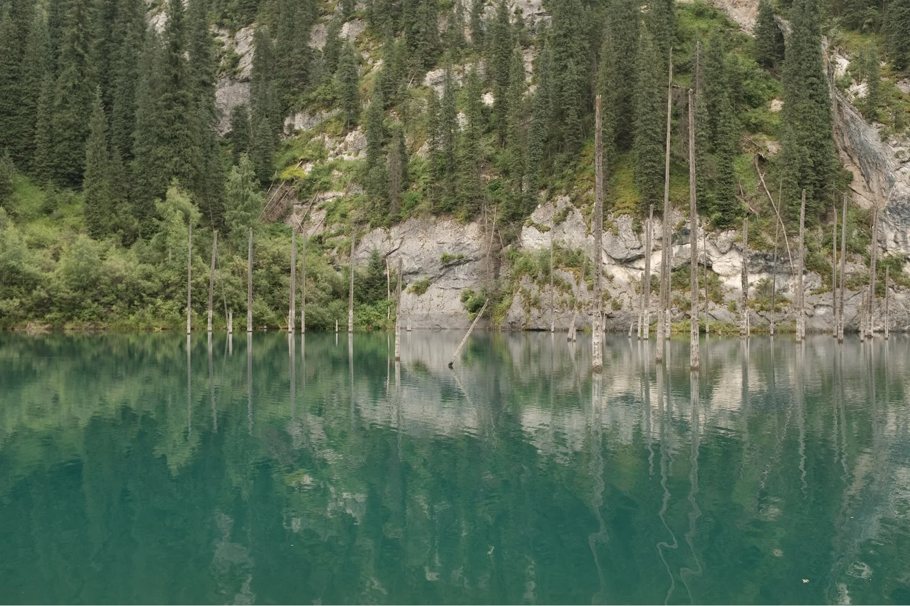
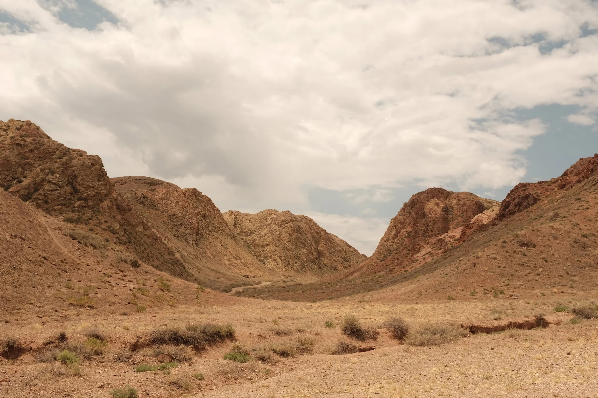
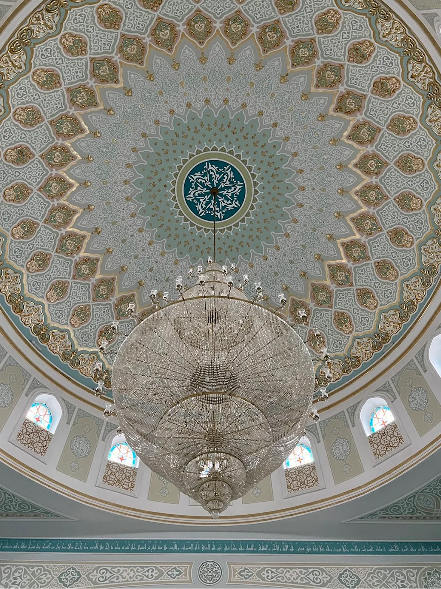
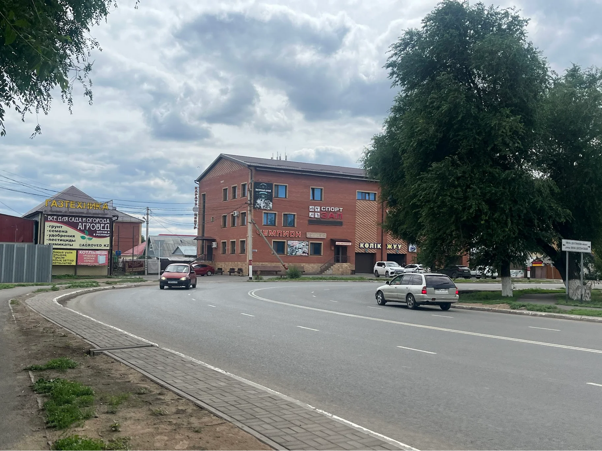
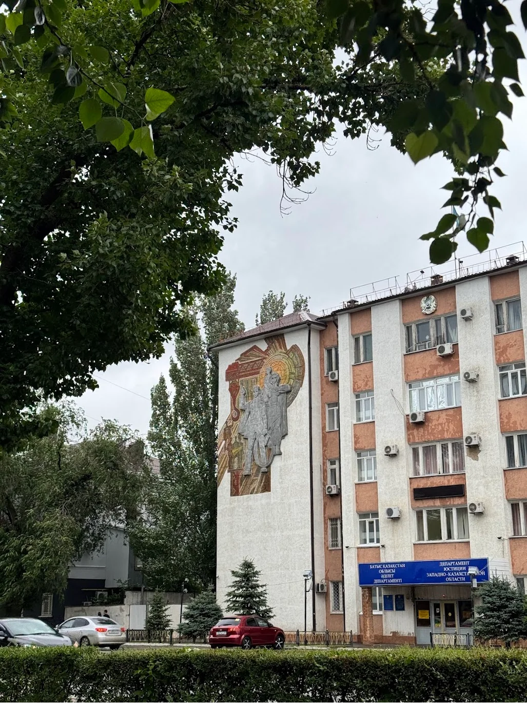
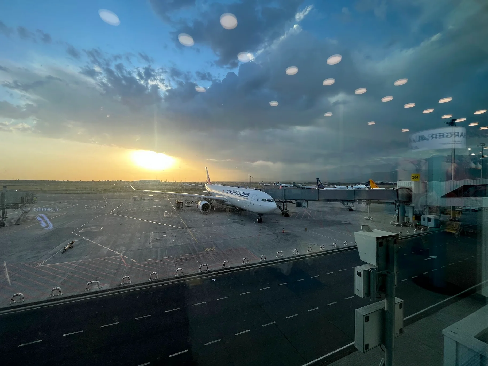

I had the most amazing opportunity to attend a friend's wedding in Kazakhstan in June of 2025. It was my first time traveling to Kazakhstan and attending a Kazakh wedding was cherry-on-top.

## Almaty

We flew from Delhi to Almaty via Air Astana. They run direct flights multiple times a week and the service was amazing, right up there with [Vistara](https://en.wikipedia.org/wiki/Vistara)(RIP). We landed at around 4 in the morning and it was a beautiful sunrise over the mountains surrounding the city, very similar to [Kathmandu](/posts/nepal-2022) airport. Our friend had arranged a cab to take us from the airport to his apartment in the city to get a few hours of sleep before we could officially check in to our Airbnb. We slept for a couple hours, and then our friends took us for a coffee and Kazakh bread. We then took a cab to our Airbnb and with some effort locating the rental unit amongst the Soviet-era residential colony, we finally checked in.

Almaty, at first glance, seemed to me to be a curious mix of old and new. This showed quite evidently in the city's buildings and its cars, and unquestionably and especially in the people. I later [read](/reading/kazakhstan-culture-smart) that many elder Kazakhs are still reeling from the aftermath of Soviet rule which is one of the many reasons for this amalgamation. Of course this is not special to Kazakhs and Kazakhstan, you see this happen in almost every country or group of people who share a similar history. Almaty has that big city energy but you take a right turn on one of the roads and you find yourself in a quiet neighborhood, pin-drop silence save for the occasional cackle of a small child who's out basking in the sun with her mother.

We had two days before the first wedding event, so we headed out into the city and explored the Almaty Botanical Gardens, various local eateries and nice cafes recommended by our Kazakh friends, multiple hospitals and clinics (courtesy [Raunaq](https://raunaqness.com/)), and the local Bazaar. We travelled extensively through the city on foot and via the cabs, which were affordable and quite accessible until you come across someone who spoke zero English and you have to get by using Google translate, which is fun in its own right. On the food front, I think we did a pretty good job. In Almaty itself, we tried Plov, Manti, Samsa, Doners, Baursak, Pelmeni, and many more Kazakh delicacies. If that wasn't enough, we had a _lot_ more the next day at the wedding, it was flavor overload.

The wedding day; I was extremely excited but had no idea what to expect and was wildly surprised. Both the bride and the groom's family throw a shindig in their respective hometowns. In Almaty, we were attending the first wedding event from the bride's side. Among many other highlights from the wedding, one thing etched into my mind and one that I routinely tell people whenever I'm discussing this topic, is the obligatory participation of EVERY SINGLE GUEST present there. This is unlike any other wedding I've attended--Hindu, Sikh, South Indian, Muslim, Christian, etc. You _have_ to participate in the wedding one way or another, and I think it's such a great way to make the special day so much more memorable and fun. It was simply amazing. The second most memorable thing was a "ritual" of having a karaoke session immediately after the wedding event has officially ended, that was a blast as well. Lastly, the whole affair was oddly punctual; the event started at the time it was mentioned in the invitation, breaks in between were crisply ~15 minutes, just enough for people to have a cigarette or two and a run to the toilet, dances were cordoned off right at the minute giving way to the next performance, and the whole thing ended at precisely the time it was supposed to. I had never experienced something like this before, it was quite an experience. All in all, there was an abundance of lavish Kazakh delicacies, quizzes, crazy dances, insane performances and a lot of speech-giving!

## Charyn Canyon, Kolsay & Kaindy Lake

In a week's time, the wedding event from the groom's side was supposed to take place in another part of the country. This meant we had some time to explore further, so all of the friends booked a two-day trip to the famous [Charyn Canyon](https://en.wikipedia.org/wiki/Charyn_Canyon), [Kolsay](https://en.wikipedia.org/wiki/Kolsai_Lakes) and [Kaindy](https://en.wikipedia.org/wiki/Kaindy_Lake) lake. We took a private bus from Almaty and headed straight to the lakes which were both a short hike to reach the lake and back. Both were pristine and beautiful, I'm not sure if the photos are doing justice.

We checked in to a local homestay, had some amazing local delicacies for dinner and then played a few different games late into the night before getting ready in the morning for the canyon. It has been a bucket-list item for me to visit the Grand Canyon someday, and so I was understandably awestruck at the "Grand Canyon of Central Asia" even though it was scorching. We went all the way _through_ the canyon to the Charyn river on the opposite end which sits proudly amongst these huge canyons serving fresh cold water to the parched tourists. On the way back to Almaty, we also stopped over to see the massive Black Canyons, had lunch nearby before continuing back to the city.

These two days were loaded. Apart from the major attractions I've already mentioned, I happened to try out dried Kazakh cheese called _Qurt_ that people simply snack on--pretty much the same as _Chugo_ from [Bhutan](/photos/bhutan-2025), we played a whole lot of Spyfall (we called it Spy) during the road journey, and ate more Plov along with many other more traditional Kazakh meals.

## Astana

The next day, we flew from Almaty to Astana, the official capital of Kazakhstan. Upon inquiring about the city, our friends explained to us that Astana consists mainly of modern architecture--buildings and infrastructure but, as a city, it lacks "soul", unlike Almaty. I sort of agreed to it for the most part. Astana felt like a carefully curated concrete-laden biosphere with the wide\[st] roads and some really fancy and interesting architecture. It barely had any trees, at least I didn't see any foliage in the area I was in and during the time I was there. In Astana, we visited the Grand Mosque, Baiterek, Dostyq Street, the local Bazaar, and Khan Shatyr. I was also working during this time, so quite a lot of time was spent in cafes and at the Airbnb. Astana was also where I finally realized that I have a Doner addiction; partial blame goes to the 24hr Doner store at the ground floor of our Airbnb building.

Astana really was a blur now that I think about it, but it was a good kind of blur. The two days we spent there felt "efficient", weirdly enough. I'd do some work in the first half, sightseeing in the second, and then dinner even later in the night. Nights in Astana were the most fun; quite a lot of shops were open, streets were reasonably busy considering how late it was, food was good, Doner was even better! That being said, I will find it hard to spend more days in Astana as a tourist, but perhaps if I was living there, I believe I'd quite like it.

## Uralsk

For our last stop, we took a flight to Uralsk, a city in the northwestern part of Kazakhstan close to the Russian border. This is where the second and final wedding event was going to take place. Our friend had arranged an apartment for us to spend 3 nights here. The apartment, as it turns out, was a classic soviet-style apartment and quite a fun experience. Later in the day, we stepped out in the streets and walked around the residential neighborhood, got some food and then roamed around in the rainy evening. For whatever little time we spent in Uralsk, it came across as a quaint little town with lovely people. I think everyone there was surprised to see Indians roaming around on the streets of their small town, so much so that they did _not_ hesitate to stop us to ask questions and get photos clicked! We even had the same experience with a lot of guests at the wedding, everyone was eager to know about where we came from and to take pictures with us, it was a whole lot of fun.

Which brings me to the wedding event from the groom's side. For what it's worth, the structure and the overall timeline of the event was more or less the same as the first one in Almaty, just that the majority of the guests and some of the performances were different. But it was equally fun, if not more! By the time we were done with the karaoke, the sun had started to show up. Naturally, the next day started at noon, and our friends were kind enough to show us around the town despite their extremely busy schedule, their favorite coffee shops, neighborhoods, cafes, shops, etc. We essentially walked through the town visiting a couple places before saying final goodbyes as most of them were heading back to Almaty now that the festivities had ended. It was an amazing past couple of days with all these superb folks. If any of you are reading this, just know that it was great meeting you all!

Our flight was not for another two days so we had time on our hands to explore more of Uralsk. Once parting with our friends, we explored the neighborhood further and came across a nice cafe. We met a presumably famous Soviet-era wrestler and his best friend there who were all too interested in knowing about India. We spent quite some time chatting with them over coffee and discussing virtually everything from trade, politics, and a myriad of topics I can't even recall at this point. Being situated up north, the sunsets in Uralsk are quite late, which inadvertently led to extremely late dinners. We found a 24hr [Chinese restaurant](https://maps.app.goo.gl/LZBufgCvNvLeydM79) which served scrumptious, mostly Chinese, meals that went really well with the crisp cold nights of Uralsk, that became our go-to dinner spot late at night. It's an odd experience having dinner at ~1AM and seeing families having a jolly good time over food that late into the night, with some families and diners still trickling in as the night went by.

The next day we did some souvenir shopping and cafe hopping. Later in the evening, as we headed back to our apartment, we got to talking with the cab driver who, at the end of the ride, promptly invited us to his restaurant for lunch tomorrow. This is one thing I will fondly remember about Uralsk, the people. Everyone we met there was super kind and extremely friendly. Our Kazakh friends were surprised when I put Uralsk at the top of the list compared to the other two cities we had visited. Astana and especially Almaty share much with other big cities where people walk fast, are always in a hurry, they seem to always have somewhere to go. And as tourists, it all feels doubly rushed because we're deliberately trying to be slow. But Uralsk was the same pace as us, if not slower. I had the most relaxed few days in the whole trip in Uralsk, no matter how much you tried, you couldn't rush. Maybe it was because it was not a touristy city and there was only so much to do but I think that's what worked for Uralsk. That being said, we were at a huge advantage given that our lodging and other logistics were taken care of by our hosts, but I would absolutely love to come back to this town.

Early next morning, we headed to Uralsk airport; we had a layover in Almaty before landing in Delhi.

## Closing

I started writing an extremely rough first draft of this post at the Almaty airport waiting for my flight back to Delhi with barely any sleep; no wonder this post is coming out almost a year after. To be completely honest, it would've been a long time before I visited Kazakhstan if it weren't for this wedding, and I'm so grateful for this opportunity. Kazakhstan was nothing like I had expected it to be. It was vast, people were extremely friendly and inquisitive! and the food was great! I still fondly recall the time I spent in Almaty and Uralsk, and long to go back soon. I met some great folks during this trip which was a cherry-on-top of an already memorable experience of attending a Kazakh wedding (құттықтаймын!).

