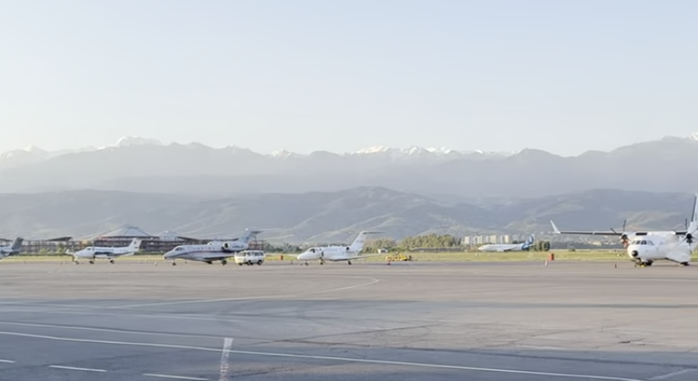
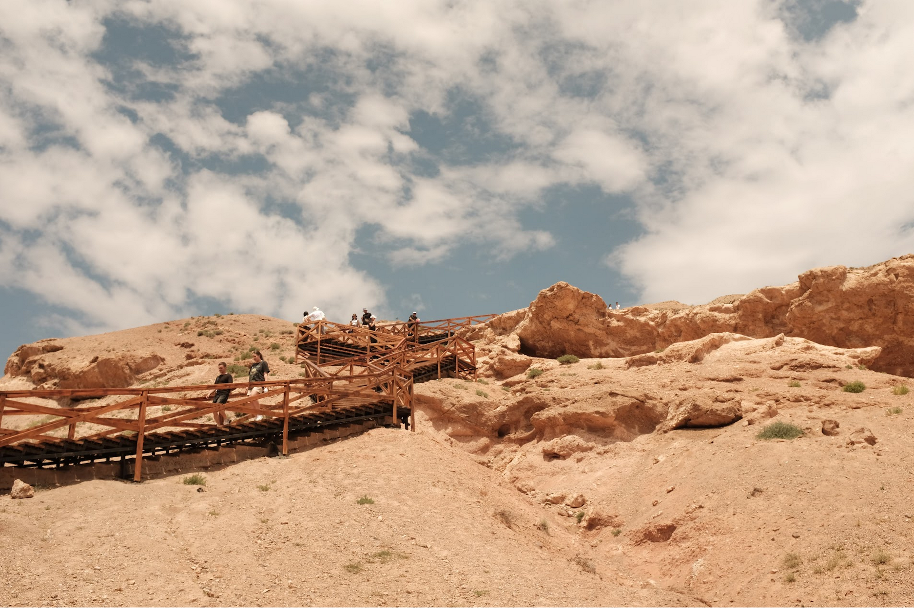
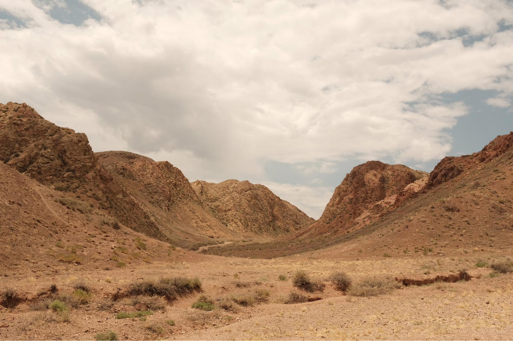
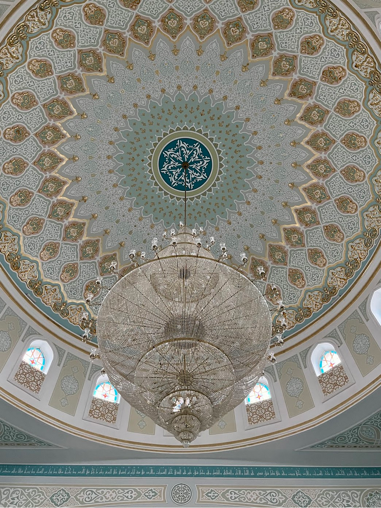
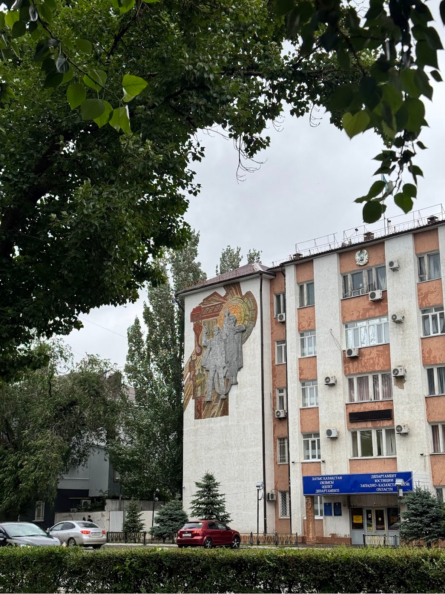

I had the most amazing opportunity to attend a friend's wedding in Kazakhstan in June of 2025. It was my first time traveling to Kazakhstan and attending a Kazakh wedding was cherry-on-top.

We flew from Delhi to Almaty via AirAstana. They run direct flights multiple times a week and the service was amazing, right up there with [Vistara](https://en.wikipedia.org/wiki/Vistara)(RIP). We landed at around 4 in the morning and it was a beautiful sunrise over the mountains surrounding the city, very similar to [Kathmandu](/posts/nepal-2022) airport. Our friend arranged a cab to take us from the airport to his apartment in the city to get a few hours of sleep before we can officially check-in to our Airbnb. We met up with the couple who took us for a coffee with some Kazakh bread which was super good. We then took a cab to our Airbnb and with some effort locating the rental unit amongst the Soviet-era residential colony, we finally checked-in.

Almaty, at first glance, seemed to me to be a curious mix of old and new. This showed quite evidently in the city's buildings and its cars, and unquestionably and especially in the people. I later [read](/reading/kazakhstan-culture-smart) that the older generation is still reeling from the aftermath of Soviet rule which is one of the many reasons for this difference. Of course this is not special to Kazakhs and Kazakhstan, you see this happen in almost every country or group of people who share a similar history.

We had two days before the wedding, so we headed out into the city and explored the Almaty Botanical Gardens, various local eateries and nice cafes recommended by our Kazak friends, multiple hospitals and clinics (courtesy [Raunaq](https://raunaqness.com/)), and the local bazaar. We travelled extensively through the city on foot and via the cabs, which were affordable and quite acessible until you come across someone who spoke zero english and you've to get by using Google translate, which is fun in its own right.

The wedding day; I was personally extremely excited to attend a Kazakh wedding. I had no idea what to expect and was wildly surprised. Among many other highglights from the wedding, one thing etched into my mind and one that I routinely tell people whenever I'm discussing this topic, is the obligatory participation of EVERY SINGLE GUEST present there. This is unlike any other wedding I've attended--Hindu, South Indian, Muslim, Christian, etc. You _have_ to participate in the wedding one way or another, and I think it's such a great way to make the special day so much more memorable and fun. It was simply amazing. The second most memorable thing was a "ritual" of having a karaoke session immediately after the wedding event has officially ended, that was a blast as well.

There were two more wedding events of equal importance in the coming weeks in a different city. After the wedding, all of us friends of the couple booked a two day trip to the famous Charyn Canyon, Kolsai and Kaindy lake. We took a private bus from Almaty and headed straight to the lakes which were a short hike to reach the lake and back. Both were pristine and beautiful, I'm not sure if the photos are indeed doing justice.

We checked-in to a local homestay, had some amazing local delicacies for dinner and then played a few different games late into the night before getting ready in the morning for the canyon. It has been a bucket-list item for me to visit the Grand Canyon someday, and so I was understandably awestruck at the "Grand Canyon of Central Asia" even though it was scorching. We went all the way through the canyones to the Charyn river on the opposite end which sits proudly amongst these huge canyons serving fresh cold water to the parched tourists. On the way back to Almaty, we also stopped over to see the collosal Black Canyons.

The next day, we flew from Almaty to Astana, the official capital of Kazakhstan. Upon inquiring, our friends explained to us that Astana consists mainly of modern architecture--buildings and infrastructure but, as a city, it lacks "soul" unlike Almaty. I sort of agreed to it for the most part, Astana felt like this carefully curated concrete-laden biosphere with the wide\[st] roads and some really fancy and interesting architecture. But it barely had any trees, at least I didn't see any foliage in the area during the time I was there. In Astana, we visited the great Mosque, Baiterek, Dostyq Street, the local Bazaar, and Khan Shatyr. I was also working during this time, so quite a lot of time was spent in cafes and in the Airbnb. Astana was also where I finally realized that I have a Doner addiction; partial blame goes to the 24hr Doner store at the ground floor of our Airnb building.

For our last stop, we took a flight to Uralsk, a city in the northwestern part of Kazakhstan close to the Russian border. This is where the second and final wedding event was going to take place. Our friend had arranged an apartment for us to spend 3 nights here, it was a classic soviet-style apartment and quite a fun experience. Later in the day, we stepped out in the streets and walked around the residential neighborhood, got some food and then roamed around in the rainy evening. Sunsets are quite late in Uralsk which inadvertently led to late dinners, we found a 24hr [Chinese restaurant](https://maps.app.goo.gl/LZBufgCvNvLeydM79) which served delicious food, that went well with the surprisingly chilly nights of Uralsk.

Uralsk is a small town, significantly smaller than both Almaty and Astana. Owing to this fact, almost everyone in Urlask was surprised to see Indians raoming the streets of their town, and they did not hesitate to stop us to ask questions and click photos! We had a similar experience with a lot of guests at the wedding, everyone was eager to know about where we came from and to take pictures with us, it was a lot of fun. The second wedding event followed the same format as the first, and was equally fun. It was followed by a karaoke before we called it quits.The next day we were shown around the neighborhood by our friends, we went to a couple of cafes, the mall, etc, before saying goodbye to everyone.

The next day we did some souvenir shopping and cafe hopping. Funny story; we met and chatted with a former wrestler at a local cafe; his friend later arranged for me a bag full of truffle products that his company manufactures, he still occasionally calls me to say hi.

// add the following bits

// about the trip to the local market we went to here

// the cab driver who invited us to his restaurant but we couldn't

// the spiderman on the street greeting us, wtf was that!

// closer on how Uralsk was so much warmer culturally than the other two cities while our friends were a bit concerned that we might feel otherwise

Early next morning, we headed to the airport; we had a layover in Almaty before landing in Delhi.

#### closing

I started writing an extremely rough first draft of this post at the Almaty airport waiting for my flight back to Delhi with barely any sleep; no wonder this post is coming out almost an year after. To be completely honest, It would've been a long time before I visited Kazakhstan if it weren't for this wedding, and I'm so grateful for this opportunity. Kazakhstan was nothing like I had expected it to be. It was vast, people were extremely friendly and inquisitive! and the food was great! I still fondly recall the time I spent in Almaty, and long to go back soon. For once, it's accessible and not too expensive compared to other destinations with the same accessibility. I also met some great folks during this trip which was a cherry-on-top of an already memorable experience of attending a Kazakh wedding.

