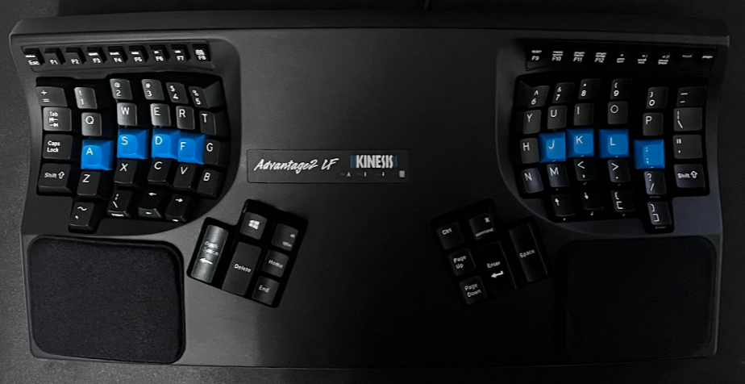
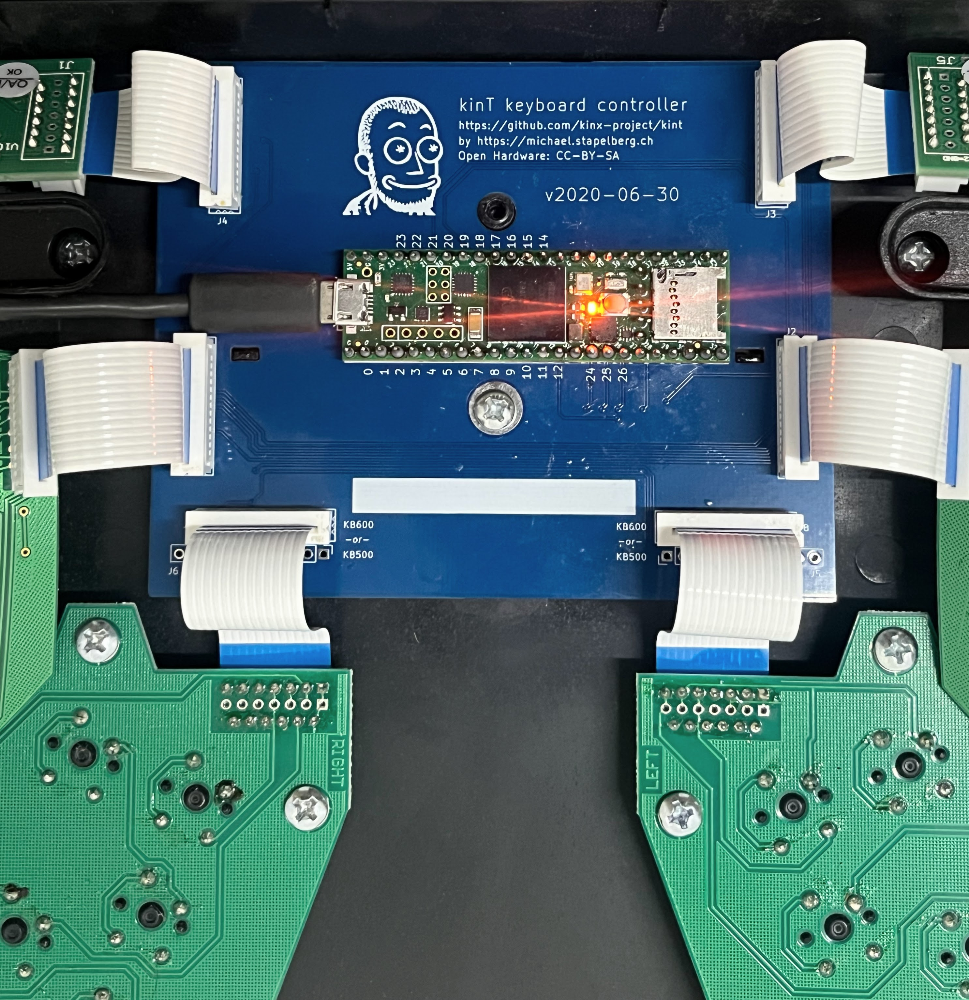

I bought a mechanical keyboard when I first started working remotely back in 2021. It was a Varmilo x Ducky 60% board and I quite enjoyed it, it was fun to write on a mechanical board with the linear red switches. But after roughly a year of using it, I started experiencing mild RSI. I did some "internet-research" and found that the ergonomic community was raving about split keyboards and I ended up zeroing in on the Kinesis Advantage2 (KA2). Primarily because it had been around for ages, and I was yet to read a bad review of this board.

I got the Kinesis Advantage2 Quiet LF (the Cherry MX Silent Linear Red version) from a friend of mine who was visiting the US. It's not cheap by any standards especially if you plan to have it shipped outside of the US from Kinesis themselves.

## First impressions
The keyboard felt extremely light and hollow which is a common sentiment amongst KA2 users. It is divided into two splits, the left and right wells, as they call it. These keywells allow you to keep your hands in a naturally rested position without any undue strain on your wrists. There are two thumb clusters that make use of your thumbs more efficiently, unlike traditional keyboards where both the thumbs tag team on the single long spacebar key. This allows you to quickly hit Return, Backspace or Modifier keys without moving your thumbs much. It's a great concept that is used in various different kinds of keyboards, some implementing it even more efficiently than Kinesis, the Glove80 for instance.

The keyboard is also tented at 20 degrees allowing a more comfortable and natural position for your arms to rest. There are two wrist pads provided but I have since stopped using them. The keyboard connects to your device via a USB-A connection and connects directly to the controller inside the keyboard. You get a few replacement keycaps and a keycap puller alongside.

## Onboarding
The first two days were brutal. I was down to 30 WPM from ~100 but it was extremely frustrating though I knew it would get easier, and so I stuck to it. I was back to 80 WPM by the end of the first week and completely at home by the end of the second week with 100 WPM. Moving to a split keyboard meant getting used to a new way to use modifier keys. I had to move my frequently used workspaces to the left well numeric keys of the keyboard allowing me to switch the workspaces with only the left hand--I had also remapped the modifier key to be on the left thumb cluster.

It was a bit jarring to hit the parentheses and tilde characters that were ever so inconveniently placed at bottom left and right corners of the keywells respectively. My pinky finger still struggles at times to press them as part of a long sentence or statement that I'm writing, forcing me to pause and take a note of where the key is and whether I'm hitting the right key or not.

By the third week, I was hitting typing PRs. I did 121 WPM with 100% accuracy. This, however, might not be representative of whether the KA2 helped in increasing both my typing speed and accuracy. I believe it was purely because I was trying out the new keyboard, I was more inclined to do typing tests more often throughout the first few weeks. Had I been doing them regularly over the years, I would've achieved these results even on an older board. But that being said, I can confidently say that typing was extremely comfortable on the KA2 compared to my older boards and the one on my Lenovo ThinkPad.

## Programming the keyboard
The KA2 doesn't support QMK for programming, it ships with SmartSet. You can remap keys, define macros and have it configured and stored on the keyboard itself. It's more than enough for daily use, and I've been using the following [config](https://github.com/danishprakash/dotfiles/blob/master/kinesis) for the past 2 years:

```
...snip

[escape]>[lctrl]
[caps]>[rctrl]
[kp-V]>[cbrack]
[kp-C]>[obrack]
[kp-right]>[kpshift]
[lctrl]>[escape]
[delete]>[rwin]
[bspace]>[enter]
[rctrl]>[rwin]
[enter]>[bspace]
[rwin]>[enter]
[pup]>[delete]

...snap
```

Notable changes include:

1. Remapping Caps Lock to RCtrl, that's one mapping I do on every system and keyboard regardless. It allows me to hit escape in vim (and in applications with vim bindings) quickly with (Ctrl+[) and often acts as a secondary modifier key for a lot of programs I use e.g. Firefox, Obsidian, Slack, Spotify, etc.
2. I swapped around the keys in the thumb clusters as well eg. Backspace <> Enter. This was purely subjective, I just found it easier and more intuitive to hit Enter with my left thumb rather than my right, YMMV.
3. Activate keypad layer and use HJKL as arrow keys. Since the arrow keys on the board are integrated in the bottom-most layer, it helps to move around while keeping my right hand on the home row.

It took me a while before I arrived at the above configuration which has served me well so far. Clearly, I wish it had QMK support so I can go a step beyond what SmartSet allows.

## Long-term experience
I've been using this keyboard almost exclusively for the past two years at the time of writing this article and so I think it's a good enough time to evaluate on some aspects of this keyboard. I've seen quite a few reviews when I was planning to purchase this keyboard that reviewed the keyboard in just 3-6 months of usage and I feel that's not enough time, so here goes.

#### RSI and comfort
For starters, I've not had any strain related issues so far. If anything, it has gotten more comfortable as I slowly got used to the split and keywell layout. I know it's not for everyone, and in fact, there might be better and slightly cheaper options available but I think I'm settled with this keyboard for the foreseeable future. So much so that I'm thinking of getting a secondary backup board in the unfortunate scenario where my primary board dies, more on that later.

#### Build quality/durability
As I mentioned earlier in the article, the board when I first held it, felt extremely light and hollow. Anybody I show this board to has the same reaction. But it hasn't really been a bother when it comes to using the board. Sure, the hollow sound feels cheap and flimsy but there are workarounds for that which we'll discuss shortly.

I also haven't dropped it or banged it against something yet to tell you how sturdy it is but I've seen people using this keyboard for 10-20 years so I guess it's sturdy enough.

#### Portability
This keyboard is _not_ meant for travelling. There are cases available somewhere and people do carry it around but it's simply not meant for that. Even though it's light, the keyboard itself is huge enough to be a nuisance to carry around. I've never traveled with this keyboard, never intended to in the first place and probably never will. I'm more than happy if I get to spend 80% of my time with this keyboard, and manage the rest 20% with the laptop keyboard whenever I'm traveling.

I was afraid I won't be able to use the standard keyboard at all after switching to a split, but that's not the case. It's like riding a bicycle, even after a long hiatus, the older standard keyboard layout just clicks, and you're good to go. As I said, that doesn't mean I would switch completely to a standard keyboard layout.

#### Price value
For me personally, the keyboard is value for money, even after considering the cost of getting it to India. If your job relies on you typing and your standard keyboard is giving you wrist issues, it might be worth giving a split keyboard a shot. It's a shame that it's not possible to try such keyboards before you can buy them, because that'd be a lot more convincing for a lot of folks who are on the fence about buying a split keyboard.

## Modding: KinT and QMK
Sometime at the end of the two year mark, I started experiencing ghost typing with my KA2. At random, it would enter a barrage of seemingly random characters at lightning speed, rendering the keyboard useless. I couldn't type or do anything, and would scramble around to save the work I was doing, or at times, prevent the sentient keyboard from sending messages to my work Slack on my behalf.

I reached out to Kinesis and they suggested a few troubleshooting steps. I tried thoroughly cleaning the board inside out, resetting it, and reseating the ribbon connectors connecting the keywells and function layers to the main controller, but all in vain. It was concluded that the motherboard was at fault and changing it would cost me upwards of $150 excluding shipping and RMA costs. I had earlier known about the [KinT](https://github.com/kinx-project/kint) mod by [Michael Stapelberg](https://michael.stapelberg.ch/) for the KA2. It's an open source replacement board for the KA2. I quickly did some napkin math to confirm that the cost of all the parts needed to mod my KA2 with the KinT mod would be slightly cheaper than getting a new motherboard from Kinesis. It was also the week SUSE held its annual [hackweek](https://hackweek.opensuse.org/), so the timing was just right.

#### KinT
I purchased all the required parts mentioned in the project BoM, and soldered them onto the PCB. It had been a while since I had done soldering, so while I was able to solder the majority of the board (MOLEX, etc.), I had to take a little bit of help to solder the Teensy microcontroller onto the PCB. I inserted the new controller into the keyboard, and after a little bit of resoldering, tightening the screws and reseating ribbon connectors for the umpteenth time, I managed to flash QMK on the Teensy and voila! I've been using the keyboard with the new controller for roughly 2 days and haven't had any ghosting issues yet.



#### QMK

The KinT project uses QMK as the firmware of choice. I had heard about QMK and the amount of flexibility it allows when it comes to configuring your keyboard. I was quickly able to recreate my Kinesis [SmartSet configuration](https://github.com/danishprakash/dotfiles/tree/master/kinesis) remappings into QMK-supported configuration. QMK supports quite a few super nifty features such as Mod-taps, Tap dance, HRMs, and key combos. Looking forward to trying some of these soon.

I'm extremely happy with the mod. I would never have attempted it if the original board hadn't gone bust. I'm glad it did. My second backup board would also see this mod as soon as I get my hands on it, the QMK support alone is worth it.

## Challenges & Future improvements
Even though this keyboard is perfect (for me), there are still challenges that I've faced with it and improvements I wished it had.

#### Support
If you're based outside of the US, getting this keyboard fixed would cost a fortune. I was bit by this problem and it wasn't as easy dealing with it compared to other keyboards I've held in the past. From what I've read and heard, support is not a problem in the US where Kinesis takes care of everything for you if your board is still under warranty. Even if it is not, getting the parts and paying Kinesis for the RMA would still come out cheaper and reasonably affordable imo.

#### Switches
As much as I like the linearity of the Cherry MX Silent Red switches, I don't like how they sound at all. In the past I've tried Cherry MX Browns but while they sound decent, the actuation force on them isn't for me. I might experiment with Gateron Reds or even a clicky switch. The KA2 doesn't have hot swappable switches and from what I gather it uses diodes for the switches, so it might not be as easy as other keyboards. Unfortunately this also means not being able to experiment much, if only there was a hotswappable mod for the KA2.

At the same time, I also plan to add some weight and dampening to the board. It's an easy hack that would help improve the sound profile of the keyboard.

#### Keycaps
I have remapped most of the modifier keys and have been touch typing for as long as I remember, so I don't see the point of having printed keycaps, they're just a distraction at this point, and besides, blank keycaps look good. Apart from the blank keycap set from Kinesis, the DSA profiles fit almost perfectly, so that might be the next best option. Though I am a little worried about what happens when I clean the keyboard by taking the keycaps out at some point in time.

#### Bluetooth Mod
I like a clean table and have pondered about modding the KA2 with the amazing [bluetooth mod](https://github.com/dcpedit/pillzmod). It can perhaps make for another post detailing the procedure.

## Closing
I've been meaning to write this post for some time but the recent issues with the board, and the subsequent revival excited me enough to finally write it. My experience so far with the Kinesis Advantage2 has been great, it's the most comfortable keyboard I've used and I wish to write more about it, perhaps after hitting another milestone.

:wq