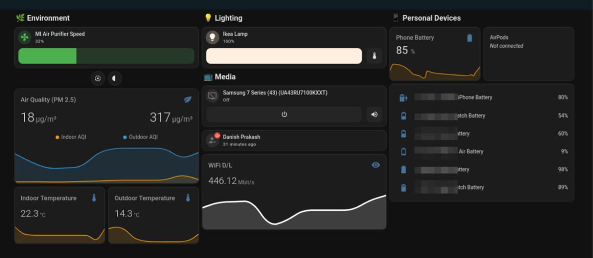

I never quite had the motivation or need to self-host anything really. Once I got comfortable paying for software, I never looked back, until very recently, that is. The trigger was [Audible](https://www.audible.in/). I got hooked onto Audiobooks again recently and honestly quite enjoyed Audible for the longest time. But then whenever I would travel or was busy for extended periods of time when I didn't have time to listen to audiobook, those monthly payments started stinging. I was paying for something I wasn't using. Sure, I tried pausing the membership every once in a while in the past few years and it was an overhead.

So I did searching around on the internet and found out about [Audiobookshelf (ABS)](https://audiobookshelf.org/), a self-hosted Audiobook server, much like Plex but tailor-made for audiobooks. I promptly also found out about a couple of mobile clients that I could use on my phone because that's how I normally listen to audiobooks. And that was it, I did some quick math to convince me that it's the right time to setup the coveted "homelab".

## Infrastructure

You must've noticed that the title of the post doesn't have the term "homelab" in it. Once I was confident I wanted to use ABS, the first thing I did was to look for hardware. I knew of mini PCs and thin clients from friends, colleagues and from the internet but I could neither find a trusted vendor nor a hardware configuration that I thought would work for a first-time homelabber like me. I parked aside the idea of self-hosting thinking that unless or until I have the hardware, the whole thing is moot. Fast forward to a couple weeks when I realized I could simply get a VPS that would do the job _until_ I find myself the hardware I desired.

So as things stand now, I don't really have a homelab but I do have a self-hosted setup and that's what we're going to talk about here. This naturally means there would be little to no hardware talk but I'll talk a bit more about the technical details and background information about the services I'm self-hosting.

A high-level topology looks something like the following:

```
                         Tailscale Mesh
                              │
                ┌─────────────┴─────────────┐
                │                           │
        ┌───────▼───────┐           ┌───────▼─────────┐
        │    ThinkPad   │           │   VPS (Hetzner) │
        ├───────────────┤           ├─────────────────┤
        │     Podman    │           │      Podman     │
        ├───────────────┤           ├─────────────────┤
        │ HomeAssistant │           │      Caddy      │
        └───────────────┘           ├─────────────────┤
                                    │ Audiobookshelf  │
                                    │ ActualBudget    │
                                    │ Grimmory        │
                                    │ Paperless       │
                                    └─────────────────┘
```

### Tailscale

Tailscale provides a private mesh VPN for all my devices to communicate securely. It's built on top of WireGuard. In simpler words, I can communicate between all my different devices securely over the internet. Tailscale hands you a unique IP for each of your devices. I've then used Cloudflare to map my subdomains to these IPs so each device gets its own subdomain and others can connect to it. I found it to be an extremely convenient tool especially if you have multiple devices talking to each other. This way my phone connected to the tailscale network can access services in my VPS with no additional hassle.

As shown in the diagram above, all my devices (my phone and Kindle not shown here) are on the Tailscale mesh, therefore all my self-hosted services are also behind Tailscale. This adds a layer of security while making intra-device and service communication convenient.

### ThinkPad

This is my old work laptop that I bought off the company, it has a dead battery and I fire it up sometimes to run podman-remote jobs or a remote VM for testing. I had also setup HomeAssistant on it but I have problems with running it on AC so it's not an active member of my self-hosted ecosystem. I plan to find a solution to have it running on low power for longer periods if I find it feasible.

Long term idea is to get rid of this and find a smaller more portable and power-efficient hardware to run HomeAssistant and services like PiHole which runs on the local network. But given the hardware pricing at present, I think it'll be a while before I replace this hunk of a machine.

### Hetzner

This is where all my services are hosted. The VPS vendor was pretty much obvious. I had heard a lot about Hetzner and how they conduct their business ethically and their somewhat reasonable pricing (aging like milk unfortunately). So I quickly provisioned a machine off [Hetzner](https://www.hetzner.com/) with more than enough memory and storage to run multiple applications even though I had only ABS in mind at the moment. My VPS config:

```
4vCPU
8GB RAM
80GB Local Disk
€6.49/mo
```

### Podman

I run all my services as containers via systemd. I use [Podman Quadlets](https://docs.podman.io/en/v6.1.0/markdown/podman-quadlet.1.html) to generate systemd unit files from container configuration files. Systemd will then handle the services for you while podman takes care of handling the container lifecycle. It might seem a bit too much but it takes very little effort to set it all up properly once.

The configuration files that are consumed by podman quadlets are declarative, so this means the entirety of my self-hosted setup can be tracked in git and hosted on a hosting tool of your choice. I have a private GitHub repo that houses the state of my self-hosted lab. This makes it easier to update and recreate services, as we shall see in a later section.

### Caddy

Lastly, Caddy is used as a reverse proxy that forwards the subdomain matches to the localhost ports of the respective containers. I like Caddy over others because it's easy to configure and is even easier to setup.

## Applications

That was mostly all I had to share Infrastructure-wise, let's talk briefly about the services I'm currently self-hosting and why.

### Audiobookshelf

An audiobook and podcast server that simply does the job. As I said earlier in this post, it was [Audiobookshelf](https://audiobookshelf.org/) that set me off on the self-hosted journey. It's a great solution for all my audiobook needs. There are numerous mobile clients available for you to use with Audiobookshelf, I'm currently using [Audiobooth](https://github.com/AudioBooth/AudioBooth). It's a great app, is free and open source. It handles audiobooks with great ease, has decent listening and library stats and comes with metadata editing tool that makes the whole experience a tad bit more pleasant. I use it almost everyday and I haven't had a problem yet.

As good an application Audiobookshelf itself is, it gave me the confidence that self-hosted apps are equally good, if not better, alternatives to their proprietary and paid counterparts. This also led me to search for self-hosted alternatives to many of the other apps I rely on a daily basis.

### ActualBudget

A budgeting tool that's extremely fast and capable. I recently wrote about [budgeting](/posts/on-budgeting) and in the post, I talked extensively about YNAB, a budgeting tool that I've been using for the past 6 years. Lately though, the team behind YNAB started making changes that were more non-functional in nature and at the same time, they increased the subscription manifolds in the past few years. The most recent UI change was the final nail in the coffin and I spent a few hours setting up ActualBudget and [migrating](https://actualbudget.org/docs/migration/) all my YNAB data to it.

ActualBudget surpassed my expectations in many ways. First, it's essentially free considering I already was paying for my VPS. This means I was dropping a hefty (albeit valuable hitherto) annual YNAB membership which was more than what I'm paying for my VPS. Secondly, ActualBudget is fast, customizable, and quite capable in terms of the features it offers. I've already recommended it to friends who've been using YNAB nudging them to also jump ship. I've written at length about [how I budget and my thoughts around budgeting](/posts/on-budgeting) in case you're interested.

### Paperless-ngx

A document management system. I'm a hoarder, especially when it comes to documents and images. For the longest time I collected all the documents in my Google Drive but it was cumbersome to search for them and quite annoying to scan and upload them. It also didn't help when Microsoft discontinued Office Lens, which was one of the best PDF scanning apps available without any fluff. So I was on the lookout for a good document scanning app and a document management app both. Much to my surprise, just this one app solved both of these problems for me.

I found [Paperless](https://docs.paperless-ngx.com/) when I was trying to find services I could self-host now that I was paying for a VPS. It has an amazing [mobile app](https://github.com/paulgessinger/swift-paperless) which is my primary mode of scanning and storing documents. The webapp is convenient to quickly search through all the documents either via tags or my preferred way of doing a fuzzy search of the document's contents. I rely on it heavily for all things document-related.

### Grimmory (formerly Booklore)

Grimmory is an eBook management software. It's a fork of Booklore before Booklore was shut down after the [controversy](https://www.notebookcheck.net/Booklore-The-Plex-of-self-hosted-e-book-libraries-sparks-licensing-controversy-and-community-backlash.1287933.0.html) surrounding its AI usage and policy.

The reason I set up Grimmory in the first place was to have a bird's eye view of my eBook library. I [read](/reading) quite extensively on my Kindle and before I jailbroke it, I was using [Calibre](https://calibre-ebook.com) to manage and sideload eBooks onto my Kindle from my laptop. But after jailbreaking my Kindle, I realized I could use OPDS to download books from an eBook management server of my own. That led me to Grimmory and I've used it ever since. But the app still needs polishing (functionality-wise), there are few rough edges around the core features that I hope would be fixed in future releases under the new ownership.

Grimmory also supports physical books but I haven't managed to import or add my physical books onto Grimmory yet but I plan to. The library stats feature is quite nifty and I plan to use it along with Audiobookshelf's listening stats to complement my [Year in Review](/posts/year-in-review-2025) posts.

### HomeAssistant

Air pollution is a problem in Delhi especially during winters and I wanted a way to track it. That was the primary reason I set HA up. I was able to hook my Mi Air Purifier into HA, and along with it, I added lighting and some read-only metrics. I also had some basic automations set up which would turn off or reduce the speed of my air purifier if the AQI in my area is below a certain threshold. Or it would light up the room shortly after sunrise, or notify me if one of my devices is running low on battery. I would also frequently use it to turn on the lights in my house and the air purifier on full blast 3-4 minutes before I'm supposed to reach my home.



Unfortunately, as I mentioned previously, the ThinkPad has trouble booting on AC and sometimes dies if there's a power failure or if I'm not home and so I have not really used this for the time being (it also helps that the AQI has been good past couple of months so I'm not using my air purifier either) but I need to figure something out soon because winter is around the corner, and so is pollution season.

### Deprecated Services

Over the past few months, I tried a few self-hosted apps, initially due to the newfound enthusiasm and freedom to try out apps, but realized later that they don't fit my needs:

1. [Linkding](https://github.com/sissbruecker/linkding) - A bookmark service that I didn't quite find intuitive enough to use regularly. For starters, adding a new bookmark was clunky and search wasn't all that great either. But at the same time, I'm also not quite sure what I really want from a bookmark manager so there's that. Next, I'll be trying out [Karakeep](https://karakeep.app/) after having read this [post](https://mrkaran.dev/posts/karakeep-kindle/).
2. [Donetick](https://github.com/donetick/donetick) - I quit paying for Todoist after 5 years of using it and was looking for a change. Donetick looked promising but the mobile app is very rudimentary so I had to stop using this altogether. It's still promising and I would definitely come back to this in the future.
3. [Dreeve](https://github.com/dreeveapp/dreeve) - Open source dashboard for primarily Strava. I quite liked the idea being a data nerd but then Strava paywalled their API and I didn't want to pay a premium to Strava in order to access my own data and had to unfortunately drop this as well.

Those are all the applications I'm using or have used. Clearly this is a living list and I _hope_ to update this in the future.

## Backup & Upgrades

### Backup

When it comes to backups, I'm mostly concerned with the documents that are stored in the paperless database. For the first few weeks, I had a cron restic trigger with my Thinkpad as the target. I've since then setup a Backblaze B2 bucket as another restic target. The storage grows linearly since most of the artifacts are simply documents and books. So I'm okay with the associated costs of this backup strategy.

### Upgrades

For updating the individual services, it's pretty straightforward since I'm running all the services as podman containers, all I really need to modify in the git repo is the container image tag. For this, I've setup renovatebot on the GitHub repo where I store all the quadlet files. So every time a new container image of a version is released upstream, renovate raises a PR and I can choose to simply accept it. Once I merge the PR(s), I can pull the latest changes on my VPS and redeploy the services:

```
git pull
systemctl --user daemon-reload
systemctl --user restart [services...]
```

I also had an LLM agent put together a bash script that simply does all the bootstrapping that is required, for instance installing the necessary packages and creating the required symlinks, etc. This makes it quick and easy to recreate the whole setup whenever I have to.

## Closing Notes

This is a simple setup that caters to my needs while being extensible enough for me to allow trying out new services and removing them with as little operational overhead required with no additional cost. I use most of the services almost everyday and I feel that in itself has broken even the cost of the VPS that I've been paying monthly. I can very well see myself moving everything to a homelab in the future if the circumstances are right but until then, the current setup works perfectly fine.

I'd be remiss if I didn't mention how useful AI has been for me in this effort. It has greatly reduced the barrier to entry purely in terms of time and effort required, let alone the skills. Sure, a lot of folks do self-hosting and homelabbing for the fun of it. That was partly the reason for me but as I said in the beginning of the post, the trigger for me was finding a cheaper and functional Audible alternative and if it weren't for an LLM agent helping me bootstrap the configurations, setup script, etc, I might have delayed self-hosting Audiobookshelf by a few weeks if not months depending on how busy I am. It's surreal how quickly and easily you can go from 0-40 before taking the wheel, that takes away most of the activation cost, and it's quite rewarding.
