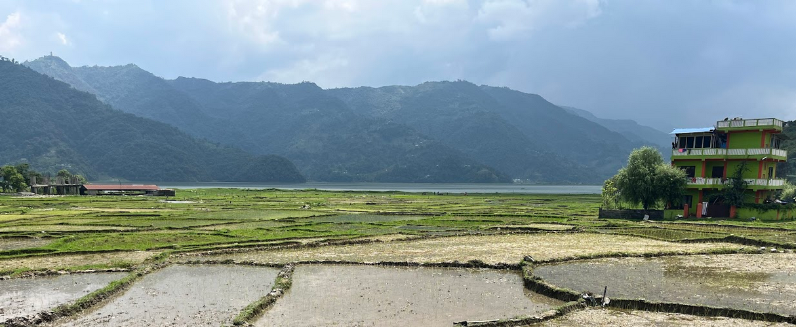
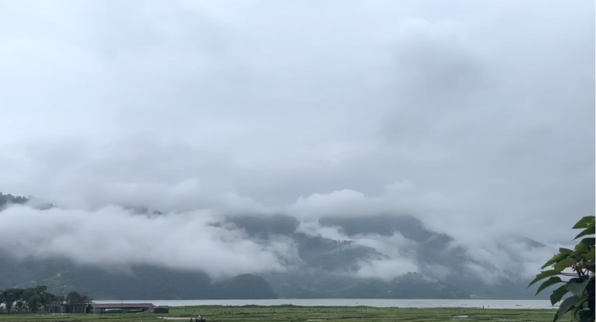
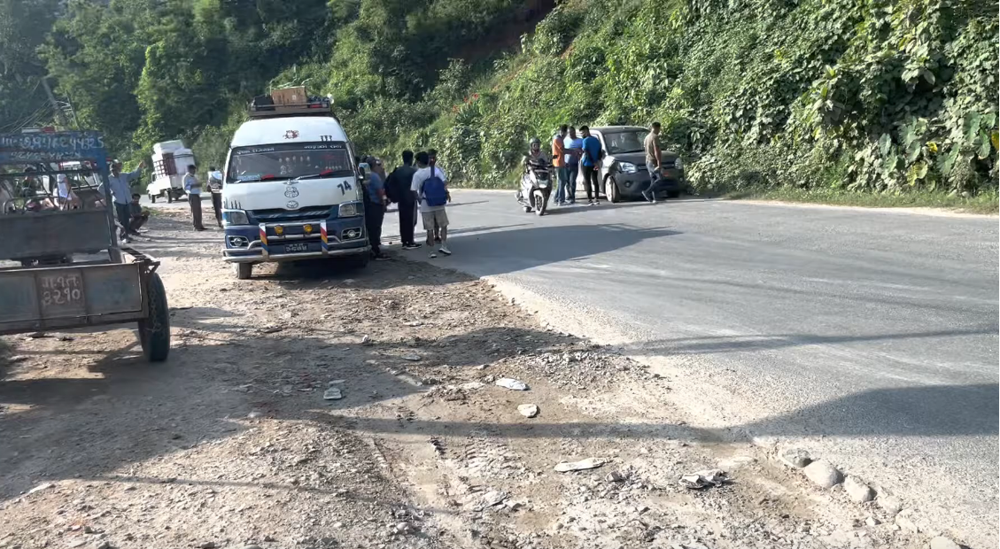

This is a post-dated post about my experience travelling across Nepal in the summer of 2022. It's a typical travelogue, sharing much in similarities to the ones I've written in the past.

Flew from New Delhi to Kathmandu, it was a relatively smoother ride. We got some good mountain views as we approached Kathmandu. You get out of the airport and it's breath of fresh air--quite literally--fortified on one side by the lush green mountains compared to that of Delhi's smoggy skyline surrounding its airport. Immediately outside the airport, we got into a haggling match with a cab driver who then took us to our hostel.

### kathmandu -> pokhara

First impressions of the city weren't much different from that of let's say Delhi or any other dense Indian city. The roads were narrow, cars smaller, people everywhere. We reached our hostel and then headed out for dinner in the evening. This is where I had the best momos I've had in life, jhol momos. A soupy delicacy that I just couldn't get enough of during the whole trip. We made efforts to try the different kinds of Jhol momos at every place we found them at.

Our plan was to go to Pokhara first and then come back to explore Kathmandu. So the next morning, we went to the airport. Bought the tickets from the airport as if it was a bus depot—replete with passengers scrambling around to buy tickets, barely any security, extremely delayed flights and virtually no organisation whatsoever. The regional airport was as barebones as it could possibly be. Finally, after the usual airport process, I took one of the most scariest flights I have ever taken in life. Aboard the Yeti Airways YT-677 (ATR-72 IIRC), everybody excluding the locals held their breath as the pilot did dangerous maneuvers before finally hard landing us at Pokhara airport. It was intense. The airport was a relic in itself, you deboard the plane and you huddle together in a small shed close to the aircraft, collect your bags and take the taxi, all within roughly 500m.

You can see the airplane right in front, a stone's throw away from the "airport". Just behind me is the taxi stand, so in a way this was the quickest deboard-to-taxi experience I had but it was also arguably the most terrifying flight experiences I've ever had so far. Not more than 6 months from when I took this flight, a [plane crashed](https://en.wikipedia.org/wiki/Yeti_Airlines_Flight_691) at the same route before landing at Pokhara from Kathmandu, reading about that crash gave me chills.

### pokhara
After some haggling, we too a cab to our Hostel. Pokhara stood in stark contrast to the chaotic Kathmandu, people seemed relatively relaxed, pace was slow, roads were relatively empty and the air was fresh. Our hostel was close to the Phewa lake with paddy farming around our premises looking onto the Phewa lake. It's funny how I'm able to recall how I exactly felt at the place looking at the picture below roughly 3 years later. The chill early morning breeze, the sound of the hills further out back, and the stillness of the water. It somewhat resembled the slow life Thoreau came around to appreciate while living next to [Walden](/reading/walden), you could spend your day looking out the window, or sitting by the lake and that would still constitute a day well spent. Which seems a bit hard to comprehend nowadays where there's a risk of being chastised if even a single minute of your day goes by unproductive.

Guzzled down a traditional Nepalese lunch along with their local wine--[Raksi](https://en.wikipedia.org/wiki/Raksi)--and then took the local bus to Baidam Road, downtown Pokhara. The area lined up with fancy cafes, souvenier shops and shops offering adventure sports to the visitors of Pokhara made it a pleasant walking and shopping street where all the action in Pokhara happened. We had planned to do a mountain bike tour in the hills surrounding the Phewa lake. After getting our bikes, and the relevant equipment, we took off for the route, and as luck would have it, the weather turned cloudy sparing us the wrath of the summer sun.

We [biked](https://strava.app.link/mMTsiGqOKRb) on the road that ran alongside the lake till we reached the foothills and then meandered into the forest. The route was a mix of passing through complete wilderness--not untrodden, there was a clear trail but nobody around for the most part--and then passing through local houses and shops. We were trying to time our return but it so happened that it got dark and we were lost. If it weren't for that ex-armymen who was out cycling that same route as his daily routine, I might've much more gory details to write about. But then we returned the bikes, had dinner on Baidam Road, did some shopping, and returned to our hostel.

Woke up the next morning amidst the clouds, it was nothing short of magical, so we tried to capture the perfect shot of the cloudy hills with the Phewa Lake in front, but in vain. But it was the perfect weather, and it rained shortly afterwards which was expected. We had planned to do sightseeing today, so we hopped on the local bus again, deboarded on Baidam Road and rented a scooty.

We headed to Devi's Fall and Gupteshware Mahadev Cave first. It was raining through and through the whole time but that did not deter the crowds. The rains at least allowed us to take some photographs with slightly higher saturation.

We then headed further up to World Peace Pagoda, it was extremeley serene. The only "noise" was the raindrops sputterning around on the cold marble floor. Part of the charm was it was built at a high altitude lending to the cooler and pleasant climate, and partly because the place itself was quite and well maintained.

While riding back to the town, we got caught by the traffic police. The person we rented the scooty from specifically said Indian driving licenses are valid in Nepal and it said something similar on the internet too. But the policemen was adamant and just wouldn't let go. He kept the registration certificate of the vehicle with him and asked us to tell the owner to collect it himself. Upon reaching the rental place, we got into a huge altercation (verbal) and after paying him for the "damages", we were on our way, on foot back to Baidam Road.

Putting that single bad experience with the locals aside, we went to this place for dinner by the Phewa Lake--everything happens around Phewa Lake in Pokhara--that had good food, a good environment and live local live music. That was the end of our time in Pokhara, a city I would love to come back to to spend some quality time but by road and not by flight...or so I thought.

The next day as we checked out of the hostel, the adventure sports shop guy called us and asked us whether we want to partake in paragliding. So next thing we know, we were in a cab hailing us from Baidam Road to the top of a hill.

### pokhara -> kathmandu
The paragliding was a good experience overall but it also meant we were late for the last flight out of Pokhara for the day. We did squander around the airport trying to see if another flight would be scheduled but nope. The next best option was to take a local cab from right outisde the airport to Kathmandu. 

So we hopped onto the most normal looking cab and took our seats at the back. It was a 6-seater cab, but the resourceful cabbies loaded upto 10-12 people inside the cab. It was packed to the brim with adults, kids, and lots of luggage. We weren't feeling so good and as luck would have it, a local doctor was also sitting next to us. He slipped us some tablets that he said were for headache. And next thing I personally remember is getting off in Kathmandu at midnight. I was dazed (and later confused) through the whole journey. It was only later that I came to know that the journey was arduous thanks to the terrible roads and that we even had an accident on the way which caused such a delay. Bottomline, there's no good way to travel between Kathmandu and Pokhara, unless of course you're driving on your own.

### kathmandu

Fun fact: my friend carried a frog in one of his spare shoes in his bag from Pokhara(probably Phewa Lake) to Kathmandu. Poor lad must've been overwhelmed from the chaos of the city.

Back in Kathmandu, we stayed in the old town area, and witnessed remnants of the destruction from the [2015 Nepal earthquake](https://en.wikipedia.org/wiki/April_2015_Nepal_earthquake) that rocked the country. The Patan Durbar Square was being renovated along with other structures in and around Durbar Square. But the residential parts of the old town area were exactly that, an old town. You could enter an alley, discover a small temple, while old folks are sitting next to the temple, having a chat or a smoke.

We spent the last day sightseeing the city; Swayambhu Temple, Buddha Stupa followed by shopping at the Bazaar near Durbar Square. And just like that, the day ended, and so did the trip. We took an early morning flight the next day from Kathmandu back to Delhi, of course we had Jhol Momos before we left.

### closing

I have a habit of jotting down observations when I travel, sometimes even in the most mundane of places and sometimes when there's nothing to observe. For whatever time I spent in Nepal, I noted how everybody was happy for the most part. But as the old adage goes, as a tourist, you only experience the good parts of the place you're visiting. But to lend some credibility to my observations, a taxi driver in Kathmandu told me that while you would find poor people here, you woulnd't find people who are sad. My view of Nepal, shaped from the [books](/reading/leaving-microsoft-to-change-the-world/) and media coverage about the country I've come across admittedly conditioned me to have a dismissive view about Nepal as a country but It's safe to say that's not the case anymore, in fact, I'm much in awe of the country and the people and would hope to go back again.

:wq
