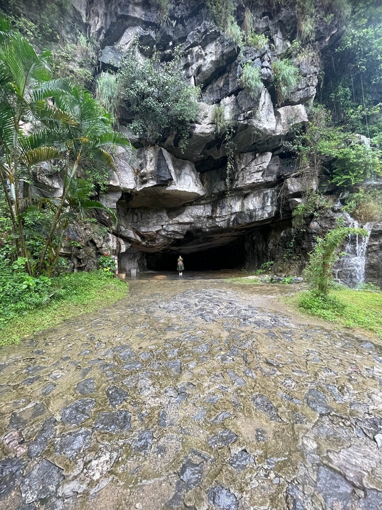

Last September, I, along with a friend of mine planned for a trip to Vietnam. We spent quite some time planning for the whole trip. We did discussions on where to go, where to stay, what to eat, etc. This post is a travelogue-ish post, similar to what I did with my [Goa](/2022/06/03/south-goa.html) trip earlier this year. I had planned a trip to Vietnam in March of 2020 and then COVID struck, bringing the rains down on the entire plan. But this one came together and It was an experience worth sharing.

# journey

We took a direct flight to Hanoi from Delhi, landed late in Hanoi and took a public bus to the famous/iconic [Buffalo hostel](https://buffalohostels.com/). The next morning, we visited the Literature Temple, a famous Bun Cha place and tried egg coffee at a lakeside cafe. The city was teeming with young people rustling by on their bikes and scooties. It's an overwhelming sight when you first ride on the main roads and streets. And this is coming from someone who's ridden in some of the most congested of places in Delhi.

 
 

The first thing we had planned to do in Vietnam was the incredibly surreal Ha Giang bike loop. It's exactly what it sounds like, a 4-day bike loop in the mountains of northern Vietnam. Our group, by the time we flew from Delhi, had morphed into a 6-member group. In Ha Giang, it further transmogrified into a 12-member group when we teamed upw with two other smaller groups to do the loop together.

The idea is to start from Ha Giang city, then ride a couple hundred kilometres and stay at a homestay in the valleys, repeat 3 more days. We all rode a semi-automatic bike with surprisingly good mileage. The loop is designed in such a way that even though it's ~120km a day, it has enough stops in between that you cover the whole day and reach the homestays after sundown.

The pictures aren't lying. It was just sheer greenery through and through with occasional patches of life when you're passing by a valley. And that too was accompanied with extremely curious locals trying to get as much information about India as they can.

I have so many more photos I can attach here but then I might not be able to talk about the other destinations, so let's stop here with Ha Giang and move on.

Next stop was Ha Long Bay. The UNESCO World Heritage Center site is famous for it's limestone pillar in the inland ocean. The only way to explore these is to book a cruise which would sail further into the bay to give you a closer look at the formations.

You can also visit the caves formed naturally inside these formations and additionally, go canoeing around them.

Back to Hanoi, and off we went to Ninh Binh for a night. We rode bikes from Hanoi to Ninh Binh and the reliable partner that Google Maps is, it took us through deep residential pockets skipping the highways only meant for cars. But thanks to this route, we were able to see middle-aged ladies enjoying a session of tai-chi? in the evening in a community center verandah while a group of young kids played volleyball in a ground further ahead. Or in other words, a casual evening routine for the residents of outer Hanoi.

Ninh Binh was quiet, serene but due to the storm that just went by a couple of days before we arrived, it was raining quite heavily. We still managed to do the famous boat tour there. During the ride, Vietnamese tourists would shout out and greet us and ask us where we're from, it was a jovial affair. We even had a couple of races with some of them, it was healthy.

We headed back to Hanoi for one last night where we explored the War Museum, it was an overwhelming collection of feelings, artifacts and information surrounding Vietnam's history especially the infamous [Vietnam](https://en.wikipedia.org/wiki/Vietnam_War) war.

The next morning we took an early morning bus to Hue, the ancient capital of Vietnam. It was raining cats and dogs and while we touched upon some famous tourist spots in the city, we eventually ended up having coffee and just taking short walks around the bus stand waiting for our afternoon bus to Da Nang.

Da Nang is a typical urban expanse with lots of things to do. We made a day trip from Da Nang to explore Hoi An, which is a quaint little coastal town with lots and lots of tourists throughout the day. You can walk around the town capturing the old streets, shop for souveniers and have their local delicacy, Cao Lau. The town suddenly transforms after sundown, it's a brightly lit cacophony of lights and lamps, a sight to behold.

The final leg of the trip was to head south to Ho Chi Minh City, formerly Saigon. As soon as we landed in Saigon, it was chaos. It looked like any other big city in South East Asia but with lots of people. There were bikes all around and coming from Da Nang and the quieter North, Saigon was the polar opposite.

On the flipside, I had the best coffee here coupled with getting some really good street shots.

We visited the Ho Chi Minh City Museum where, along with the Vietnamese history, we witnessed some intense wedding shoots. Yes, inside the museum. I also witnessed the city's wildest nightlife at the Bui Vien street, it was crazy and mere inches away from being considered a stampede. Throngs of people out on the street drinking, smoking and just being plain crazy. I was glad that stretch was over when it finally was.

Ho Chi Minh is where we did most of our shopping at the famous Ben Thanh market. There are eateries all around the place and it gets especially lively at night when all the street eateries put their [baby-chairs](https://khaipham1093.wordpress.com/2016/03/03/why-do-vietnamese-sit-on-little-chairs/) out for the locals.

# food
If you're a vegetarian and are planning a trip to Vietnam, god forbid you're going to have a hard time. Especially if you're planning to do the Ha Giang loop or thinking of going deeper into the mainlands. In the cities, you'd still find a variety of vegetarian, vegan even, options. That being said, I think I personally enjoyed the Vietnamese cuisine the most out of this trip.

<!--  -->

And of course, I've already mentioned the coffee. I didn't have a single bad coffee during the whole time I was there and it was a sentiment most of friends shared too.

# observations
I always note down interesting observations during travel, I feel some of them are worth sharing:

- Vietnam is a matriarchal society and the difference is stark. Coming from India, I was pleasantly greeted with every other business being run by ladies. It was a fresh departure from a traditionally patriarchal Indian society. Not just that, being a matriarchal society, Vietnam naturally lends itself to a save environment for women. This is ofcourse, my observations from slightly more than 2 weeks there but from what I've read so far, it is indeed true.
- How the locals enjoy their downtime. Scores of families and friends would pour out onto the streets at night, especially pronounced during the weekends, to eat good food and watch some live music. It was a sight to behold especially since we rarely see something like this in India. In fact, I noticed a similar trend when I visited Nepal earlier this year, locals tend to enjoy their downtime to the fullest. This is possibly entirely anecdotal but unlike India, where you mostly only see people from upper-middle class seated in a Starbucks or a Third Wave in order to have a good time, I was pleasantly surprised to see people from all walks of life to a nearby Highlands Coffee. I don't know the exact reason but I guess it has at least something to do with its communist and socialist roots.
- People are extremely friendly. We talked to so many locals in our entire trip and all of them were quite willing to engage in a dialogue. Every single one of them was extremely interested in knowing about India and our lives.
- Restarurants closing quite early, as early as 7:30 in the evening. I noticed the whole staff having dinner together shortly after pulling the shutters down. I saw similar groupings of the restaurant staff at the end of the day in other eateries too. I've never seen something like this back home.
- The amount of western tourists. It naturally got me thinking, if you were born in a western country, you automatically have a lot more avenues for travel open up for you. First off, it's dirt cheap and secondly, you don't have to deal with Visas most of the times. Put another way, what I'm trying to say is that there's always going to be a cohort of people who'd never be able to see and experience what's out there in the world just because of where they were born, and that's depressing.

I can't say if these observations are a helpful addition to the post or not, but this is what I seek when I travel, a new worldview, understanding of how people live their lives and how societies are different from what you're used to back home and I thought they are worth sharing.

# conclusion
After a failed attempt to travel to Vietnam right before COVID in early 2020, I was really looking forward to explore this land of hardworking people, as the saying goes. I wasn't disappointed. Additionaly, I paired this trip with a reading of [Vietnam: Rising Dragon](/books/vietnam-rising-dragon), it was the perfect companion.

I remember I was having this discussion with a friend at work about how travel is not what it used to be with the advent of internet. One can even "experience" a new land with all the innovations in AR. But writing this post, I realize there are things I'd have never even read about lest I had travelled to the place by myself and that makes all the difference. It expands your worldview, for the better.

:wq
