## Background

It's been roughly 5 years since I started capturing my shell history in a MariaDB (MySQL originally). I had a vague plan to derive insights or optimize my shell usage from all the data I would capture. And sometime in [2022](/posts/year-in-command-line), I decided to sit down, write some SQL queries and rather forcefully, derive insights from my shell usage.

This is the second iteration of Year In Command Line. I hadn't originally planned for this particular post but a friend suggested I make Claude do the heavy lifting by writing SQL queries and generating graphs, and I can focus on writing the actual article. So let me preface this article by saying that all the queries and graph generation scripts were written by claude, and while I did review most of them, there might be some issues though unlikely. All in all, it turned out to be fairly convenient, and fun.

The structure of this post remains the same as earlier. I will go through some high-level insights, and then dig deeper into some of the most used commands.

## Data

Starting in January [2021](https://github.com/danishprakash/dotfiles/commit/e3f23dbcefa64868aac3e70669e81bf35932c5a1), I now have 5 years worth of shell history in a MariaDB (MySQL originally) database. As of December 2025, I've gathered:

- Total commands (all time): 145,415
- Total commands in 2025: 29,120
- Distinct commands in 2025: 7,411
- Total commands in 2022: 21,475
- Distinct commands in 2022: 5,060

This post will only use data for the year 2025. A new section comparing the insights between the previous and the current iteration is added later in this post. Let's start.

## Usage

### Weekly Usage

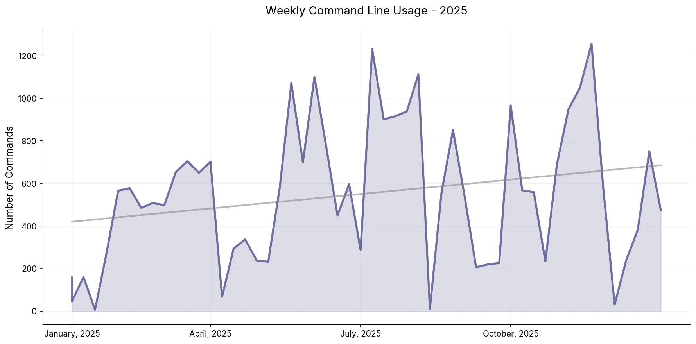

The year didn't start off CLI-heavy but then it picked up. There's a positive upward trend throughout the year. The most notable dip just before October was when I was travelling. I mostly did meta work while I travelled, preparing slides for a conference I was attending, and spent little time on the command line.

One thing that surprised me is how the adoption of AI didn't seem to show up as a data point, or even an outlier. I started using agentic editors sometime in June 2025 and even though my usage mostly revolves around editing, reviewing and understanding code, I was prepared to see a sharp dip and a subsequent downward trend for the rest of the year.

### Day of the week

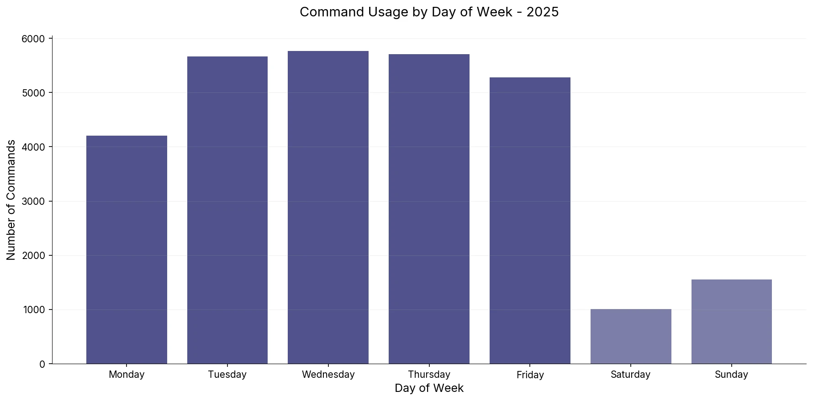

Looks like the blues have been hitting me hard. I recall Monday being the highest in weekly frequency but it seems to have taken a slight dip. Though I will chalk that up to meta work and catching up on communication in the past week.

The fall on weekends is comparatively sharper, Since 2022, I've stopped spending as much time on the command line on weekends as I used to. This is a bittersweet revelation because I genuinely enjoyed hacking on personal projects over the weekend. Perhaps life happened, or I just involuntarily wanted to step away from the machine after spending the whole week in front of it. Or it could simply be me spending more or less the same amount of time, but not on the command line. Though I'm afraid it's very much the former.

### Hourly Usage

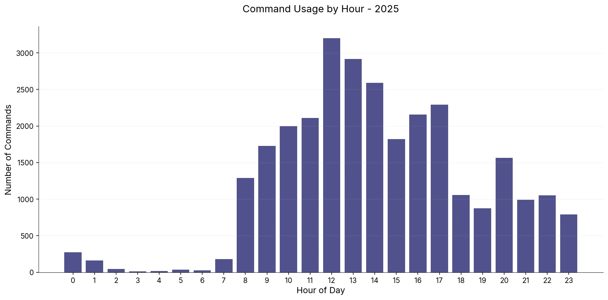

This is fun, mostly because the graph clearly depicts the change in my routine between 2022 and 2025. Starting January 2023, about the same time I started at SUSE, I also moved to an active-evening routine. This means I no longer hit the gym in the morning; instead, I spend my time on cognitive tasks--mostly reading, but also researching and often getting a head start on something important and interesting at work.

So the graph shows that I now start working much earlier than I used to back in 2022. And then after a short dip around 6 (that's when I now hit the gym or go for a run), I'm again back at work till dinner. Not ideal but the post-activity productivity rush is seemingly real, for me.

### Activity Heatmap

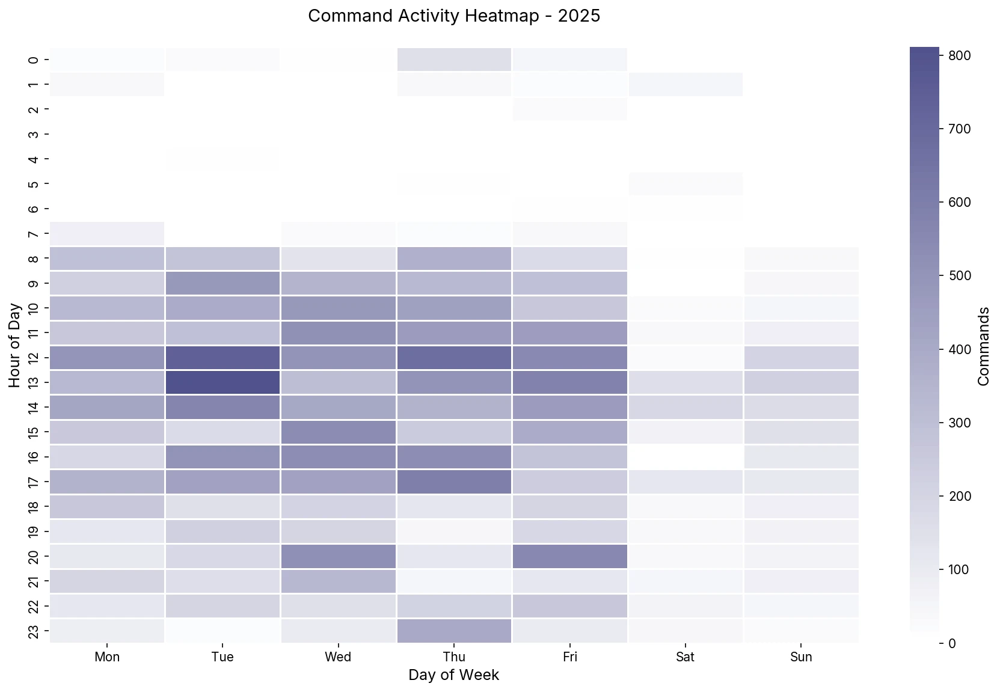

This graph is a new addition. It shows the activity heatmap and shows the day-time combo when I was the most active on the command line. I'm slightly skeptical of the insights here because Wednesday is the day I have most, if not all, my meetings and so for Wednesday noon to be the most active seems weird.

Saturday is also interesting, that's the day I spend on catching up on pending personal digital chores. Writing an [article](/), [book review](/reading), or hacking on a side project, etc. It's nice to see the graph aligning with that.

## Top Commands

Moving on to the actual commands, the following treemap shows the top 10 commands of 2025, this doesn't include coreutils or built-in commands, those are discussed in the next section.

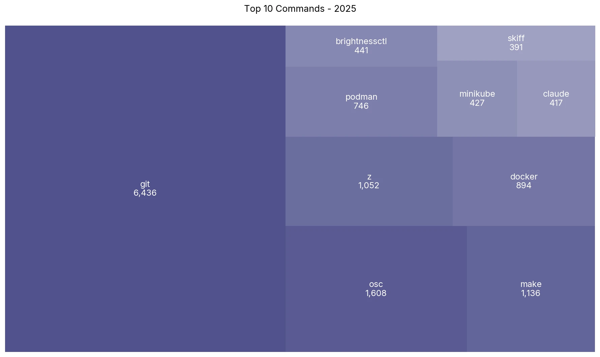

There are quite a few things going on here:

1. `git` remains the most used command for presumably 5 years in a row (though I haven't checked that specifically), and I guess this will be the case for years to come--the Lindy effect.
2. The biggest change is the disappearance of `kubectl`. It used to be the second most-used command after git. I used to work extensively with Kubernetes at my last job, but I'm now focusing more on container technologies and while I've played around with k8s now and then, I've effectively moved away from actively using it.
3. Replacing `kubectl` is `osc`--the command line interface to work with Open Build Service. At SUSE, I maintain quite a few container packages and the lifecycle of those RPM packages are managed via OBS, and interfaced via the `osc` tool. This data also includes `isc` along with `osc`, the private OBS instance we use at work.
4. I've been working with Podman quite extensively at SUSE, contributing to upstream, and maintaining the package downstream. So it's natural for podman to make an appearance in the top commands list. I still work with `docker` so it's also right up there along with podman.
5. `claude` makes an appearance but I'm surprised at the mere invocation of a long-running interactive process like claude being triggered so many times that it made the list. I will talk more about the role of AI in this context in a later section.
6. Finally, [`skiff`](https://github.com/dcermak/skiff)--a container image inspection utility I co-developed with Dan. It can help you find duplicate layers, inspect the diff between two images, or find the largest files by size in an image, and more. Feel free to check it out.
7. I'm a little embarrassed at the presence of `brightnessctl` in this list. Whenever I'm not using my laptop in clamshell mode, I use `brightnessctl` to configure the brightness of the laptop display. I admit that I couldn't be bothered to figure out how to make the fn keys work.

### Top Coreutils

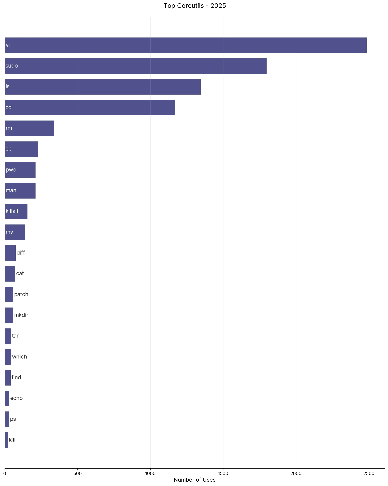

There's little to be said for this graph, however there are some interesting insights:

1. `vi` for some reason exploded in usage, I'm not quite sure what's going on here. I've `vi` aliased to `nvim` and have been using neovim for the past [9 years](https://github.com/danishprakash/dots/commit/4b9045faa07cd92c970242524e5cde0793332f1c). But I wasn't expecting any real change here. One hypothesis is that I'm spending relatively more time dealing with ephemeral tasks such as package maintenance, doc writing, along with writing code and that usually begins with me firing up neovim.
2. I've mentioned this before but I'm a big fan of `z` utility. It helps you switch to directories based on weightage and frequency and is smart enough to not require the whole directory name, let alone the full path. It's extremely convenient, so much so that you can see it as the 4th top command in the previous section. So with that being said, it's interesting to see `cd` taking the 4th spot in the standard commands.

Not much else seems to be going on apart from the fact that the reliable coreutils are still alive and kicking, what wonderful pieces of software.

## Git

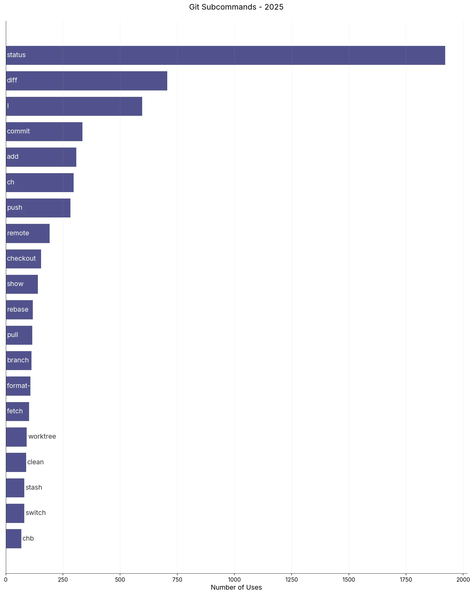

There are 3 new commands that made it to this year's list, namely:

1. `format-patch`: Some projects that I contribute to now collaborate over email. So I generate patchsets via `format-patch` to share over `send-email` and to backport some of them for downstream work.
2. `worktree`: This is purely a function of AI introduction in my development workflow. It allows you to manage multiple working trees (separate directories) that are parented to the same repository. So you can work on multiple features/bugs in the same repo in parallel.
3. `switch`: One of my friends introduced me to this command. It was introduced to clear the confusion around the multi-use `checkout` subcommand, and can only be used to switch and create branches.

I still incessantly revert to hitting `git status` on a repository as a kind of mental reset. In the same vein, `git diff` and `git l` are also almost reflexive when I'm working and they provide me with a bird's eye view of what's what in the current repository. I guess I can shorten `git diff` to `git d` and save those precious ms.

It's funny how workflows change over time, I thought I would only use a handful of git subcommands forever but git is such an exceptional and complex software that there are increasingly new features and concepts that I'm being made aware of every now and then. I still remember the time I learnt about `git rebase` during my first internship and it was a game-changer. I think of `worktree` with the same level of appreciation and admiration now. The powerful ability to work on multiple branches in the same repository is underrated, especially with the advent of AI. So while the basic git commands still dominate its usage, it's exciting to learn new ways to work with git repositories in the future.

## Docker

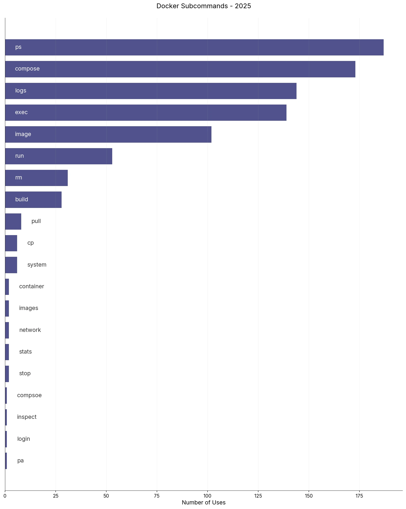

Docker usage has reduced a little, given that I'm focusing more on Podman. Docker still finds use as a lot of applications still default to docker as their container engine of choice. More often than not, this comes by way of Docker Compose since it makes it easier to distribute a container stack for applications. Additionally, I use docker as a reference as I develop for and contribute to podman. It's also funny how a few typos also made it to the list.

## Podman

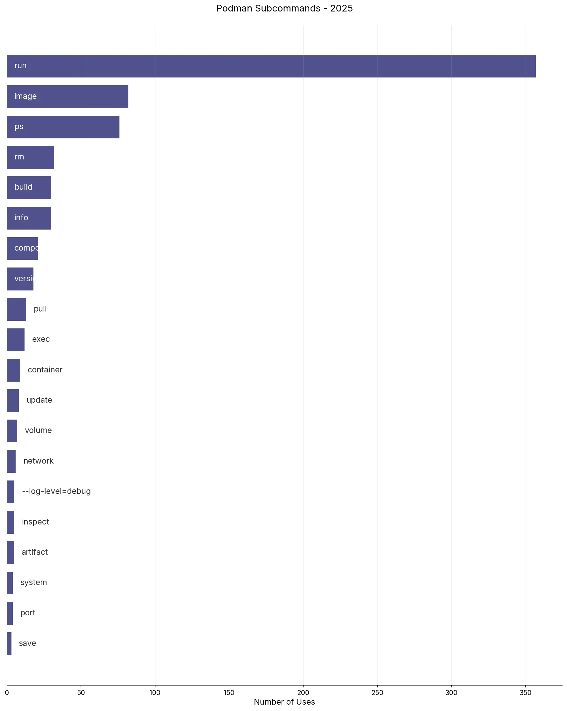

Podman has been one of my primary focuses this past year. I've developed various features, debugged issues, backported security patches, etc. `run` takes the lead because that's been the entrypoint to testing most of the features or bugs I work on, `--push`, `-p`, etc. Please note that `podman` here also includes `./bin/podman` or the development build.

Beyond `run`, the distribution is fairly linear. The workflow is quite simple, run the containers, play around with them, check status using `ps`, and clean them up via `rm`.

## Switching Directories

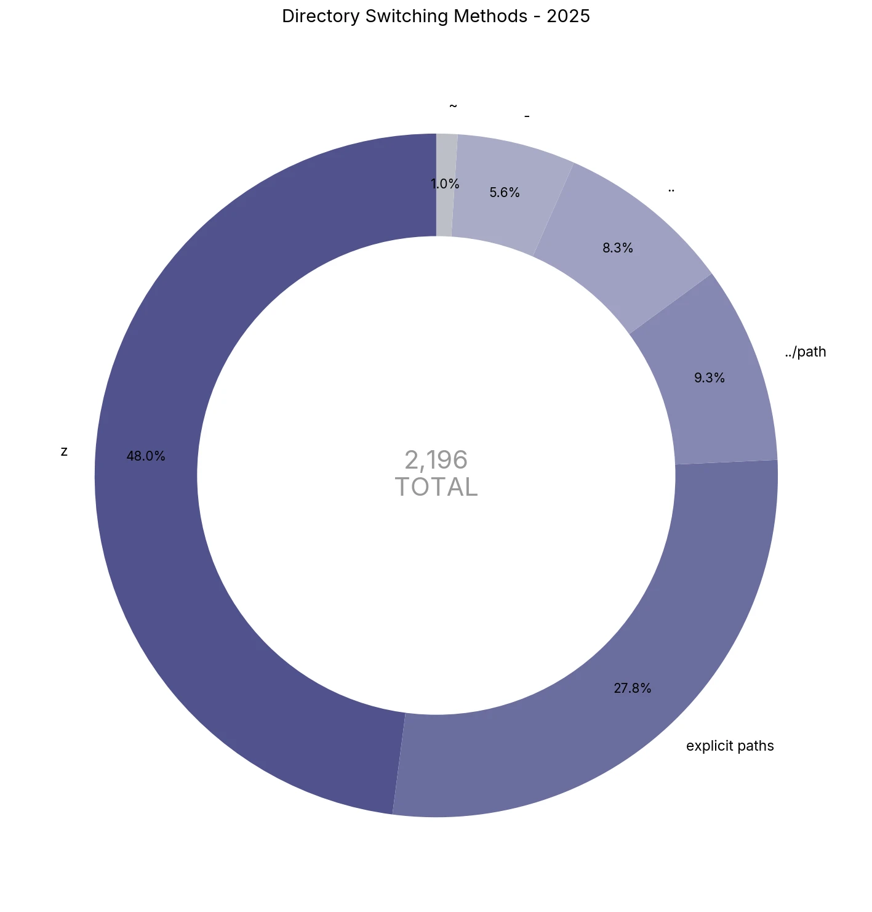

There are many ways to switch directories on a command line. There are inefficient ways, and then there are more efficient ways. I've mostly grown habitual to using `z` to switch directories majority of the time, it's a nifty little bash program that does its job really well, highly recommended.

I'm also a big fan of swapping directories back and forth using `cd -`. A lot of other tools also [support this](https://oppi.li/posts/snip_snap/), for instance, `git switch -` allows you to switch back and forth between recently used branches, it's a great way to save time.

Lastly, modern shells also support switching to the parent directory using `..` and pathname tab expansion. These are helpful at times but as you can see in the split above, `z` takes care of almost half of the directory switching.

## Evolution and Reflection

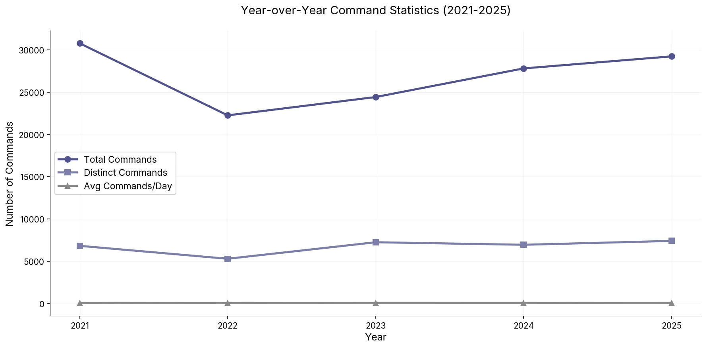

Looking at the year-on-year trend from when I first started tracking the data back in 2021 to now, we can see the dip in 2022, that was the time I got into a little bit of meta or leading the project work, so there were lots more discussions, planning, and delegating. End of 2022 was me switching jobs so there's that. Post that, there's steady increase in the total commands graph.

It's interesting that the distinct commands and average commands per day remains more or less same(there's slight fluctuation in both but are dwarfed due to the scale of the graph) through the past 5 years. The distinctions in the metrics only starts happening once you step into them individually as we've discussed earlier in the article.

### 2022 vs 2025: What Changed?

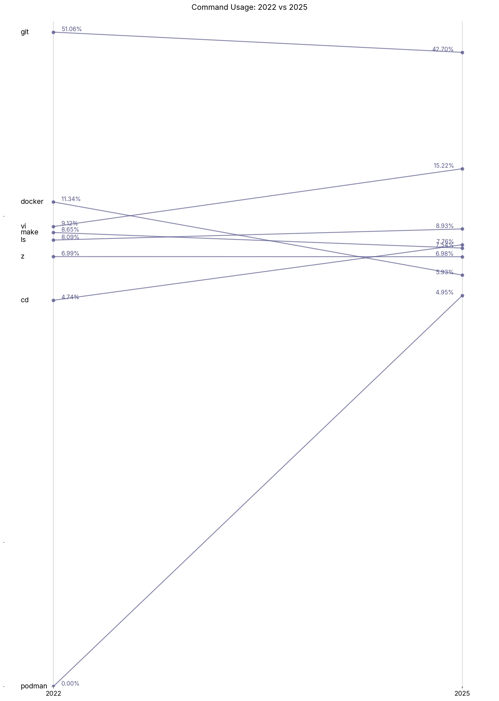

I think the biggest change is the disappearance of `kubectl` and the adoption of podman. You can see the spike in usage of podman, and at the same time, how docker and podman converge in numbers.

#### Open Source
The major change in my workflow after 2022 came in [2023](/posts/year-in-review-2023) when I switched to SUSE. I ended up doing a lot more Open Source work--podman, openSUSE package maintenance, etc. This is reflective of tooling changes such as the high usage of `osc`.

#### AI
Lastly, adopting AI in 2025 has been the biggest change I've had in my workflow in the past 10 years. I was initially not sold on the idea but it really shines if you know how and when to use it. I had fully expected AI to reduce raw command count but that wasn't the case. This review would've been quite different if it weren't for AI. For instance, git usage wouldn't have dropped or `vi` usage might've been higher.

## Conclusion

It's a lot of fun for me to go through data and charts to derive insights into one's workflow. While there aren't many actionable optimizations to extract, it's interesting to see how my workflow has evolved over time with changing roles and requirements--a shift from Kubernetes to containers in this case, the surprising absence of AI's impact on metrics, and a bittersweet decline in weekend hacking.

Doing this review every 5 years seems to be the sweet spot, and it will be interesting to see what changes might show up in 2030 with the development landscape changing every few months these days, thanks to AI. I also plan to write a small post on the methodology behind this activity soon.

Beyond the numbers, this exercise serves as a time capsule, a snapshot of not just what tools I used, but also how I worked, when I worked, and what I worked on. I'm a big believer of the concept of compounding, and I'm excited to see the trends over the course of decades.

 
:wq
