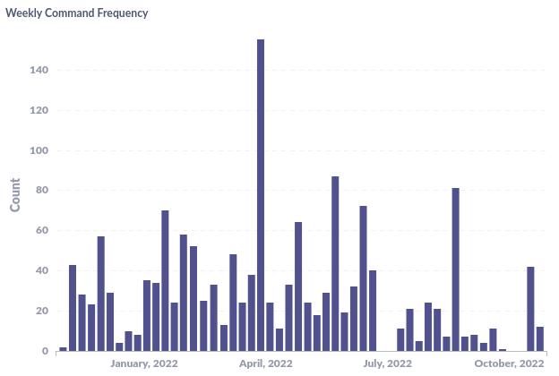
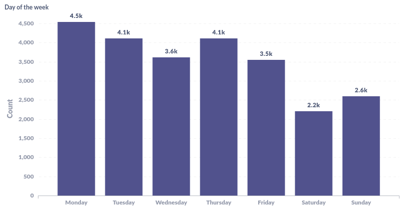
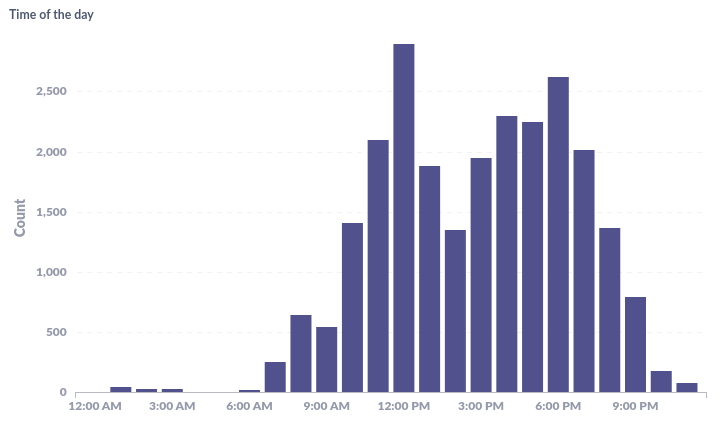
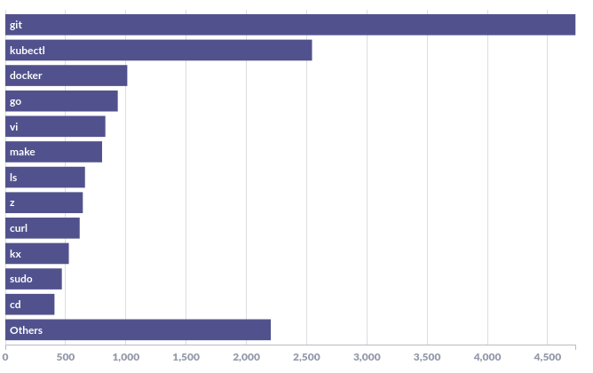
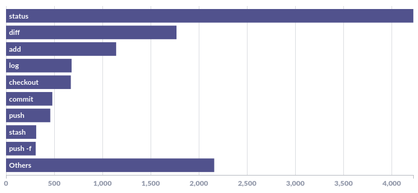
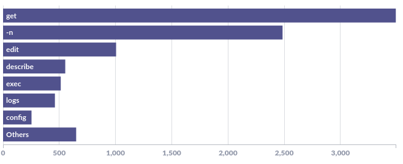
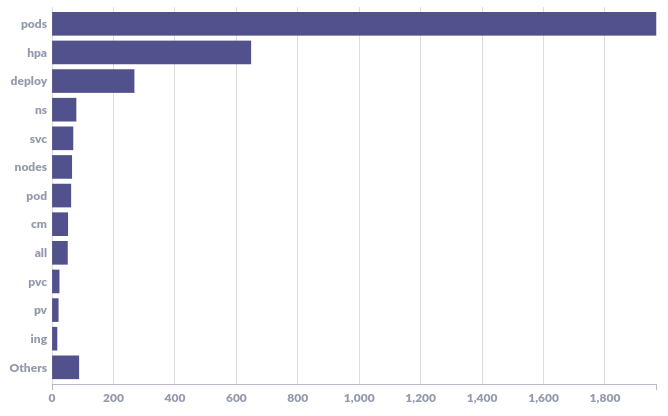
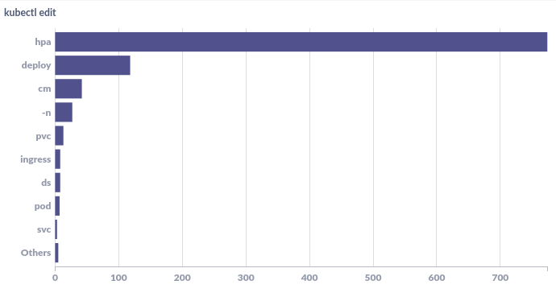
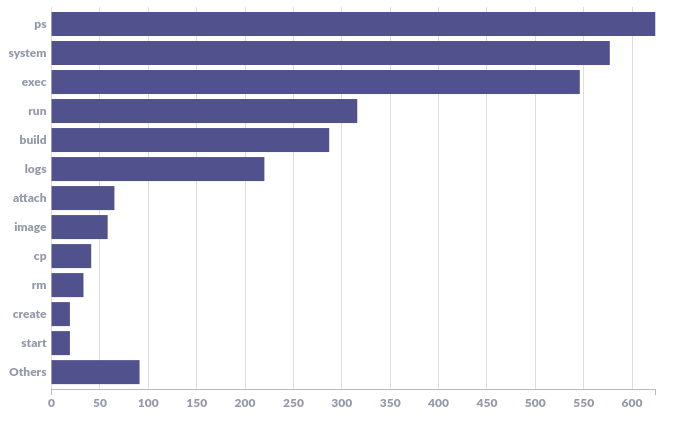
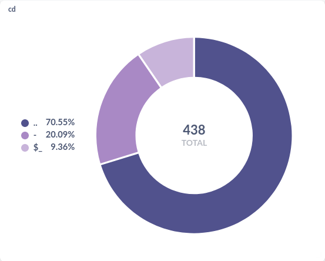

## Background
Sometime last year while browsing Spotify Wrapped, Strava Year in Review and other yearly reports from different applications, I thought about doing something similar with my command line usage. I spend a lot of time on the terminal and was naturally drawn to bringing this idea to fruiton. I started recording my shell history in a MySQL instance as a starting point shortly thereafter. Back then I did not know what kind of insights I'd be able to draw out of the data that I'll have eventually or whether they'll be interesting or not. But the idea of taking a step back to realize patterns from such data to see how I've "evolved" in a year's span sounded a little too interesting to simply discard.

Part of the motivation was also my [Year in Review 2021](../../../2022/01/30/year-in-review-2021.html) which I thorougly enjoyed writing and I thought I might as well start doing it for other aspects of my life too.

The way I've structured this post is to go through some high-level insights first and then digging deeper into some of the most used commands and gain insights out of those. I'll skip explaining the setup and how I visualized the data for this post and park it aside for another post.

## Data
I started capturing my shell history in a MySQL instance in [January 2021](https://github.com/danishprakash/dotfiles/commit/e3f23dbcefa64868aac3e70669e81bf35932c5a1). Post that, all the commands that I've hit on my machine, along with metadata such as the current working directory and timestamp have been dumped into that same database. As of writing this post, in December 2022, I've gathered:

- Total commands: 63,264
- Distinct commands: 13,477
- Total commands in 2022: 21,475
- Total distinct commands in 2022: 5,060

Also, since the database contains data from 2021 and this post is aptly titled 2022, I'll add a date filter on all the queries to only fetch data for 2022.

Let's now dig deeper into the data and see what kind of insights we can draw. Again, there is no structured index to this post, I've kept it quite loose. We'll talk first about the usage patterns for the year and then we'll talk in-depth about the individual commands. Finally, we'll talk about optimizations.

## Usage
Before diving into the actual commands, let's take a look at the kind of usage pattern that emerges from this dataset to see what kind of command line user am I.

### Weekly Usage
The graph below shows my command line usage on a weekly basis for the past 12 months:



That one huge spike in March-April was when I was working on a feature I had to push which involved a fair bit of programming and infrastructure work.

The two dips in July and October correspond with my vacations where I did some work but certainly didn't hit the terminal. On average, I think the graph pretty nicely shows a weekly wave-like pattern having crests and troughs depending upon the kind of work I'm doing that week.

### Day of the week

Is there a day on which I've been programming or hitting the terminal the most, due to a reason?



Turns out that's not the case. Saturday and Sunday lines up just fine, I do some [open source](../../../software) work on weekends. And then weekdays were expected to have taken up the majority share. One surprising observation here is how Tuesday is on par with Thursday considering that the latter is the day in my week with the most meetings.


### Hourly Usage
Finally, let's take a look at how the usage is distributed when it comes to the time of day:



Aligns quite nicely with my natural circadian rhythm. I'm most productive in the mornings/first half. I tend to block time for focused work (read time spent on the terminal or thinking) in the first half and then move as many meetings/ad-hoc items to the second half, post lunch.

An interesting pattern to note is that since my early mornings(6-9) are blocked for [reading](../../../reading) and working out, I'm more likely to stretch in the later half of the day(6-9) as evident from the graph above.

Lastly, I can count the number of instances where I had been on the terminal post 10:30 at night, those were neither deliberate nor fun but the need of the hour, but it's interesting to see that I was able to keep the routine in check willingly over the course of an entire year.

## Top Commands

Let's now move to the actual commands. The graph below lists the top 13 (odd I know, metabase resize ftw) commands in the past 1 year, ordered by frequency. These are just the base commands, we'll dig deeper into some of these commands in separate sections where we'll talk about the subcommands and arguments.



I had an inkling that the top 3 would be a combination of `git`, `kubectl` and `docker` but not in that order. We'll dig deeper into each of these top 3 commands in later sections to understand how my usage varied over time.

But before doing that, I have a few observations on the other commands that made the cut in the list above.

- `cd`: I was half expecting `cd` to pop in at least in the top 10 but then I realized I don't use `cd` as much as I do `z` for my directory switching needs. It is a great tool to jump to a directory if you know the directory name and have used it at least _once_ before.

- `vi`: is again, unsurprising, as it's the choice of editor for all things editing for me. I've actually aliased `vi` to `nvim` and almost never explicitly type out `nvim` on the prompt.

- `make`: since this data is from my work machine, you can see `make` also being used quite extensively. I've been using [Makefiles](../../../2019/12/07/using-makefiles-for-go.html) for Go projects at work and it fits right in. Since then, I've used Makefiles in a lot of other places where I need some repeatable commands to be run as routine manually, I usually opt for Make over bash scripts.

- To debug microservices locally or on a development cluster, I use `curl` but It's surprising that it's up there in the top 10 with ~600 hits.

- `kx`: finally, I work with Kubernetes a lot and have multiple clusters/projects at work between which I jump around time to time. I earlier used to use `kubectl config use-context <>` but realized it wastes a lot of time, both writing the command and then writing the context name. I switched to `kx`, which coupled with `fzf` provides a quick and nifty way to switch kubernetes contexts.

I think that gave a really nice overview of my command line habits. I have a couple of staple commands which I use day in, day out. I have made some optimizations (read alias) because I had an inkling that I'm using a particular command a lot but I didn't have the numbers back then to corroborate my hunch. Thankfully, I can now make informed decisions on how I can(or should I) better optimize my command line usage. We'll talk more about optimization further ahead.

Let us now pick each of the top 3 commands and see how the usage is and how it differs from the command.

## Git
Below are the top `git` subcommands ordered by frequency in descending order. It shows the most commonly used commands on top and groups a few at the end of the top 20 spectrum:



As is evident from the graph above, I'm obsessed with checking the repository status. Everytime I'm away from the editor for a while and get back to it, I instinctively hit `git status` to see how I had left things.

I then check for what all have I changed so far and then further going into the tunnel, I add the modified/added/deleted files to the stage and then commit and push. Looking at it this way, it's more of a funnel than a tunnel as I mentioned earlier. I'm more likely to run the `status` or the `diff` sub command than I'd `add` or `commit` or `push` those changes, and this makes sense logically too.

A note I'd like to make here is that I don't type these sub-commands every time I need to use them. I've used git aliases for almost all of them, for e.g. instead of `git status`, I'd simply do `git s`. The expansion of these aliases has been done here for presentation purposes. You can find the complete configuration [here](https://github.com/danishprakash/dotfiles/blob/master/.gitconfig). We'll talk more about how this translates into time saved later in the post.

## Kubectl
Let's look at how I've been using `kubectl` for the past one year so far. The following graph shows the top sub-commands I've used with `kubectl` ordered by frequency:



Naturally, I mostly use `kubectl` client to get resources deployed in the cluster. Digging further into `get`, we can see how skewed the distribution is. Majority of the time, I'm dealing with Pods, HPAs or Deployments.

Another fun insight is the use of `config` sub-command. I had used it extensively to switch across multiple contexts earlier. But I soon realized this and I swapped it with `kx` as mentioned previously. Now, I use `config` only for renaming the automatically generated context names to something more human-readable using the following:

```
$ kubectl config rename-context $(kubectl config current-context) <new-context-name>
```

Also, the `-n` is again, specifying namespace for the command to follow. This definitely has skewed the data generated by the query but the problem here is the use of the default namespace for some of the clusters. Going forward, I'll add a trailing `-n` flag instead of a leading.


Let's now explore the usage for `get` and `edit`.

### kubectl get


I mostly work across a bunch of different clusters under different projects and cloud providers, namely GCP and AWS. Different projects call for debugging/operations/monitoring on different resources but the common theme across all of them are, unsurprisingly, Pods, HPAs and Deployments.

I've seen other engineers at work using graphical interface tools such as [Lens](https://k8slens.dev/) to view the cluster state at a glance, but for some reason, I still feel comfortable running these commands on the terminal and seeing if things are fine or not.

### kubectl edit
<figure>
    
  <!-- <figcaption>kubectl edit</figcaption> -->
</figure>

I've spent a lot more time _editing_ HPAs than any other resource. At work, I've to quite frequently scale workloads manually(unfortunately) due to AWS control plane constraints and hence so many edit invocations. What's more interesting is that I had realized that I'm spending so much time doing gruntwork that I worked on a [custom k8s controller](https://github.com/danishprakash/kube-step-podautoscaler) to do this job for me.

## Docker

Last of the top commands, let's take a look at the sub commands which I've been using the most with `docker`:



I knew `ps` would be on top. This is akin to my usage of `git status`. I'm a sucker for checking status and keeping things clean.

The next is quite interesting, I use `docker` so much so that I have to regularly run `docker system prune` to clear dangling containers, images, volumes, etc. I've seen that If I go without running this command for a couple of days, I end up accumulating GBs of dangling data. I don't know how effective this is in terms of the actual cleanup that docker does.

Nothing out of the ordinary about the rest of the subcommands if you've been using docker.

## Optimizations
Now that we've seen quite a few insights from my command line usage for the past one year, is there a scope for optimization? i.e. can I save my time and make my time on the command line more efficient? I'm personally quite wary of [yak shaving](https://www.pcmag.com/encyclopedia/term/yak-shaving) and [premature optimization](https://stackify.com/premature-optimization-evil/) and am not going to mindlessly plunge into this quest but it makes for a good discussion especially as we end this post.

## Using aliases
Unfortunately, the disclaimer I used about using git aliases is not true for `kubectl`, which means, If I have to get pods in a specific namespace matching app=frontend label, I'll have to write this every time:

```
$ kubectl -n namespace get pods -lapp=frontend
```

Let's do some napkin math get a quick idea on the kind of savings we can do If I were to be using an alias for `kubectl`. My typing speed is ~82wpm. Assuming the average size of the word is 4, the character per minute comes out to be 328. We can simplify it to roughly ~5 characters per second or 1 character every 1/5s. Now, let's say, If I had aliased `kubectl` to just `k` as many people do. That would mean I'm writing an additional 6 characters every time. Based on the Top Commands graph, I've used `kubectl` roughly 2500 times in the past one year. This gives me a total time savings of (6/5 * 2500)/60 => ~1 hour of time saved _if_ I had used that alias. I think, going into the new year, I might as well add this alias and save that one crucial hour.

I can apply this to the `git` command too and save me 30 minutes which I honestly don't think is worth it.

### Subcommands aliases
Unlike git, not a lot of commands provide a way to alias subcommands. `kubectl` still provides [shorthand](https://github.com/kubernetes/kubectl/blob/1d7e71a12f476bb95d1eb550130505678d0d3c08/pkg/cmd/set/set_env.go#L49) for some of the commands. For docker, the commands are short in and of itself so it might not make a lot of difference to actually have a shorthand.

But I really like how git allows you to configure this and much more to make your life using git easier. I wished other commands would support something similar.

### Switching directories

Another interesting observation was when I tried to map out the arguments for `cd`. Out of a total of 1347 matches, the distribution for the top 3 arguments to `cd` are as follows(refer to the legend):



Again, an obvious change here could be to just alias `..` and `-` to do their jobs without using `cd`. I know some shells support this out of the box, I just need to configure this and I believe it'll help consderably.

Also, please note that these three are topping the chart above because I don't use `cd` for actually moving to a directory. As previously mentioned, I use `z` for that purpose.

### Drawback
One drawback that I've noticed when using aliases or custom functions extensively is how I'm essentially paralysed while using a different machine or working briefly on someone else's machine or even pair programming.

But, the flipside is that you spend a stark majority of your time one your _own_ machine, so any potential downside arising out of using some other machine for a brief period of time will be miniscule against the time saved by heavily optimizing your own setup.


## Conclusion
No inference to be drawn in this post. I just enjoyed the whole activity. Learnt a thing or two about when and how I use the command line. Did some overthinking about optimization that _might_ save me some time potentially. I personally feel data is extremely important to make informed decisions. Insights from the data are fun and they can tell you about patterns that are otherwise extremely difficult to be found.

The kind of post this is, I'd love to hear from you if you have something interesting in mind in terms of what I just talked about in this post. It could be an optimization, a new tool, virtually anything.

Obligatory request, if you find any issues/errors in this post, feel free to reach out or raise an issue [here](https://github.com/danishprakash/danishpraka.sh).

<br>
:wq
