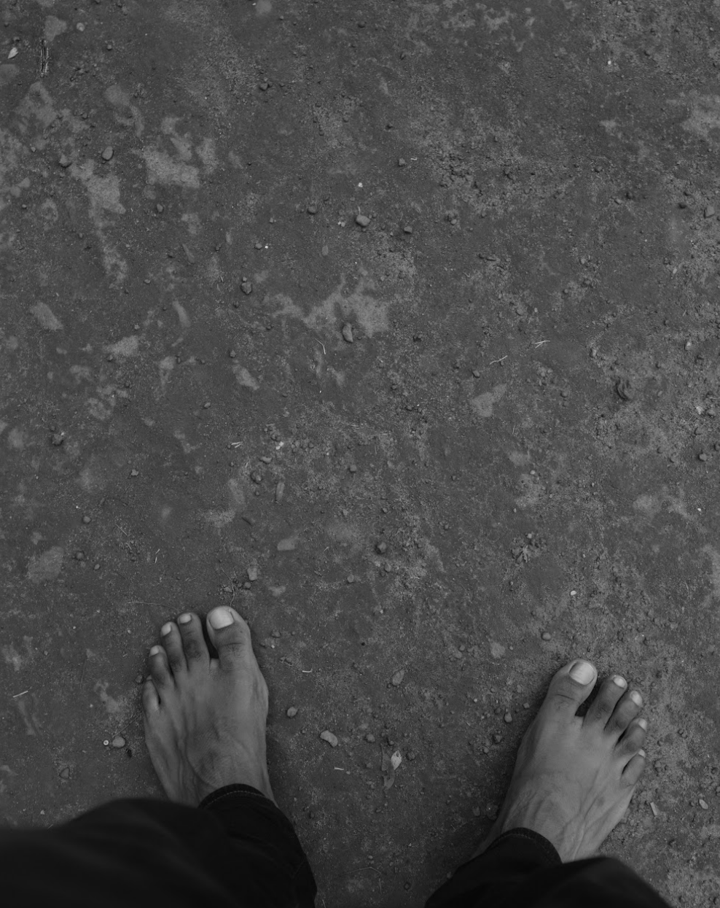
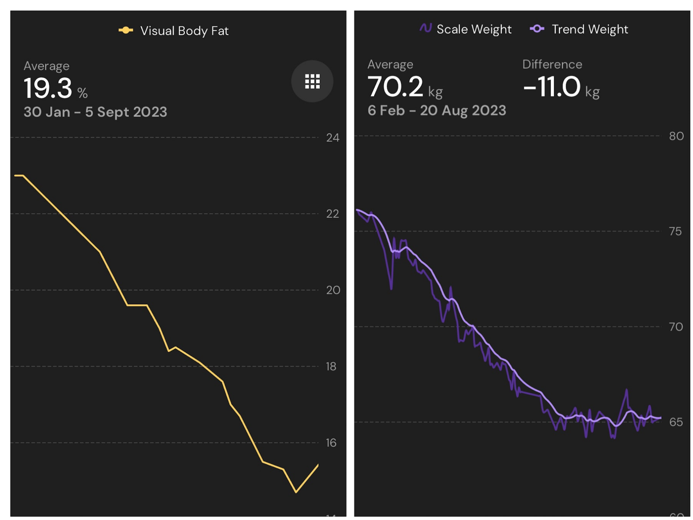
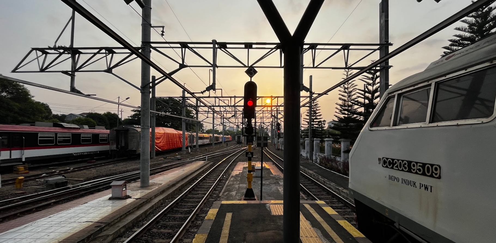
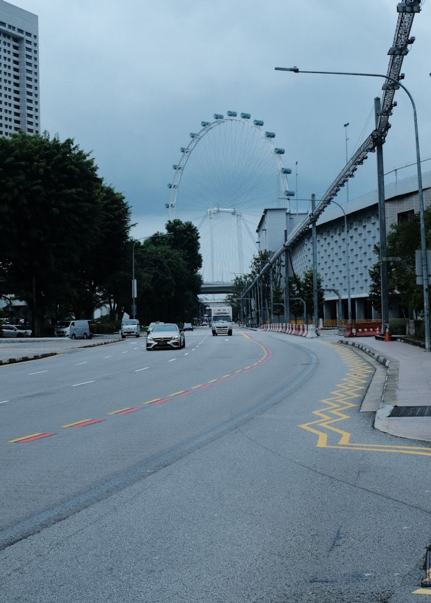

3rd iteration in the series calls for some changes, namely, the category headers are changing but the content remains the same more or less. This is done in order to keep articles in this series in sync with my private goal planning. Let's begin.

## Personal (Health & Fitness)
One of my most important health goals this year was to reach an acceptable(to me) bodyfat percentage. I managed to get my bodyfat down from 23% at 72kg body weight to ~14% at 65kg body weight in the span of roughly 10 months. I did however made some mistakes in order to reach this target but it was all worthwhile at the end.

Bodyfat stats on the left, bodyweight on the right, with roughly the same x-axis scale denoting the time in weeks. That last blip at the end in the BF stats and the stagnation was when I went on a vacation and simulataneously went on a maintenance phase.

I also [lifted](https://hevy.com/user/danishprakash) consistently throughout the year, except for when I was travelling. There were times when I had to sit back due to an overdone knee or shoulder but thankfully neither was it as bad as it was the previous years nor was it long. One reason could be because I started focusing more on mobility and isometrics as part of my workout warmup. Badminton was also right up there with lifting in terms of consistency. I didn't spread myself too thin by engaging in a number of activities this year and it was fun nonetheless.

For the upcoming year, I'm going to be focusing slightly more on bodyweight exercises and foray into calisthenics. My composition goal is to get to ~72kg body weight again with <15% bodyfat by the end of next year. Slightly ambitious but I'm hopeful.

## Career
I started a new job with the year and it has been great so far with occassional hiccups which I'm used to by now. But I'm enjoying working for and in the open source domain and the people around me are smart and supportive. I primarily worked on container technologies and contributed to projects such as podman, buildah and nerdctl, both upstream and downstream.

There's still a lot for me to learn in this domain, and one of my goals for the next year is to publicly document as much of the learning I can in the form of technical articles or even talks if and when the circumstances allow.

## Education
[Read](/reading) a wide variety of authors and topics this year ranging from geography, nutrition, literature and science among others. Some of my best reads were [The Demon-Haunted World by Carl Sagan](/reading/the-demon-haunted-world), [Home in the World by Amartya Sen](/reading/home-in-the-world) and [Where India Goes by Diane Coffe & Dean Spears](/reading/where-india-goes). I stopped tracking the number of books as a goal two years back so there's no goal to look for in the next year as such but I'm just going to continue exploring the domains I mentioned above.

Unlike reading, [writing](/) was a dismal affair. As much as I enjoy writing, or let's say the thought of me writing, I didn't write at all this year. I barely scraped by at the end of this year with 2 articles that I started sometime in June of this year but kept dragging them unfinished to the very end. This becomes more pronounced because I was able to bring this category back from the dead in 2022 but it fell through the cracks again.I'll be trying things out to ensure this doesn't happen again.

Last year, I mentioned I had been learning Japanese for a while now. To be more precise, I'd been learning vocabulary, this year I started learning grammar using Genki. The plan is to finish both editions of the book as soon as I reasonably can but to be realistic, this year's goal is to complete Genki-I through and through while continuing to learn more kanji. Talking of languages, I had originally planned to learn Rust last year but I was lost on both time and motivation to do it. I'm not setting any concrete goals this year but If at all things seem to fall in place, I will start learning Rust this year, finally.

## Finance
Can't share the exact details here for reasons but I index invested consistently and donated monthly, except for a few misses here and there. My goals for next year is to simply increase the percentage contribution to both slightly and clear out an ongoing loan. I have more drawn out and specific goals internally but the big picture is to spend meaningfully and focus on time in the market.

## Travel
It was a good year for travel for me, I travelled to Hampi, Coorg, Shantiniketan, Singapore, Malaysia and Indonesia. I learnt so much from all these travels, and perhaps I'll be writing about my experiences in some of these places some day. I worked remotely on some trips, was with a group on some and solo on others, it was a healthy mixture of experiences. Despite sounding like a broken record, I'd like to emphasize again the fact that I'm grateful and lucky enough to be able to make travel plans and execute them.

## Productivity
My only plan in this category was to cut down on social media. I brought down the consumption to only my laptop and that too only on Sundays. And in so doing, I could feel no tangible difference between when I was all over social media and this past year when I reduced it to, essentially 52 times a year, technically. I could safely say I didn't miss anything major or life changing that one of my friends wouldn't later talk to me about. I've written about this [before](/posts/directed-undirected-consumption) and I still believe that social media is predominantly a waste of time, not even considering the other more psychologically damning issues.

For all the reasons stated and more, I can happily cut this piece out for good going forward. For the upcoming year, I plan to use it either once a month or not use social media at all.

## Conclusion
That was about it for this year's reflection. Before closing, I jumped on the AI hype train and asked ChatGPT to summarise this year for me, based on this post so far and here's what it had to say:

_In summary, 2023 marked a year of personal transformation and professional growth. Achieving significant strides in health and fitness, successful navigation of a new career path in open source technologies, diverse reading experiences, and enriching travel adventures defined the year. While writing saw a dip, plans are in place for a more consistent output. Language learning progressed, financial goals were met, and social media consumption was effectively curtailed. Reflecting on these accomplishments, I look forward to embracing new challenges and opportunities in the upcoming year with optimism and determination._

Not bad at all, thanks for reading and see you next year!

:wq
