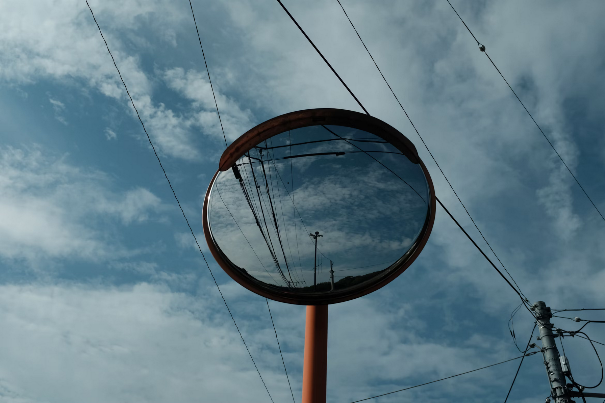

It's been roughly two weeks since I actually started the draft for this article. I guess I wanted some more time to gather what has happened this past year, summarise it and put it in words here.

# personal (health & fitness)
2023, in hindsight was quite good in this category. 2024 started out with a serious ankle injury while playing badminton which meant little to no movement for a good part of January and some of February. I did continue to lift throughout the year when I wasn't travelling or out of town. I reached my bodyweight goal of 72kg but realized it's not cutting it, and upped the goal weight to 75kg. But this meant that I wasn't able to achieve my goal of reaching sub-15% bodyfat.

In terms of sports, I mostly played badminton and started running as part of my ankle injury rehab. Nutrition was quite a success, I continued to cook and track everything I ate and that has been quite helpful in the whole journey, I plan to continue doing that for as long as feasible.

# career
Work has been fulfilling, primarily because of the ownership and flexibility I have in my current role and the good set of people I get to work with. My work still primarily revolves around open source software, and occasionally I get to solve problems that are interesting. Another goal I was able to accomplish from last year was to speak at a conference, I spoke at Open Source Summit 2024 talking about [container image internals](https://youtu.be/TsfT5qsTMB0?si=3m8D8mH17w1X2X91).

That being said, I can objectively say that the amount of code I've written this past year hasn't been much and that's unfortunate. I'm already planning so that things are not the same in 2025.

# education
On the [reading](/reading) front, I continued to explore different subjects and authors. Some of my favorite reads from last year were [Einstein](/reading/einstein), [Linux System Programming](/reading/linux-system-programming), and [The Last Lecture](/reading/the-last-lecture). I seem to have finally settled on a note-taking system for my reading, of course, it's nothing as extravagant as incremental reading but it does the job and does it well for me. So far, all my reads from past 2 years have proper notes and every once in a while I create flashcards from those for long-term retention of certain topics.

Writing is a bit hard to describe or justify. Looking at the archive here, it's clear I wrote 2 articles in 2024, one of them being the review for 2023. But I've done a _lot_ of writing that I haven't published yet. This includes my reading notes, personal notes, work notes, and other auxiliary topics that I find writing about fun. Then there are article drafts that I haven't decided to publish yet because I plan to publish them after a certain period of time. For instance, writing an article about my experience with budgeting for the past 5 years would _have_ to wait 5 years before I can write about it. And so I have long-term articles planned for 5 and 10 years intervals. I believe talking about a topic with which you have certain experience--skin in the game, so to say--carries a certain credibility automatically. So while there isn't much published in 2024, I've written a lot and there are numerous items in the pipeline that I wish to publish on a semi-regular basis soon.

On learning side of things, I've continued doing Anki everyday this whole past year focusing on subjects such as Japanese, mathematics, nutrition, cosmology, etc. I didn't read the Genki book I set out to last year and neither did I learn Rust. There are goals for 2025 that address these issues but I'm not being too adamant or aggressive about such goals.

# travel
I travelled quite a bit this year, as usual. Partly because 4 of my friends got married and I travelled to different parts of the country for the ceremonies, it was a lot of fun meeting old friends. I also travelled to Japan for Open Source Summit 2024 and spent some time there.

I travelled to Rishikesh, Dehradun, Palwancha, Jaipur, Japan, Tungnath, and Mysore. A good thing about travel I realized lately, especially solo, is the time you get to simply think about things. I spent so much time on some of my travels in 2024 taking personal--dare I say philosophical--notes that I was quite surprised at the amount of stuff I had jotted down in random places and about random observations.

# productivity
I think I've cured myself of the curse of [social media](/posts/shortform-content) a couple years back. There's still the occasional reddit binge which I'm trying to also bring into a routine but I'm quite happy with what I have so far. Social media isn't an impediment to the work that's actually important to me anymore.

Looking back at some stats and retrospecting, I did however feel I could do better with how I [structure](https://supermemo.guru/wiki/Natural_creativity_cycle) my day by giving importance to creative or educational pursuits early in the day and then allocating time for physical fitness or other chores like cooking later in the day post work. I'm trying this out now in the new year and it's been working well so far, a proper summary is due in next year's review.

As I said last year, I don't have an active goal towards reducing my social media usage in 2025. I'm focusing instead on applying the concept of [directed consumption](/posts/directed-undirected-consumption) to certain services on my phone, namely messaging apps and email.

# conclusion
The idea of writing these annual reviews has become therapeutic and doesn't feel like a chore anymore--it used to feel like it when I first started it while I was building the habit. There was a lot I didn't achieve in 2024 but there are always learnings that I can carry over to the next year and try not to fall into the same traps.

:wq
