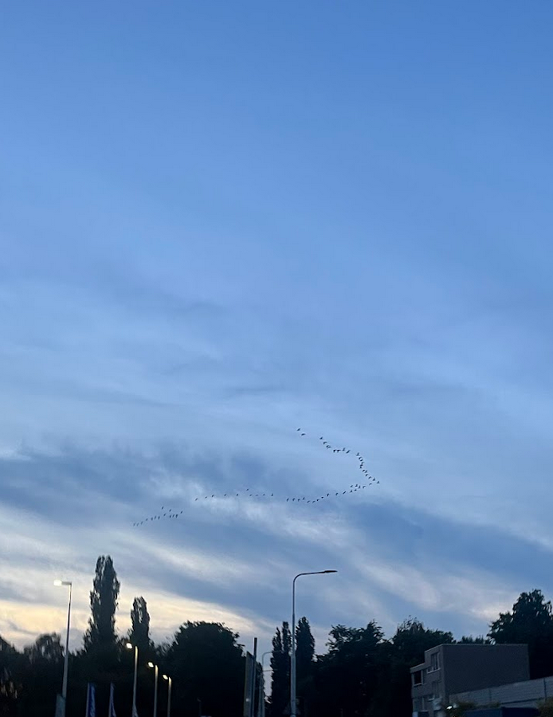
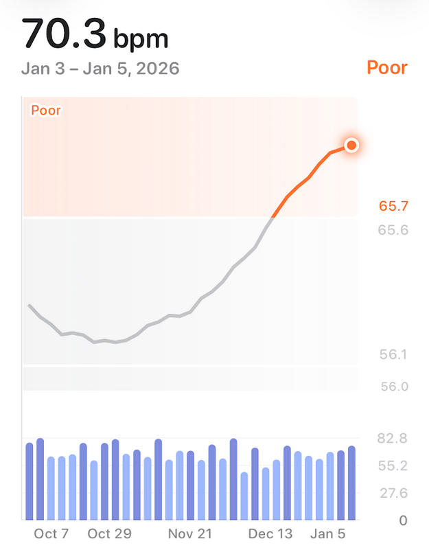

Fifth anniversary of the Year in Review series, and I'm happy I stuck with it for so long. The structure remains the same, barring the change in ordering of the sections that I feel is now more appropriate.

## Education
My favorite books from this year, in no particular order, are [CODE](/reading/code), [City of Djinns](/reading/city-of-djinns), [To Kill a Mockingbird](/reading/to-kill-a-mockingbird), and [The Anxious Generation](/reading/the-anxious-generation). I also finally found audiobooks to be a viable reading format. I think the reason I had not been able to stick with audiobooks was the kind of books I was choosing.

I'll divide writing into two. Public and personal writing. Public writing, the articles I share here, followed the trend for the past 3 years--handful of articles. I've amassed over 70 topics I would like to write about, and a lot of them are even drafts with either a rough outline or writing points that I've gathered over time. I've pondered about this while I was writing this article and doing my internal goal review for 2025 and it all comes down to this--"If you want to write, write.". That might seem simple but it's the one suggestion I've heard repeatedly from people who are good at writing and seemingly great at churning out pieces. I did manage to find both time and motivation to write 2 additional articles. My favorite posts from 2025 are [Kinesis Advantage2](/posts/kinesis-advantage2) and [Nepal (2022)](/posts/nepal-2022).

My personal writing, on the other hand, is a completely different picture. I'm now writing more than I have ever before. There are more observations in my journal, more notes in my book notes, more entries in my auxiliary notes. Personal writing has been indescribably therapeutic, so much so that I now pull out my phone to capture a moment, not only by the camera, but by words. The next step would be to carry over this comfort to public writing.

The other pillar of how I learn, beyond reading and writing, is how I retain information, and that has been a bit of a hit or miss. I managed to accumulate a massive Anki backlog when I travelled to Europe in August and have been trying to clear it to this day. This sucks because it means that while there's a backlog to be cleared, I'm not learning new information. Which in turn means, the notes I take while I'm reading, even though they help solidify my understanding of a concept or an argument, I'm not making an effort at remembering important information I want to remember because I'm not actively [injecting](https://supermemo.guru/wiki/Incremental_reading) anything into Anki.

## Health

This year has been the worst when it comes to consistency surrounding health and fitness. I tried to understand the cause of decline in fitness this year and this is what I found. Lack of routine and travelling; I have a hard time maintaining my physical fitness routine when I travel, not to mention sleep takes a massive hit. This year I travelled comparatively more than previous years and that showed up in the various metrics I track.

Second was dealing with injuries and moving back to Delhi. Things were going well till the air quality dropped down to hazardous levels in October. I had to stop running, productivity dropped, focus took a hit. It didn't help that I met with a lot of injuries as the year came to a close, thanks in part to Delhi winters.

It was shocking, though not surprising to see the metrics tell the same story. The graph above shows the Resting Heart Rate (RHR) Baselines. So while I was in the fair category and was well on the way to improve my cardiovascular health by getting into regular running, life happened and here we are. But I'm hopeful for what's to come in this new year.

Lifting was also somewhat consistent except for when I was travelling and was recovering from injuries. I gained considerable muscle this year, and as is the norm, a lot of fat along with it as well. On the nutrition front, I stopped tracking my macros as rigidly as I was these past 3 years but will shortly get back to the grind once I start losing weight. I think I have a strong baseline for nutrition entrenched that allows me to stay the course even when I'm injured or when I'm travelling.

## Career

First half of 2025 wasn't as exciting as the second half, unfortunately. I spent a lot of time doing meta work, which even though is necessary, wasn't challenging. I managed to spend slightly more time in the second half on a few long-pending upstream bugs I had been working on which was a welcome respite. I wish and have planned to do more of this in 2026, in a more structured manner.

It's natural I speak about AI in this section. Adopting AI for technical work has been the biggest change I've ever done to my workflow. There was a time this past year when I had to use Cursor, and while its agentic capabilities were good, I was disappointed to work outside the terminal, after roughly a decade of working within tmux sessions, so naturally, I rejoiced when terminal based agents particularly Claude Code came out and started gaining traction. Since then, my workflow has changed dramatically, and I've found myself using these tools more and more. I'm still programming, still debugging, still solving problems, but with some help in the gruntwork and research department. It also doesn't hurt that my organization is bullish on AI for developer productivity, I'm excited to see what the continued and rapid pace of AI means for my career growth, and how this section evolves over the years.

## Travel

If you've been following along so far, you might've noted that travelling has had a slightly negative impact on my educational and health goals. I don't normally follow routines or rules while travelling and so it's inevitable that travelling would throw off some goals that require deliberate effort and focus. Perhaps the idea is to figure out how to not completely derail while travelling, or more importantly, after coming back from a vacation.

It so happened that I condensed all my travels in the second half of the year and as much fun as it was, it was also slightly exhausting. I visited [Mangalore](/photos/mangalore-india-2025), [Bhutan](/photos/bhutan-2025), Thailand, [Kazakhstan](/photos/almaty-kazakhstan-2025), [Europe](/photos/amsterdam-netherlands-2025), and Jaipur.

I had always planned to write more travelogues but one way or another, they tend to get deprioritized and eventually out of my _to-write-about-topics_ queue altogether. For the time being, here are some photos as consolation:

## Focus

Moving back to Delhi in a new environment, instead of improving, the idea was to not regress. With that in mind, there weren't many drastic changes I made this time around in order to improve focus and productivity. Things remained more or less the same as I left them in 2024. I still maintain the practice of [undirected consumption](/posts/directed-undirected-consumption) on Saturdays, and that's about it. Though I must confess--as I've done before--that this type of consumption is a complete waste of time even if it's limited to just one day of the week. A more ambitious goal would be to eliminate it entirely.

I'll continue to use and rely on the techniques and processes I've learned over the years--pomodoro, checking messages only twice a day, cognitive-heavy morning routine, etc. But at the same time, as a self-proclaimed self-improvement junkie, I'll continue to look for new ideas and additions because honestly, I still struggle with lack of motivation, productivity and focus quite frequently.

## Conclusion

This wasn't a groundbreaking year by any measure but it was a year of change, and, as they say, change is inevitable. Of course, there are many changes that happened this past year that don't quite fit here but they all shaped me, and I'm hopeful for what 2026 will bring. I'm still working on my goal setting for 2026 and the idea is to incorporate incremental and realistic improvements that build upon the foundation, and to maintain existing systems.

:wq
